# Developer Documentation

Comprehensive technical documentation for the Nostr BBS platform.

**Version:** 1.0.0
**Last Updated:** 2026-01-16

---

## Table of Contents

1. [Architecture Overview](#architecture-overview)
2. [Tech Stack](#tech-stack)
3. [Project Structure](#project-structure)
4. [Key Components](#key-components)
5. [Nostr Protocol Integration](#nostr-protocol-integration)
6. [Security Model](#security-model)
7. [Testing Strategy](#testing-strategy)
8. [Deployment](#deployment)

---

## Architecture Overview

The platform is a **Progressive Web Application (PWA)** built on the **Nostr protocol**, designed for community communication with strong privacy guarantees.

### System Architecture

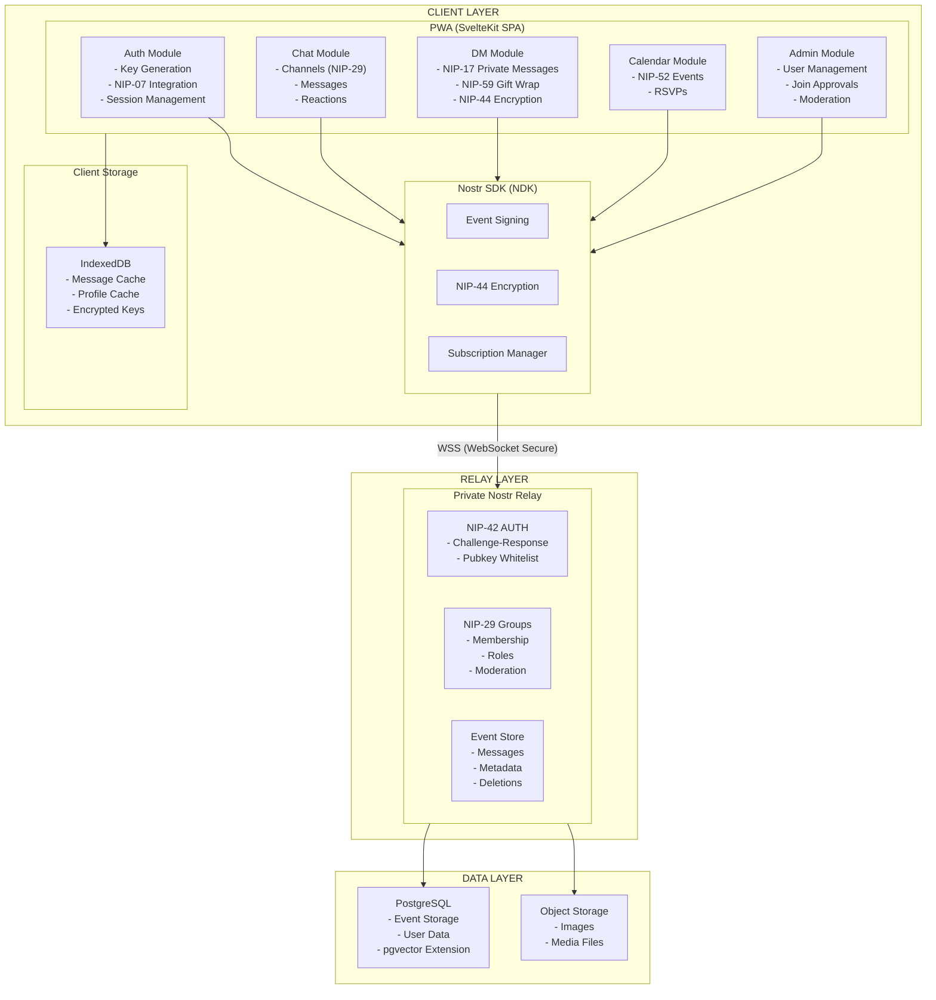

### Key Architectural Layers

| Layer | Responsibility | Technologies |
|-------|---------------|--------------|
| **Client** | User interface, local state, event creation | SvelteKit, NDK, IndexedDB |
| **Transport** | Secure WebSocket communication | WSS, NIP-42 AUTH |
| **Relay** | Event routing, storage, access control | Custom Nostr relay, NIP-29 |
| **Data** | Persistent storage, search | PostgreSQL, pgvector |

### Data Flow Overview

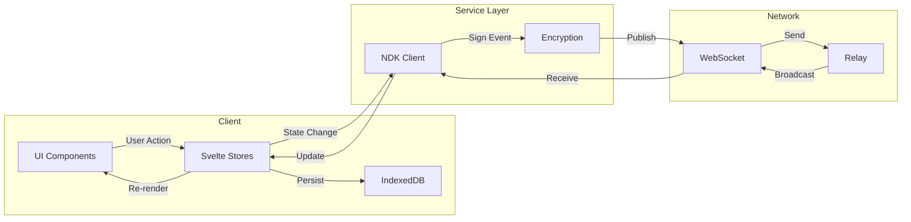

---

## Tech Stack

### Frontend

| Technology | Version | Purpose |
|------------|---------|---------|
| **SvelteKit** | 2.x | Application framework |
| **Svelte** | 4.x | UI components |
| **TypeScript** | 5.x | Type safety |
| **Tailwind CSS** | 3.x | Styling |
| **DaisyUI** | 4.x | Component library |
| **Lucide** | Latest | Icons |

### Nostr Libraries

| Library | Purpose |
|---------|---------|
| **@nostr-dev-kit/ndk** | Core Nostr functionality |
| **@nostr-dev-kit/ndk-svelte** | Svelte bindings for NDK |
| **@nostr-dev-kit/ndk-cache-dexie** | IndexedDB caching |
| **nostr-tools** | Low-level Nostr utilities |

### Cryptography

| Library | Purpose |
|---------|---------|
| **@scure/bip32** | HD key derivation |
| **@scure/bip39** | Mnemonic generation |
| **@noble/hashes** | SHA-256, HMAC |
| **@noble/curves** | secp256k1, Schnorr signatures |

### Storage & Search

| Technology | Purpose |
|------------|---------|
| **Dexie** | IndexedDB wrapper |
| **hnswlib-wasm** | Vector search (semantic search) |

### Development Tools

| Tool | Purpose |
|------|---------|
| **Vite** | Build tool |
| **Vitest** | Unit testing |
| **Playwright** | E2E testing |
| **ESLint** | Linting |
| **Prettier** | Code formatting |

---

## Project Structure

```
nostr-bbs/
├── src/
│   ├── lib/
│   │   ├── components/          # Svelte components
│   │   │   ├── ui/             # Generic UI (Button, Input, Modal)
│   │   │   ├── chat/           # Chat components
│   │   │   ├── dm/             # Direct message components
│   │   │   ├── calendar/       # Calendar components
│   │   │   ├── admin/          # Admin panel components
│   │   │   ├── auth/           # Authentication components
│   │   │   ├── navigation/     # Navigation components
│   │   │   └── zones/          # Zone-specific components
│   │   ├── stores/             # Svelte stores (state)
│   │   │   ├── auth.ts         # Authentication state
│   │   │   ├── ndk.ts          # NDK instance
│   │   │   ├── channelStore.ts # Channel data
│   │   │   ├── notifications.ts # Notifications
│   │   │   └── settings.ts     # User preferences
│   │   ├── nostr/              # Nostr-specific logic
│   │   │   ├── ndk.ts          # NDK initialisation
│   │   │   ├── dm.ts           # NIP-17/59 DM handling
│   │   │   ├── groups.ts       # NIP-29 group operations
│   │   │   ├── calendar.ts     # NIP-52 calendar events
│   │   │   ├── encryption.ts   # NIP-44 encryption
│   │   │   └── events.ts       # Event creation/validation
│   │   ├── utils/              # Utility functions
│   │   │   ├── crypto.ts       # Cryptography helpers
│   │   │   ├── validation.ts   # Input validation
│   │   │   └── storage.ts      # Local storage helpers
│   │   ├── types/              # TypeScript types
│   │   └── config/             # Configuration
│   ├── routes/                 # SvelteKit routes
│   │   ├── +layout.svelte      # Root layout
│   │   ├── +page.svelte        # Home page
│   │   ├── setup/              # Setup wizard
│   │   ├── chat/               # Chat routes
│   │   ├── dm/                 # DM routes
│   │   ├── forums/             # Forum routes
│   │   ├── admin/              # Admin routes
│   │   └── [category]/         # Dynamic zone routes
│   └── service-worker.ts       # PWA service worker
├── static/                     # Static assets
├── tests/                      # Test files
├── docs/                       # Documentation
└── config files               # Configuration
```

### Path Aliases

| Alias | Path |
|-------|------|
| `$lib` | `src/lib` |
| `$components` | `src/lib/components` |
| `$stores` | `src/lib/stores` |

---

## Key Components

### Component Hierarchy

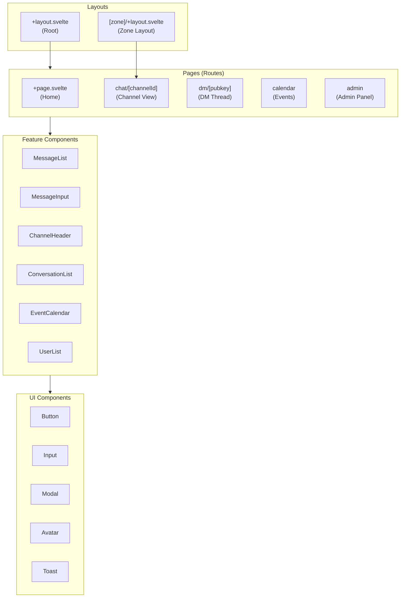

### Message Creation Flow

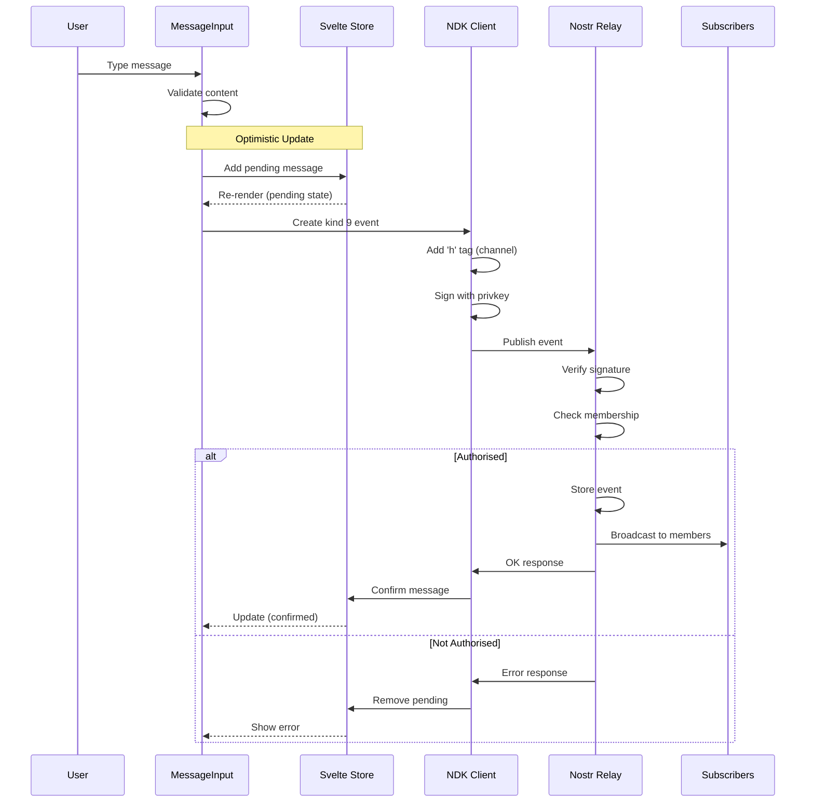

### State Management Pattern

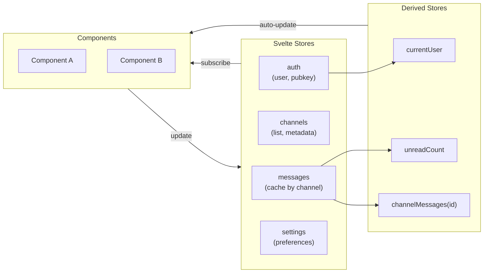

---

## Nostr Protocol Integration

### NIP Implementation Status

| NIP | Name | Status | Usage |
|-----|------|--------|-------|
| **NIP-01** | Basic Protocol | Full | Event structure, signatures |
| **NIP-06** | Key Derivation | Full | BIP-39 mnemonic to keys |
| **NIP-07** | Browser Extension | Full | Alby, nos2x integration |
| **NIP-09** | Event Deletion | Full | User message deletion |
| **NIP-10** | Text Notes | Full | Threading with markers |
| **NIP-17** | Private DMs | Full | Sealed rumours |
| **NIP-25** | Reactions | Full | Emoji reactions |
| **NIP-29** | Groups | Full | Primary chat mechanism |
| **NIP-42** | Authentication | Full | Relay AUTH |
| **NIP-44** | Encryption | Full | ChaCha20-Poly1305 |
| **NIP-52** | Calendar | Full | Events and RSVPs |
| **NIP-59** | Gift Wrap | Full | Metadata hiding for DMs |

### Event Kinds Used

| Kind | NIP | Purpose |
|------|-----|---------|
| 0 | 01 | User metadata (profile) |
| 5 | 09 | Deletion request |
| 7 | 25 | Reaction (like, emoji) |
| 9 | 29 | Group chat message |
| 1059 | 59 | Gift-wrapped event (DMs) |
| 9000 | 29 | Group add user |
| 9001 | 29 | Group remove user |
| 9005 | 29 | Group delete event |
| 9007 | 29 | Join request |
| 22242 | 42 | AUTH challenge response |
| 31923 | 52 | Calendar event |
| 31925 | 52 | Calendar RSVP |
| 39000 | 29 | Group metadata |

### Channel Message Flow (NIP-29)

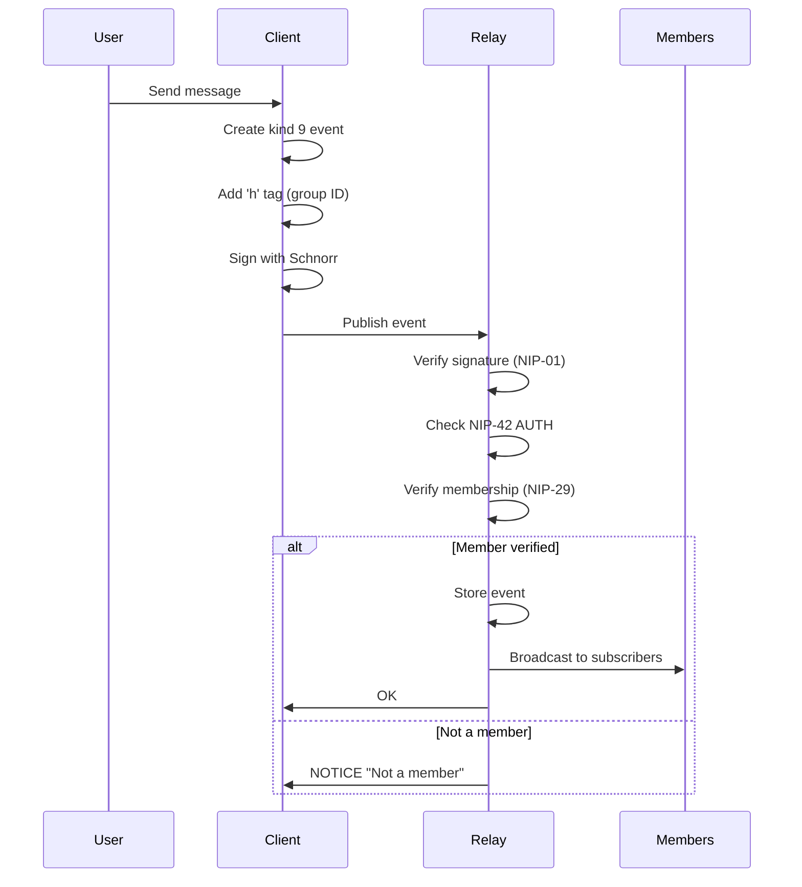

### Private DM Flow (NIP-17 + NIP-59)

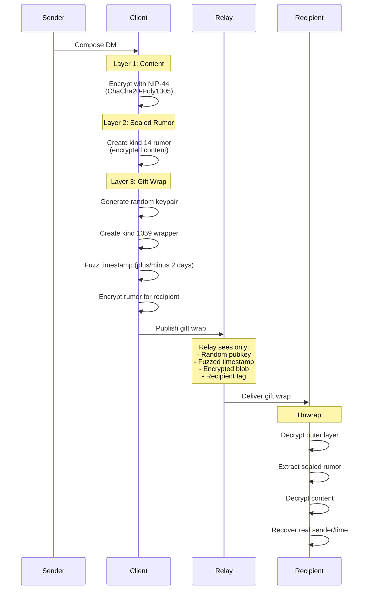

### Zone/Section Hierarchy

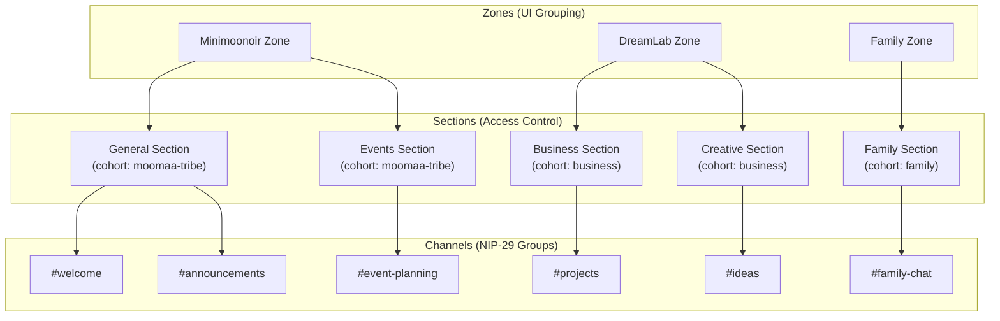

### Cohort-Based Access Control

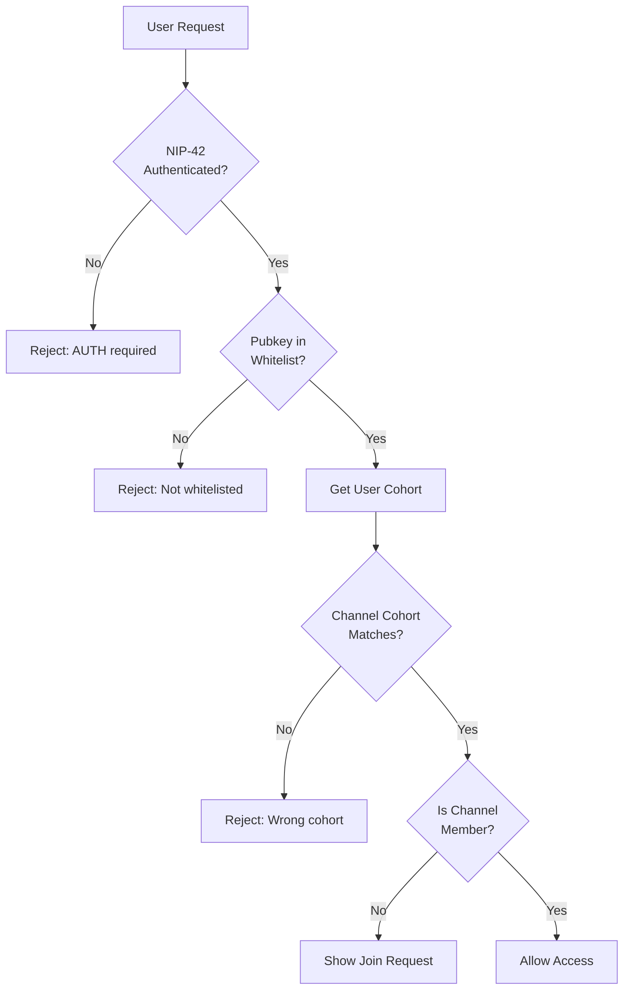

---

## Security Model

### Trust Boundaries

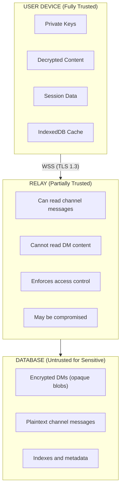

### Authentication Flow

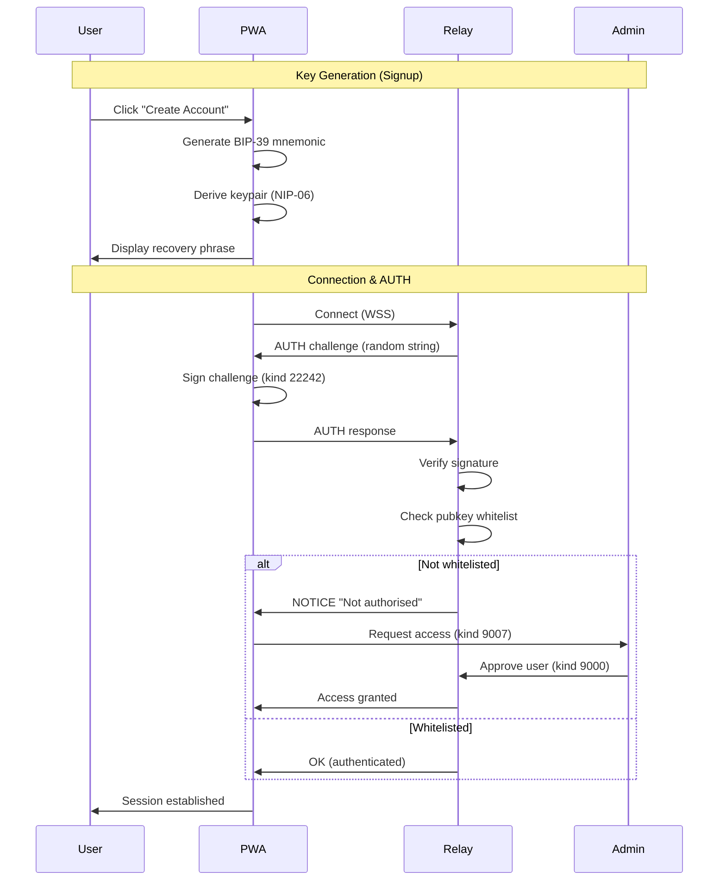

### NIP-07 Browser Extension Flow

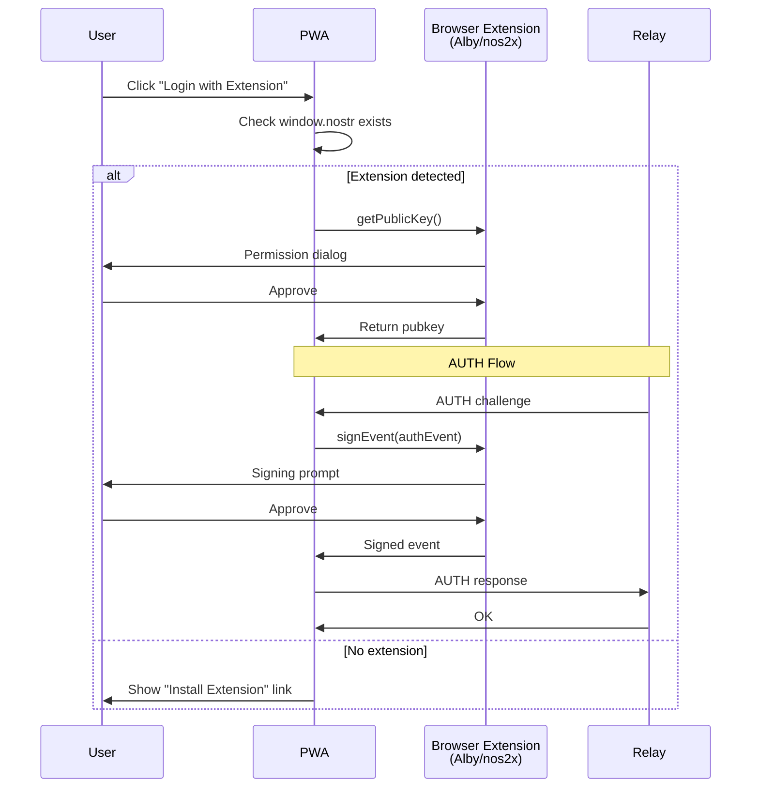

### Encryption Architecture

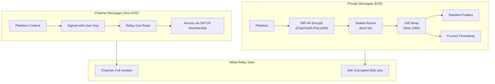

### Security Properties

| Property | Implementation |
|----------|----------------|
| **Authentication** | NIP-42 challenge-response with signing key |
| **Authorisation** | Pubkey whitelist + cohort membership |
| **Integrity** | Schnorr signatures on all events |
| **Confidentiality (DMs)** | NIP-44 ChaCha20-Poly1305 + NIP-59 gift wrap |
| **Metadata Protection (DMs)** | Random sender key, fuzzed timestamps |
| **Forward Secrecy** | Not implemented (key compromise exposes history) |

### Threat Mitigations

| Threat | Mitigation |
|--------|------------|
| Key Theft | Encrypted storage, optional passphrase |
| MITM Attack | TLS 1.3 (WSS) |
| Relay Compromise | E2E encryption for DMs |
| Replay Attack | Timestamp validation |
| Impersonation | Schnorr signature verification |
| XSS | Content sanitisation (DOMPurify), CSP headers |

---

## Testing Strategy

### Test Pyramid

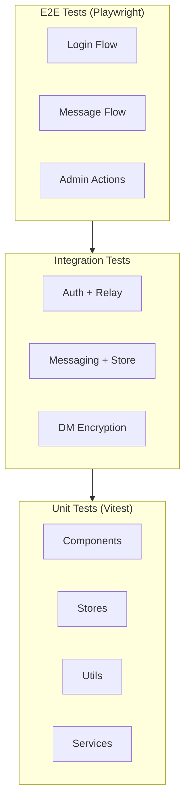

### Running Tests

```bash
# Unit tests
npm run test

# Watch mode
npm run test:watch

# Coverage report
npm run test:coverage

# E2E tests
npm run test:e2e

# E2E with UI
npm run test:e2e:ui
```

### Test Structure

```
tests/
├── unit/
│   ├── components/
│   │   ├── Button.test.ts
│   │   └── MessageBubble.test.ts
│   ├── stores/
│   │   └── messages.test.ts
│   ├── services/
│   │   └── messaging.test.ts
│   └── utils/
│       └── validation.test.ts
├── integration/
│   ├── auth.test.ts
│   └── messaging.test.ts
├── e2e/
│   └── flows/
│       ├── login.test.ts
│       └── messaging.test.ts
└── fixtures/
    ├── events.ts
    └── users.ts
```

### Coverage Targets

| Metric | Target |
|--------|--------|
| Statements | 80% |
| Branches | 75% |
| Functions | 80% |
| Lines | 80% |

### Test Patterns

**Component Testing:**
```typescript
import { render, screen, fireEvent } from '@testing-library/svelte';
import { describe, it, expect } from 'vitest';
import Button from '$components/ui/Button.svelte';

describe('Button', () => {
  it('renders with default props', () => {
    render(Button, { props: { children: 'Click' } });
    expect(screen.getByRole('button')).toBeInTheDocument();
  });

  it('handles click events', async () => {
    const { component } = render(Button);
    const handleClick = vi.fn();
    component.$on('click', handleClick);

    await fireEvent.click(screen.getByRole('button'));
    expect(handleClick).toHaveBeenCalled();
  });
});
```

**Store Testing:**
```typescript
import { get } from 'svelte/store';
import { messages } from '$stores/messages';

describe('messages store', () => {
  beforeEach(() => messages.reset());

  it('adds message to channel', () => {
    messages.addMessage('ch-1', { id: 'msg-1', content: 'Hello' });
    const $msgs = get(messages);
    expect($msgs.messages.get('ch-1')).toHaveLength(1);
  });
});
```

---

## Deployment

### Deployment Options

| Option | Best For | Complexity |
|--------|----------|------------|
| **GitHub Pages** | Static hosting, simplest | Low |
| **Cloud Run** | Scalable, serverless | Medium |
| **Self-Hosted** | Full control | High |

### Deployment Architecture

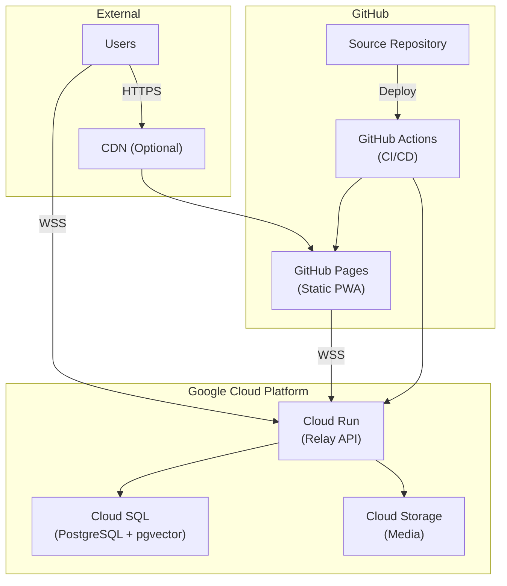

### Environment Variables

**Required:**
| Variable | Description |
|----------|-------------|
| `PUBLIC_RELAY_URL` | WebSocket relay URL |
| `PUBLIC_APP_URL` | Public application URL |
| `DATABASE_URL` | PostgreSQL connection string |

**Optional:**
| Variable | Default | Description |
|----------|---------|-------------|
| `PUBLIC_APP_NAME` | "Nostr BBS" | Application name |
| `LOG_LEVEL` | "info" | Logging verbosity |
| `RATE_LIMIT_MAX` | 100 | Max requests per window |

### GitHub Pages Deployment

```bash
# Build static site
npm run build

# Deploy via GitHub Actions (automatic on push)
git push origin main
```

### Cloud Run Deployment

```bash
# Build container
gcloud builds submit --tag gcr.io/PROJECT/relay

# Deploy
gcloud run deploy relay \
  --image gcr.io/PROJECT/relay \
  --platform managed \
  --region europe-west2 \
  --set-env-vars "DATABASE_URL=postgres://..."
```

### Scaling Architecture

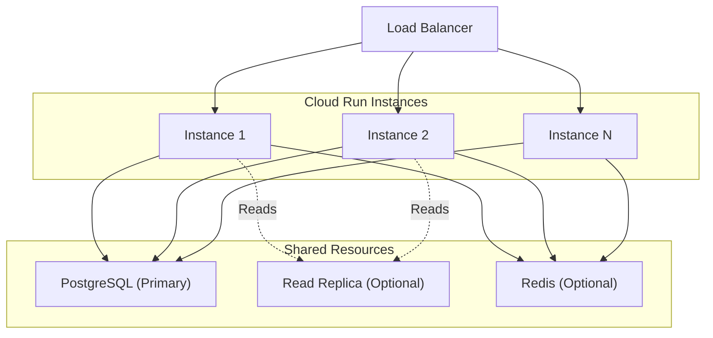

### Health Check Endpoint

```
GET /health

Response:
{
  "status": "healthy",
  "version": "1.0.0",
  "services": {
    "database": "connected",
    "relay": "connected"
  }
}
```

### Security Checklist

**Pre-deployment:**
- [ ] SSL/TLS enabled (HTTPS/WSS only)
- [ ] Strong database passwords
- [ ] Environment variables secured
- [ ] Rate limiting configured
- [ ] CORS properly configured
- [ ] CSP and security headers enabled
- [ ] Firewall rules configured

**Ongoing:**
- [ ] Regular security updates
- [ ] Log monitoring
- [ ] Backup verification
- [ ] Annual penetration testing

---

## Related Documentation

- [NIP Protocol Reference](developer/reference/nip-protocol-reference.md) - Detailed NIP specifications
- [Component Architecture](developer/architecture/components.md) - UI component patterns
- [Data Flow](developer/architecture/data-flow.md) - State management details
- [Security Model](developer/architecture/security.md) - Security implementation
- [Deployment Guides](developer/deployment/index.md) - Platform-specific deployment

---

## Quick Reference

### Key Commands

```bash
# Development
npm run dev          # Start dev server
npm run check        # Type check
npm run lint         # Lint code
npm run format       # Format code

# Testing
npm run test         # Run unit tests
npm run test:e2e     # Run E2E tests
npm run test:coverage # Coverage report

# Build & Deploy
npm run build        # Production build
npm run preview      # Preview build
```

### Important Paths

| Path | Purpose |
|------|---------|
| `src/lib/nostr/dm.ts` | NIP-17/59 DM implementation |
| `src/lib/nostr/groups.ts` | NIP-29 group operations |
| `src/lib/nostr/ndk.ts` | NDK initialisation |
| `src/lib/stores/` | All Svelte stores |
| `src/lib/components/` | UI components |

### Event Kind Quick Reference

| Action | Kind | NIP |
|--------|------|-----|
| Send channel message | 9 | NIP-29 |
| Send DM (wrapped) | 1059 | NIP-59 |
| React to message | 7 | NIP-25 |
| Delete own message | 5 | NIP-09 |
| Admin delete | 9005 | NIP-29 |
| Create calendar event | 31923 | NIP-52 |
| RSVP to event | 31925 | NIP-52 |

---

[Back to Documentation Index](README.md)
