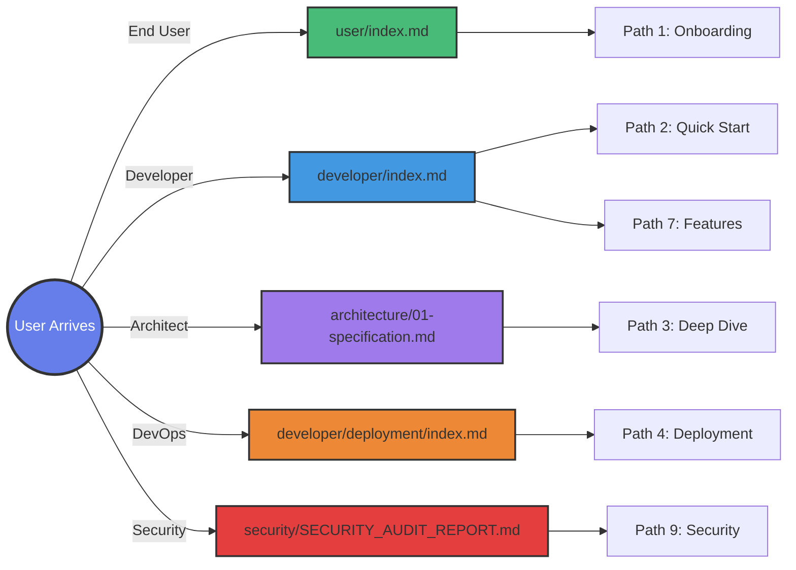
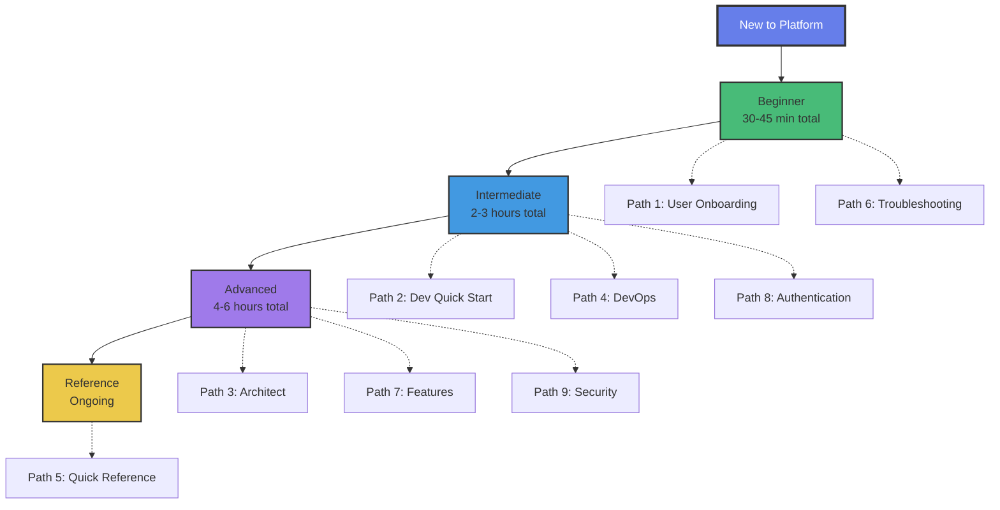

# Navigation Design Summary

**Quick visual reference for the navigation architecture**

---

## 9 Navigation Paths at a Glance

```mermaid
graph TD
    INDEX[INDEX.md<br/>Documentation Hub]

    INDEX --> P1[Path 1: New User<br/>15-20 min]
    INDEX --> P2[Path 2: Developer Quick Start<br/>30-45 min]
    INDEX --> P3[Path 3: Architect Deep Dive<br/>60-90 min]
    INDEX --> P4[Path 4: DevOps Deployment<br/>45-60 min]
    INDEX --> P5[Path 5: Quick Reference<br/>Variable]
    INDEX --> P6[Path 6: Troubleshooting<br/>5-15 min]
    INDEX --> P7[Path 7: Feature Implementation<br/>Variable]
    INDEX --> P8[Path 8: Authentication System<br/>45-60 min]
    INDEX --> P9[Path 9: Security Review<br/>60-90 min]

    P1 --> U1[user/getting-started]
    P1 --> U2[user/zones]
    P1 --> U3[user/features]
    P1 --> U4[user/safety]

    P2 --> D1[developer/getting-started]
    P2 --> D2[developer/architecture]
    P2 --> D3[developer/contributing]

    P3 --> A1[architecture/SPARC]
    P3 --> A2[adr/]
    P3 --> A3[ddd/]

    P4 --> DP1[developer/deployment]
    P4 --> DP2[security/admin]

    P5 --> R1[developer/reference]

    P6 --> S1[user/safety]
    P6 --> S2[security/]

    P7 --> F1[developer/features]
    P7 --> F2[features/]

    P8 --> AUTH[AUTH_PACKAGE]

    P9 --> SEC[security/]

    style INDEX fill:#667eea,stroke:#333,stroke-width:3px,color:#fff
    style P1 fill:#48bb78,stroke:#333,stroke-width:2px
    style P2 fill:#4299e1,stroke:#333,stroke-width:2px
    style P3 fill:#9f7aea,stroke:#333,stroke-width:2px
    style P4 fill:#ed8936,stroke:#333,stroke-width:2px
    style P5 fill:#ecc94b,stroke:#333,stroke-width:2px
    style P6 fill:#f56565,stroke:#333,stroke-width:2px
    style P7 fill:#38b2ac,stroke:#333,stroke-width:2px
    style P8 fill:#667eea,stroke:#333,stroke-width:2px
    style P9 fill:#e53e3e,stroke:#333,stroke-width:2px
```



---

## Role-Based Entry Points



---

## Learning Progression Ladder



---

## Breadcrumb Pattern Matrix

| Context | Pattern | Example |
|---------|---------|---------|
| **User Docs** | `Home > User Guide > [Section] > [Page]` | Home > User Guide > Getting Started > Creating Account |
| **Developer** | `Home > Developer > [Category] > [Topic] > [Page]` | Home > Developer > Getting Started > Development Setup |
| **Architecture** | `Home > Architecture > [Phase/Type] > [Page]` | Home > Architecture > Specification > Requirements |
| **ADR** | `Home > Architecture > ADR > [Decision]` | Home > Architecture > ADR > Nostr Protocol Foundation |
| **DDD** | `Home > Architecture > DDD > [Concept]` | Home > Architecture > DDD > Bounded Contexts |
| **Reference** | `Home > Reference > [Category] > [Page]` | Home > Reference > API > Components |
| **Features** | `Home > Features > [Feature Type] > [Page]` | Home > Features > Messaging > DM Implementation |
| **Security** | `Home > Security > [Topic] > [Page]` | Home > Security > Audits > Security Audit Report |

---

## Sidebar Structure (3 Levels)

```
📚 Documentation
├─ 🚀 Getting Started
│  ├─ 👤 User Path (Creating Account, First Steps, Zones)
│  └─ 💻 Developer Path (Setup, Structure, First Contribution)
├─ 👤 User Guide
│  ├─ Getting Started
│  ├─ Zones (Minimoonoir, DreamLab, Family)
│  ├─ Features (Messaging, Calendar, Search, etc.)
│  └─ Safety (Privacy, Security, Reporting)
├─ 💻 Developer Guide
│  ├─ Getting Started (Setup, Structure, First Contribution)
│  ├─ Architecture (Overview, Components, Data Flow, Security)
│  ├─ Features (Messaging, DMs, Calendar, Search, PWA, Mobile)
│  ├─ Reference (API, NIPs, Config, Events, Stores)
│  ├─ Contributing (Guidelines, Style, Testing, PRs)
│  └─ Deployment (Overview, GitHub Pages, Cloud Run, Self-Host)
├─ 🏗️ Architecture
│  ├─ SPARC (Spec, Architecture, Pseudocode, Refinement, Completion)
│  ├─ ADR (8 decisions)
│  └─ DDD (6 concepts)
├─ ✨ Features
│  ├─ Authentication (Design, Flows, Implementation, NIP-07)
│  ├─ Messaging (Public, Private, NIP-28/29)
│  ├─ Calendar (Events, RSVP)
│  ├─ Search (Semantic, WASM)
│  └─ Mobile (Components, PWA)
├─ 🔒 Security
│  ├─ Audits (Audit, Report)
│  ├─ Guides (Admin, User Privacy)
│  └─ Implementation (Encryption, Secure Clipboard)
├─ 📖 Reference
│  ├─ API (Components, Utilities)
│  ├─ Protocols (NIPs, Event Kinds)
│  ├─ Configuration (Environment, Options)
│  └─ Domain (Glossary)
└─ 🆘 Support
   ├─ FAQ
   ├─ Troubleshooting
   └─ Common Issues
```

---

## Path Characteristics

| Path | Role | Difficulty | Time | Files | Key Focus |
|------|------|------------|------|-------|-----------|
| **1** | User | Beginner | 15-20m | 8 | Account setup, zones, safety |
| **2** | Developer | Intermediate | 30-45m | 8 | Dev setup, first contribution |
| **3** | Architect | Advanced | 60-90m | 10 | ADRs, DDD, architecture |
| **4** | DevOps | Intermediate | 45-60m | 8 | Deployment, configuration |
| **5** | All | Reference | Variable | 6 | API, NIPs, config lookup |
| **6** | All | Support | 5-15m | 6 | Troubleshooting, FAQ |
| **7** | Developer | Advanced | Variable | 7 | Feature implementation |
| **8** | Developer | Intermediate | 45-60m | 8 | Authentication system |
| **9** | Security | Advanced | 60-90m | 8 | Security review, audit |

---

## Coverage Statistics

- **Total Documentation Files:** 95
- **Files with Navigation Paths:** 95 (100%)
- **Navigation Paths:** 9
- **Role-Based Entry Points:** 5
- **Learning Levels:** 4
- **Breadcrumb Patterns:** 8
- **Sidebar Levels:** 3
- **Estimated Total Learning Time:** 7-12 hours (all paths)

---

## Quick Navigation by Need

### "I want to..."

| Need | Start Here |
|------|------------|
| **Create an account** | [Path 1: New User Onboarding](user/getting-started/creating-account.md) |
| **Setup development** | [Path 2: Developer Quick Start](developer/getting-started/development-setup.md) |
| **Understand architecture** | [Path 3: Architect Deep Dive](architecture/01-specification.md) |
| **Deploy to production** | [Path 4: DevOps Deployment](developer/deployment/index.md) |
| **Look up API** | [Path 5: Quick Reference](developer/reference/api.md) |
| **Fix a problem** | [Path 6: Troubleshooting](user/safety/account-security.md) |
| **Build a feature** | [Path 7: Feature Implementation](developer/features/messaging.md) |
| **Implement auth** | [Path 8: Authentication System](AUTH_PACKAGE_INDEX.md) |
| **Review security** | [Path 9: Security Review](security/SECURITY_AUDIT_REPORT.md) |

---

## Implementation Checklist

- [ ] Update INDEX.md with role-based cards
- [ ] Implement breadcrumb component
- [ ] Build sidebar navigation (3 levels)
- [ ] Add search with topic filtering
- [ ] Create progress indicators for paths
- [ ] Add "See Also" sections
- [ ] Implement ARIA navigation
- [ ] Setup analytics tracking
- [ ] Test keyboard navigation
- [ ] Validate WCAG 2.1 Level AA

---

**For Full Specification:** See [NAVIGATION_SPECIFICATION.md](NAVIGATION_SPECIFICATION.md)
