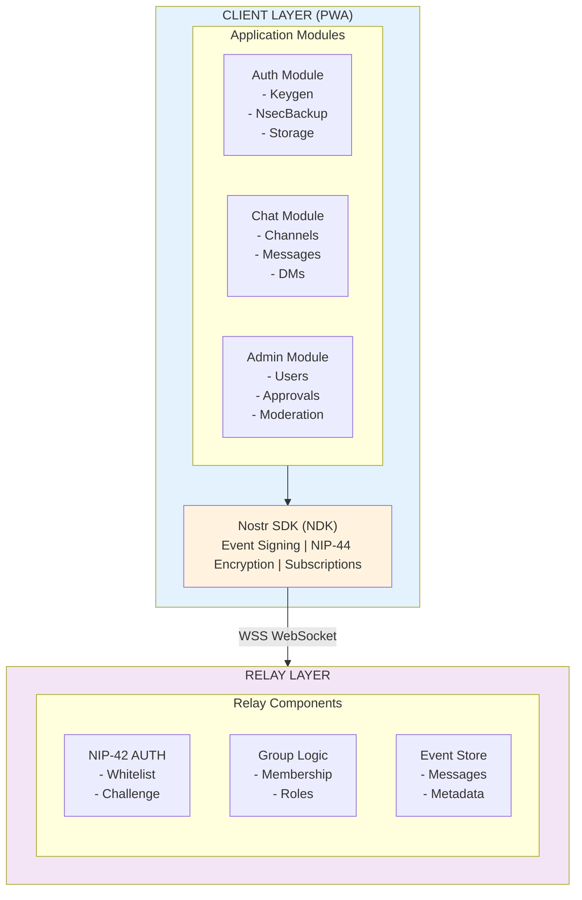
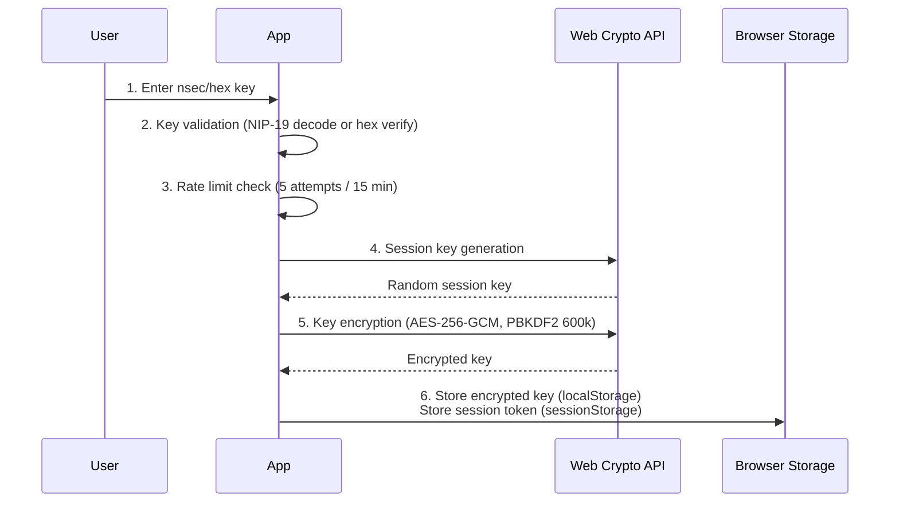
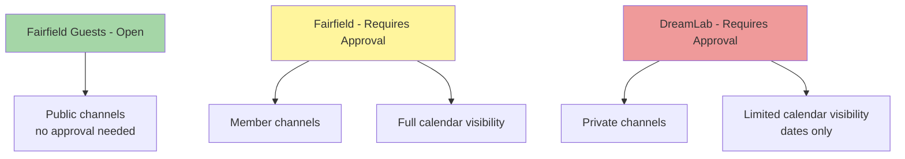
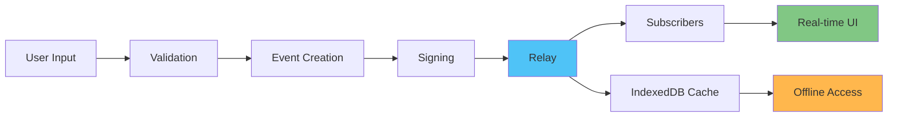
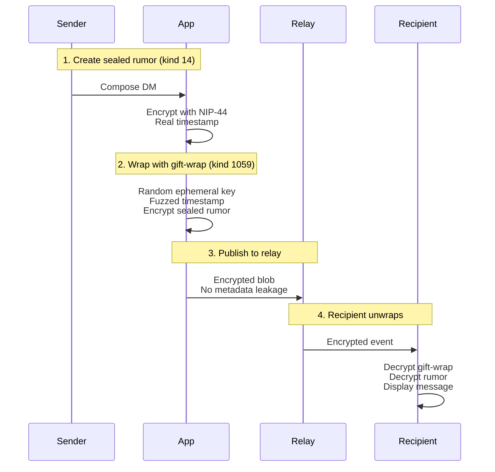

# Fairfield Architecture Overview

This document provides a high-level overview of the Fairfield application architecture. For detailed SPARC documentation, see the architecture files:
- [01-specification.md](./architecture/01-specification.md)
- [02-architecture.md](./architecture/02-architecture.md)
- [03-pseudocode.md](./architecture/03-pseudocode.md)
- [04-refinement.md](./architecture/04-refinement.md)
- [05-completion.md](./architecture/05-completion.md)

## System Architecture

Fairfield is a decentralized chat and community application built on the Nostr protocol with the following core components:



*Fairfield two-layer architecture: PWA client communicates with Nostr relay via WebSocket*

## Technology Stack

### Frontend

| Layer | Technology | Purpose |
|-------|------------|---------|
| Framework | SvelteKit | PWA with adapter-static |
| Nostr SDK | NDK (@nostr-dev-kit/ndk) | Event handling, subscriptions |
| Styling | Tailwind CSS | Utility-first CSS |
| Storage | IndexedDB (Dexie) | Offline message cache |
| Build | Vite | Development server, bundling |

### Backend / Relay

| Component | Technology | Purpose |
|-----------|------------|---------|
| Relay | Cloudflare Workers | WebSocket endpoint, edge deployment |
| Storage | Durable Objects | Persistent event storage |
| Backup | R2 Storage | Event snapshots |

## Nostr Protocol Integration

### Supported NIPs

| NIP | Purpose | Implementation |
|-----|---------|----------------|
| 01 | Basic protocol | Event creation, signing |
| 02 | Follow list | Contact management |
| 09 | Event deletion | Message removal |
| 11 | Relay info | Relay metadata |
| 17 | Private DMs | Gift-wrapped direct messages |
| 19 | Bech32 encoding | nsec/npub keys |
| 25 | Reactions | Message reactions |
| 28 | Public chat | Channel messages |
| 29 | Groups | NIP-29 group management |
| 42 | Authentication | Challenge-response auth |
| 44 | Encryption | NIP-44 ECDH encryption |
| 52 | Calendar | Event scheduling |
| 59 | Gift wrap | Metadata-protected DMs |

### Event Kinds Used

| Kind | NIP | Purpose |
|------|-----|---------|
| 0 | 01 | User profile metadata |
| 1 | 01 | Channel messages |
| 5 | 09 | Deletion requests |
| 9-12 | 29 | Group operations |
| 1059 | 59 | Gift-wrapped DMs |
| 9000-9005 | 29 | Group management |
| 30001 | 51 | Pin lists (whitelist) |
| 31922-31923 | 52 | Calendar events |

## Security Architecture

### Authentication



*Authentication flow with client-side key encryption*

### Key Security Features

| Feature | Implementation | Location |
|---------|----------------|----------|
| Key Encryption | AES-256-GCM | `src/lib/utils/key-encryption.ts` |
| Key Derivation | PBKDF2 (600k iterations) | `src/lib/utils/key-encryption.ts` |
| Rate Limiting | Token bucket + exponential backoff | `src/lib/utils/rateLimit.ts` |
| Input Validation | Regex + length limits | `src/lib/utils/validation.ts` |
| XSS Prevention | Svelte auto-escaping | Components |
| Admin Verification | Server-side relay API | `src/lib/nostr/whitelist.ts` |

## Access Control

### Cohort-Based Authorization

| Cohort | Access Level | Self-Assignable |
|--------|--------------|-----------------|
| `admin` | Full administrative access | No |
| `approved` | Standard member access | No |
| `business` | Business section access | No |
| `moomaa-tribe` | Community-specific access | No |

### Section Hierarchy



*Access hierarchy from public guest area to restricted DreamLab section*

## Data Flow

### Message Flow



*Message lifecycle from user input to real-time display and offline caching*

### DM Flow (NIP-17/59)



*Privacy-preserving direct message flow using NIP-17/59 gift wrapping*

## File Structure

```
src/
├── lib/
│   ├── nostr/           # Nostr protocol implementation
│   │   ├── keys.ts      # Key generation/validation
│   │   ├── encryption.ts# NIP-44 encryption
│   │   ├── dm.ts        # NIP-17/59 DMs
│   │   ├── groups.ts    # NIP-29 groups
│   │   ├── calendar.ts  # NIP-52 events
│   │   ├── whitelist.ts # Access control
│   │   └── admin-security.ts # Admin hardening
│   │
│   ├── stores/          # Svelte stores
│   │   ├── auth.ts      # Authentication state
│   │   ├── channels.ts  # Channel subscriptions
│   │   ├── messages.ts  # Message cache
│   │   └── session.ts   # Session management
│   │
│   ├── components/      # UI components
│   │   ├── auth/        # Authentication UI
│   │   ├── chat/        # Chat components
│   │   ├── dm/          # Direct message UI
│   │   ├── admin/       # Admin panel
│   │   └── events/      # Calendar UI
│   │
│   └── utils/           # Utilities
│       ├── validation.ts# Input validation
│       ├── rateLimit.ts # Rate limiting
│       └── key-encryption.ts # Crypto utilities
│
└── routes/              # SvelteKit routes
    ├── +page.svelte     # Landing page
    ├── chat/            # Chat routes
    ├── dm/              # DM routes
    ├── events/          # Calendar routes
    ├── admin/           # Admin routes
    └── signup/          # Onboarding
```

## Deployment

### Static Site Generation

```bash
# Build static site
npm run build

# Output: build/ directory
# Deploy: GitHub Pages, Cloudflare Pages, or any static host
```

### Environment Configuration

| Variable | Purpose |
|----------|---------|
| `VITE_RELAY_URL` | Nostr relay WebSocket URL |
| `VITE_ADMIN_PUBKEY` | Admin public key (hex) |
| `VITE_ADMIN_PUBKEYS` | Multiple admin keys (comma-separated) |

## Detailed Documentation

For comprehensive technical details, see:

| Document | Description |
|----------|-------------|
| [01-specification.md](./architecture/01-specification.md) | Requirements specification |
| [02-architecture.md](./architecture/02-architecture.md) | Detailed architecture design |
| [03-pseudocode.md](./architecture/03-pseudocode.md) | Implementation pseudocode |
| [04-refinement.md](./architecture/04-refinement.md) | Design refinements |
| [05-completion.md](./architecture/05-completion.md) | Completion checklist |

## Related Documentation

- [Authentication System](features/authentication.md) - Detailed auth flows
- [Admin Security](security/admin-security.md) - Admin hardening measures
- [User Guide](user-guide.md) - End-user documentation
- [Admin Guide](admin-guide.md) - Administrator documentation
- [Security Audit Report](security-audit-report.md) - Security findings

---

*Last updated: January 2025*
