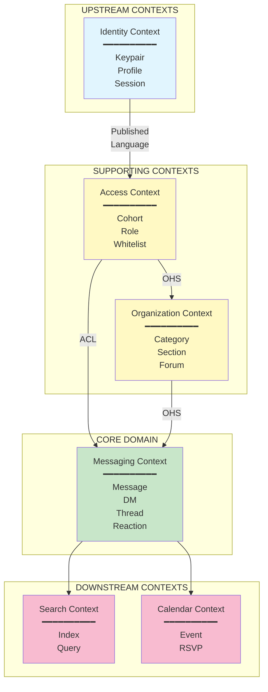

# Bounded Contexts

## Context Map



*Domain-Driven Design context map showing upstream identity, core messaging domain, and downstream contexts*

## Context Definitions

### 1. Identity Context

**Purpose**: Manage cryptographic identity and user profiles.

**Responsibilities**:
- Keypair generation and storage
- Profile metadata (NIP-01 kind 0)
- Session management
- NIP-07 extension integration

**Language**:
| Term | Definition |
|------|------------|
| Keypair | secp256k1 private/public key pair |
| Pubkey | 64-char hex public key |
| Npub | Bech32-encoded public key |
| Nsec | Bech32-encoded private key |
| Profile | NIP-01 kind 0 metadata |

**Integrations**:
- **Outbound**: Publishes `MemberIdentified` to Access Context
- **Technology**: nostr-tools, @scure/bip39

```typescript
// Identity Context Public API
interface IdentityService {
  generateKeypair(): Keypair;
  restoreFromMnemonic(mnemonic: string): Keypair;
  getProfile(pubkey: Pubkey): Promise<Profile>;
  updateProfile(profile: Profile): Promise<void>;
}
```

---

### 2. Access Context

**Purpose**: Control who can access what resources.

**Responsibilities**:
- Whitelist management
- Cohort membership
- Section role assignment
- Permission evaluation

**Language**:
| Term | Definition |
|------|------------|
| Cohort | Named group of members (e.g., "admin", "guests") |
| Role | Permission level within a section |
| Whitelist | PostgreSQL table of allowed pubkeys |
| Permission | Capability to perform an action |

**Integrations**:
- **Inbound**: Receives pubkey from Identity Context
- **Outbound**: Provides permissions to Organisation Context
- **Technology**: PostgreSQL, NIP-42

```typescript
// Access Context Public API
interface AccessService {
  checkWhitelist(pubkey: Pubkey): Promise<WhitelistEntry | null>;
  addToWhitelist(pubkey: Pubkey, cohorts: CohortId[]): Promise<void>;
  canAccess(pubkey: Pubkey, section: SectionId): Promise<boolean>;
  getPermissions(pubkey: Pubkey): Promise<UserPermissions>;
}
```

---

### 3. Organisation Context

**Purpose**: Structure the BBS hierarchy.

**Responsibilities**:
- Category/Section/Forum configuration
- Navigation structure
- Forum lifecycle management

**Language**:
| Term | Definition |
|------|------------|
| Category | Top-level grouping (UI only) |
| Section | Access-controlled container for forums |
| Forum | NIP-28 channel for messages |
| Channel | Synonym for Forum |

**Integrations**:
- **Inbound**: Permissions from Access Context
- **Outbound**: Structure to Messaging Context
- **Technology**: sections.yaml, NIP-28/29

```typescript
// Organisation Context Public API
interface OrganisationService {
  getCategories(): Category[];
  getSections(categoryId?: CategoryId): Section[];
  getForums(sectionId: SectionId): Forum[];
  createForum(sectionId: SectionId, name: string): Promise<Forum>;
}
```

---

### 4. Messaging Context (Core Domain)

**Purpose**: Handle all message exchange.

**Responsibilities**:
- Message posting and retrieval
- Thread management
- Direct messages (NIP-17)
- Reactions (NIP-25)
- Message deletion (NIP-09)

**Language**:
| Term | Definition |
|------|------------|
| Message | Nostr event in a forum channel |
| Thread | Chain of reply messages |
| DM | Encrypted direct message (NIP-17) |
| Reaction | Emoji response to message |
| Gift Wrap | NIP-59 privacy envelope |

**Integrations**:
- **Inbound**: Structure from Organisation, Identity from Identity
- **Outbound**: Content to Search Context
- **Technology**: NDK, NIP-01/17/25/28/44/59

```typescript
// Messaging Context Public API
interface MessagingService {
  postMessage(content: string, forumId: ChannelId): Promise<Message>;
  replyTo(content: string, parentId: EventId): Promise<Message>;
  sendDM(content: string, recipient: Pubkey): Promise<DirectMessage>;
  react(messageId: EventId, emoji: string): Promise<Reaction>;
  deleteMessage(messageId: EventId): Promise<void>;
}
```

---

### 5. Search Context

**Purpose**: Enable content discovery.

**Responsibilities**:
- HNSW index management
- Query embedding
- Result ranking
- WiFi-only sync

**Language**:
| Term | Definition |
|------|------------|
| Index | HNSW vector index |
| Embedding | 384-dim vector representation |
| Query | User search input |
| Result | Ranked list of event IDs |

**Integrations**:
- **Inbound**: Message content from Messaging Context
- **Technology**: WASM, HNSW, all-MiniLM-L6-v2

```typescript
// Search Context Public API
interface SearchService {
  initialize(): Promise<void>;
  search(query: string, limit?: number): Promise<SearchResult[]>;
  syncIndex(): Promise<void>;
  getIndexStatus(): IndexStatus;
}
```

---

### 6. Calendar Context

**Purpose**: Event scheduling for sections.

**Responsibilities**:
- Calendar event creation (NIP-52)
- RSVP management
- Event discovery

**Language**:
| Term | Definition |
|------|------------|
| CalendarEvent | Scheduled happening (NIP-52) |
| RSVP | Response to calendar event |
| DateEvent | All-day event (kind 31922) |
| TimeEvent | Specific time event (kind 31923) |

**Integrations**:
- **Inbound**: Section access from Access Context
- **Technology**: NIP-52

```typescript
// Calendar Context Public API
interface CalendarService {
  createEvent(event: CalendarEventInput): Promise<CalendarEvent>;
  getEvents(sectionId: SectionId): Promise<CalendarEvent[]>;
  rsvp(eventId: EventId, status: RSVPStatus): Promise<void>;
}
```

## Integration Patterns

### Anticorruption Layer (ACL)

Used between Access and Messaging contexts to translate permission models.

```typescript
// ACL: Translate whitelist entry to messaging permissions
class MessagingPermissionAdapter {
  constructor(private accessService: AccessService) {}

  async canPost(pubkey: Pubkey, forumId: ChannelId): Promise<boolean> {
    const section = await this.getSectionForForum(forumId);
    return this.accessService.canAccess(pubkey, section.id);
  }
}
```

### Open Host Service (OHS)

Organisation Context exposes structure via well-defined API.

```typescript
// OHS: Organisation Context public interface
const organisationApi = {
  '/categories': () => getCategories(),
  '/sections/:id': (id) => getSection(id),
  '/sections/:id/forums': (id) => getForums(id)
};
```

### Published Language

Identity Context publishes standard Nostr types.

```typescript
// Published Language: Standard Nostr types
export type { Pubkey, EventId, Signature, NostrEvent };
export { validateEvent, verifySignature };
```
