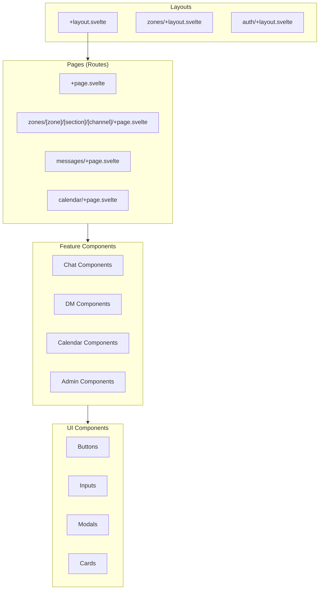
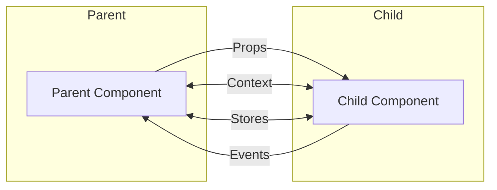

# Component Architecture

Frontend component structure and design patterns.

---

## Overview

The platform uses a component-based architecture with:

- **Atomic Design** — Components organised by complexity
- **Composition** — Complex UIs built from simple parts
- **Slots** — Flexible content projection
- **Stores** — Shared state management

---

## Component Hierarchy



---

## Atomic Design Levels

### Atoms (`$components/ui/`)

Basic building blocks:

```
ui/
├── Button.svelte
├── Input.svelte
├── Avatar.svelte
├── Badge.svelte
├── Icon.svelte
├── Spinner.svelte
└── Tooltip.svelte
```

**Example: Button Component**

```svelte
<!-- src/lib/components/ui/Button.svelte -->
<script lang="ts">
  import { createEventDispatcher } from 'svelte';

  export let variant: 'primary' | 'secondary' | 'ghost' | 'danger' = 'primary';
  export let size: 'sm' | 'md' | 'lg' = 'md';
  export let disabled = false;
  export let loading = false;
  export let type: 'button' | 'submit' | 'reset' = 'button';

  const dispatch = createEventDispatcher();
</script>

<button
  {type}
  {disabled}
  class="btn btn-{variant} btn-{size}"
  class:loading
  on:click
  on:click={() => dispatch('click')}
>
  {#if loading}
    <span class="spinner" />
  {/if}
  <slot />
</button>

<style>
  .btn {
    display: inline-flex;
    align-items: center;
    justify-content: center;
    gap: 0.5rem;
    font-weight: 500;
    border-radius: 0.5rem;
    transition: all 0.15s ease;
    cursor: pointer;
  }

  .btn-primary {
    background: var(--color-primary);
    color: white;
  }

  .btn-primary:hover:not(:disabled) {
    background: var(--color-primary-hover);
  }

  .btn-sm { padding: 0.25rem 0.75rem; font-size: 0.875rem; }
  .btn-md { padding: 0.5rem 1rem; }
  .btn-lg { padding: 0.75rem 1.5rem; font-size: 1.125rem; }

  .btn:disabled {
    opacity: 0.5;
    cursor: not-allowed;
  }

  .loading {
    pointer-events: none;
  }
</style>
```

### Molecules (`$components/chat/`, `$components/dm/`, etc.)

Combinations of atoms:

```svelte
<!-- src/lib/components/chat/MessageInput.svelte -->
<script lang="ts">
  import { createEventDispatcher } from 'svelte';
  import Button from '$components/ui/Button.svelte';
  import Icon from '$components/ui/Icon.svelte';

  export let placeholder = 'Type a message...';
  export let disabled = false;

  let content = '';
  const dispatch = createEventDispatcher<{ send: string }>();

  function handleSubmit() {
    if (content.trim()) {
      dispatch('send', content);
      content = '';
    }
  }

  function handleKeydown(e: KeyboardEvent) {
    if (e.key === 'Enter' && !e.shiftKey) {
      e.preventDefault();
      handleSubmit();
    }
  }
</script>

<form class="message-input" on:submit|preventDefault={handleSubmit}>
  <textarea
    bind:value={content}
    {placeholder}
    {disabled}
    rows="1"
    on:keydown={handleKeydown}
  />
  <Button type="submit" disabled={disabled || !content.trim()}>
    <Icon name="send" />
  </Button>
</form>
```

### Organisms (`$components/chat/MessageList.svelte`, etc.)

Complex, self-contained sections:

```svelte
<!-- src/lib/components/chat/MessageList.svelte -->
<script lang="ts">
  import { onMount, onDestroy } from 'svelte';
  import { channelMessages } from '$stores/messages';
  import { loadMessages, subscribeToChannel } from '$services/messaging';
  import MessageBubble from './MessageBubble.svelte';
  import MessageInput from './MessageInput.svelte';
  import LoadingSpinner from '$components/ui/Spinner.svelte';

  export let channelId: string;

  $: messages = channelMessages(channelId);

  let messagesEnd: HTMLElement;

  function scrollToBottom() {
    messagesEnd?.scrollIntoView({ behavior: 'smooth' });
  }

  $: if ($messages.length) scrollToBottom();

  onMount(() => {
    loadMessages(channelId);
    subscribeToChannel(channelId);
  });
</script>

<div class="message-list">
  <div class="messages-container">
    {#each $messages as message (message.id)}
      <MessageBubble {message} {channelId} />
    {/each}
    <div bind:this={messagesEnd} />
  </div>

  <MessageInput
    on:send={({ detail }) => sendMessage(channelId, detail)}
  />
</div>
```

### Templates (Layouts)

Page structure components:

```svelte
<!-- src/routes/+layout.svelte -->
<script lang="ts">
  import { page } from '$app/stores';
  import Navbar from '$components/layout/Navbar.svelte';
  import Sidebar from '$components/layout/Sidebar.svelte';
  import { auth } from '$stores/auth';
</script>

<div class="app-layout">
  <Navbar />

  <div class="main-content">
    {#if $auth.isAuthenticated}
      <Sidebar />
    {/if}

    <main>
      <slot />
    </main>
  </div>
</div>

<style>
  .app-layout {
    display: flex;
    flex-direction: column;
    min-height: 100vh;
  }

  .main-content {
    display: flex;
    flex: 1;
  }

  main {
    flex: 1;
    overflow-y: auto;
  }
</style>
```

---

## Component Patterns

### Props Interface Pattern

```typescript
// Define props interface for type safety
interface MessageBubbleProps {
  message: {
    id: string;
    content: string;
    pubkey: string;
    created_at: number;
  };
  channelId: string;
  showAvatar?: boolean;
  compact?: boolean;
}
```

### Event Dispatcher Pattern

```svelte
<script lang="ts">
  import { createEventDispatcher } from 'svelte';

  // Typed event dispatcher
  const dispatch = createEventDispatcher<{
    select: { id: string };
    delete: { id: string };
    edit: { id: string; content: string };
  }>();

  function handleSelect(id: string) {
    dispatch('select', { id });
  }
</script>
```

### Slot Pattern

```svelte
<!-- Card with named slots -->
<div class="card">
  <header class="card-header">
    <slot name="header">Default Header</slot>
  </header>

  <div class="card-body">
    <slot />
  </div>

  {#if $$slots.footer}
    <footer class="card-footer">
      <slot name="footer" />
    </footer>
  {/if}
</div>
```

**Usage:**

```svelte
<Card>
  <svelte:fragment slot="header">
    <h2>Custom Header</h2>
  </svelte:fragment>

  <p>Card content goes here</p>

  <svelte:fragment slot="footer">
    <Button>Action</Button>
  </svelte:fragment>
</Card>
```

### Context Pattern

```svelte
<!-- Parent component sets context -->
<script lang="ts">
  import { setContext } from 'svelte';
  import { writable } from 'svelte/store';

  const theme = writable('dark');
  setContext('theme', theme);
</script>

<!-- Child component uses context -->
<script lang="ts">
  import { getContext } from 'svelte';
  import type { Writable } from 'svelte/store';

  const theme = getContext<Writable<string>>('theme');
</script>

<div class="component" class:dark={$theme === 'dark'}>
  ...
</div>
```

### Action Pattern

```typescript
// src/lib/actions/clickOutside.ts
export function clickOutside(node: HTMLElement, callback: () => void) {
  function handleClick(event: MouseEvent) {
    if (!node.contains(event.target as Node)) {
      callback();
    }
  }

  document.addEventListener('click', handleClick, true);

  return {
    destroy() {
      document.removeEventListener('click', handleClick, true);
    }
  };
}
```

**Usage:**

```svelte
<script>
  import { clickOutside } from '$lib/actions/clickOutside';
  let open = false;
</script>

<div class="dropdown" use:clickOutside={() => open = false}>
  ...
</div>
```

---

## State Management

### Local State

For component-specific state:

```svelte
<script lang="ts">
  let count = 0;
  let items: string[] = [];
</script>
```

### Shared Stores

For cross-component state:

```typescript
// src/lib/stores/ui.ts
import { writable } from 'svelte/store';

export const sidebarOpen = writable(true);
export const activeModal = writable<string | null>(null);
export const toasts = writable<Toast[]>([]);
```

### Derived Stores

For computed values:

```typescript
import { derived } from 'svelte/store';
import { messages } from './messages';
import { auth } from './auth';

export const unreadCount = derived(
  [messages, auth],
  ([$messages, $auth]) => {
    return $messages.filter(m =>
      m.created_at > $auth.lastSeen &&
      m.pubkey !== $auth.pubkey
    ).length;
  }
);
```

---

## Component Communication



| Method | Direction | Use Case |
|--------|-----------|----------|
| **Props** | Parent → Child | Pass data down |
| **Events** | Child → Parent | Notify parent of actions |
| **Context** | Ancestor → Descendants | Share without prop drilling |
| **Stores** | Any → Any | Global state |

---

## Performance Patterns

### Lazy Loading

```svelte
<script lang="ts">
  import { onMount } from 'svelte';

  let AdminPanel: typeof import('./AdminPanel.svelte').default;

  onMount(async () => {
    const module = await import('./AdminPanel.svelte');
    AdminPanel = module.default;
  });
</script>

{#if AdminPanel}
  <svelte:component this={AdminPanel} />
{:else}
  <LoadingSpinner />
{/if}
```

### Virtual Scrolling

For long lists:

```svelte
<script lang="ts">
  import VirtualList from 'svelte-virtual-list-ce';
</script>

<VirtualList items={messages} let:item>
  <MessageBubble message={item} />
</VirtualList>
```

### Memoisation

```svelte
<script lang="ts">
  // Only recompute when dependencies change
  $: expensiveResult = computeExpensive(input);

  // Manual memoisation for functions
  const memoizedFn = (() => {
    const cache = new Map();
    return (key: string) => {
      if (!cache.has(key)) {
        cache.set(key, expensiveComputation(key));
      }
      return cache.get(key);
    };
  })();
</script>
```

---

## Testing Components

```typescript
// tests/unit/components/Button.test.ts
import { render, fireEvent, screen } from '@testing-library/svelte';
import { describe, it, expect, vi } from 'vitest';
import Button from '$components/ui/Button.svelte';

describe('Button', () => {
  it('renders with default props', () => {
    render(Button, { props: {} });
    expect(screen.getByRole('button')).toBeInTheDocument();
  });

  it('applies variant class', () => {
    render(Button, { props: { variant: 'danger' } });
    expect(screen.getByRole('button')).toHaveClass('btn-danger');
  });

  it('handles click events', async () => {
    const handleClick = vi.fn();
    const { component } = render(Button);
    component.$on('click', handleClick);

    await fireEvent.click(screen.getByRole('button'));
    expect(handleClick).toHaveBeenCalled();
  });

  it('shows loading state', () => {
    render(Button, { props: { loading: true } });
    expect(screen.getByRole('button')).toHaveClass('loading');
  });
});
```

---

## Related Documentation

- [Project Structure](../getting-started/project-structure.md) — File organisation
- [Data Flow](data-flow.md) — State management patterns
- [Code Style](../contributing/code-style.md) — Component conventions

---

[← Back to Developer Documentation](../index.md)
