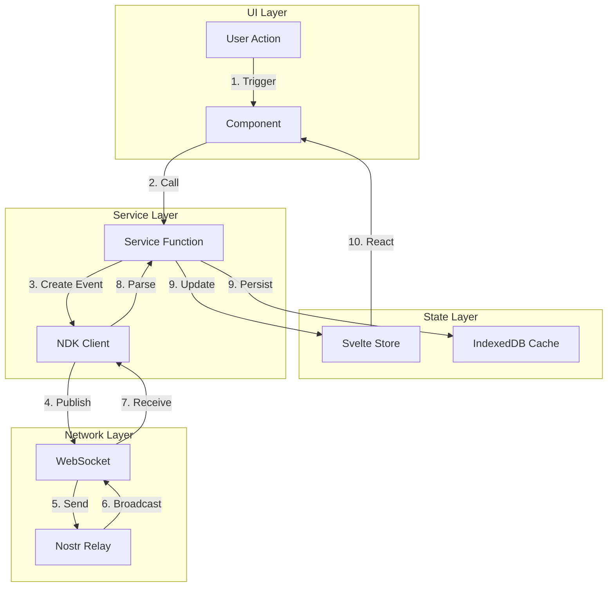
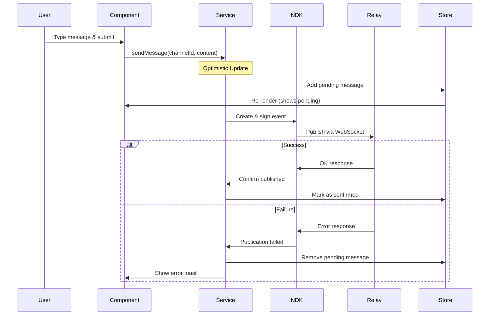
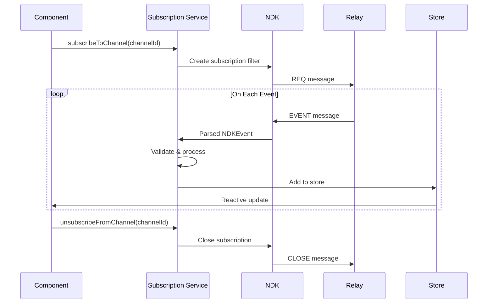
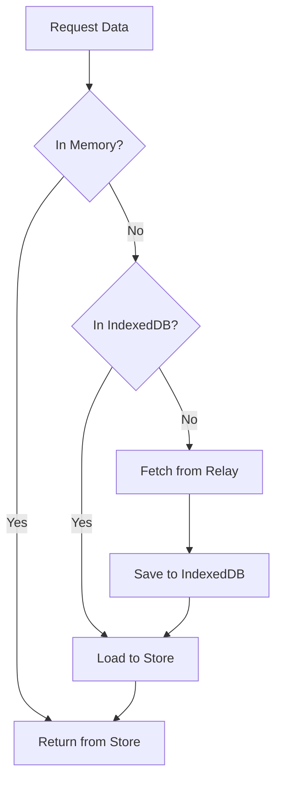
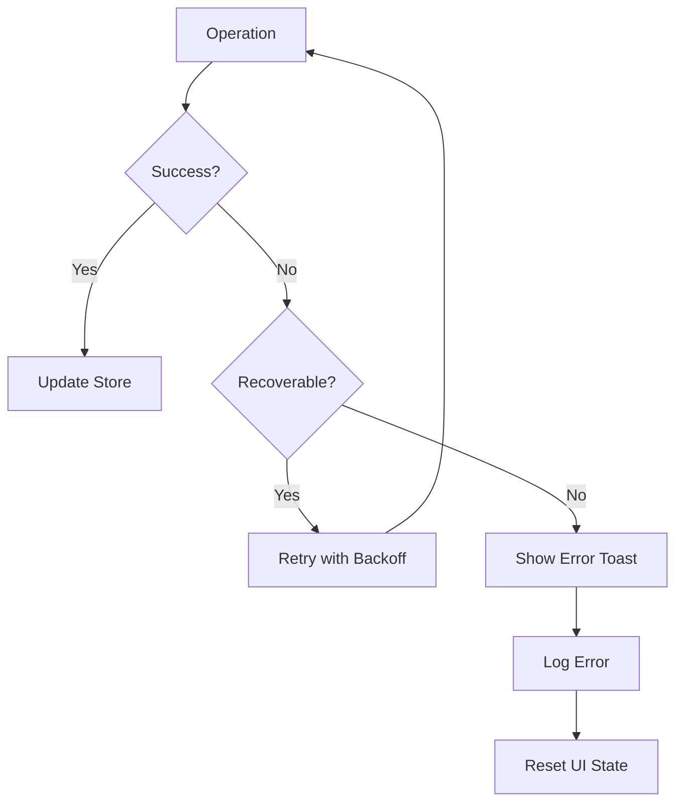

# Data Flow

Message lifecycle and state management patterns.

---

## Overview

Data flows through the application in predictable patterns:

1. **User Action** → UI Component
2. **UI Component** → Service Layer
3. **Service Layer** → NDK/Store
4. **NDK** → Relay (WebSocket)
5. **Store Update** → UI Re-render

---

## Data Flow Diagram



---

## Message Creation Flow

### Step-by-Step



### Code Implementation

```typescript
// src/lib/services/messaging/messages.ts
export async function sendMessage(
  channelId: string,
  content: string
): Promise<void> {
  const $ndk = get(ndk);
  const $auth = get(auth);

  if (!$ndk || !$auth.pubkey) {
    throw new Error('Not authenticated');
  }

  // 1. Create optimistic message
  const optimisticId = `pending-${Date.now()}`;
  const optimisticMessage = {
    id: optimisticId,
    content,
    pubkey: $auth.pubkey,
    created_at: Math.floor(Date.now() / 1000),
    pending: true
  };

  // 2. Add to store immediately
  messages.addMessage(channelId, optimisticMessage);

  try {
    // 3. Create and publish real event
    const event = new NDKEvent($ndk);
    event.kind = 9;
    event.content = content;
    event.tags = [['h', channelId]];

    await event.publish();

    // 4. Replace optimistic with real
    messages.replaceMessage(channelId, optimisticId, event);

    // 5. Cache to IndexedDB
    await cacheMessage(channelId, event);

  } catch (error) {
    // 6. Remove optimistic on failure
    messages.removeMessage(channelId, optimisticId);
    throw error;
  }
}
```

---

## Subscription Data Flow

### Real-time Updates



### Implementation

```typescript
// src/lib/services/messaging/subscriptions.ts
const subscriptions = new Map<string, NDKSubscription>();

export function subscribeToChannel(channelId: string): void {
  if (subscriptions.has(channelId)) return;

  const $ndk = get(ndk);
  if (!$ndk) return;

  const sub = $ndk.subscribe({
    kinds: [9, 5, 9005],
    '#h': [channelId],
    since: Math.floor(Date.now() / 1000)
  });

  sub.on('event', (event: NDKEvent) => {
    handleIncomingEvent(channelId, event);
  });

  sub.on('eose', () => {
    console.log(`Initial sync complete for ${channelId}`);
  });

  subscriptions.set(channelId, sub);
}

function handleIncomingEvent(channelId: string, event: NDKEvent): void {
  switch (event.kind) {
    case 9:
      // New message
      messages.addMessage(channelId, event);
      cacheMessage(channelId, event);
      break;

    case 5:
    case 9005:
      // Deletion
      const deletedId = event.tags.find(t => t[0] === 'e')?.[1];
      if (deletedId) {
        messages.removeMessage(channelId, deletedId);
        deleteCachedMessage(deletedId);
      }
      break;
  }
}
```

---

## Store Patterns

### Writable Store

```typescript
// Basic writable store
import { writable } from 'svelte/store';

interface UIState {
  sidebarOpen: boolean;
  activeModal: string | null;
}

export const ui = writable<UIState>({
  sidebarOpen: true,
  activeModal: null
});
```

### Custom Store with Methods

```typescript
// Store with encapsulated logic
function createMessagesStore() {
  const { subscribe, update } = writable<MessagesState>({
    messages: new Map(),
    loading: new Map()
  });

  return {
    subscribe,

    addMessage(channelId: string, message: Message) {
      update(state => {
        const channel = state.messages.get(channelId) || [];
        if (!channel.find(m => m.id === message.id)) {
          channel.push(message);
          channel.sort((a, b) => a.created_at - b.created_at);
          state.messages.set(channelId, channel);
        }
        return state;
      });
    },

    removeMessage(channelId: string, messageId: string) {
      update(state => {
        const channel = state.messages.get(channelId) || [];
        state.messages.set(
          channelId,
          channel.filter(m => m.id !== messageId)
        );
        return state;
      });
    },

    replaceMessage(channelId: string, oldId: string, newMessage: Message) {
      update(state => {
        const channel = state.messages.get(channelId) || [];
        const index = channel.findIndex(m => m.id === oldId);
        if (index >= 0) {
          channel[index] = newMessage;
          state.messages.set(channelId, channel);
        }
        return state;
      });
    }
  };
}

export const messages = createMessagesStore();
```

### Derived Store

```typescript
// Computed values from other stores
import { derived } from 'svelte/store';

export const channelMessages = (channelId: string) =>
  derived(messages, $messages =>
    $messages.messages.get(channelId) || []
  );

export const unreadCount = derived(
  [messages, auth, lastSeen],
  ([$messages, $auth, $lastSeen]) => {
    let count = 0;
    for (const [channelId, msgs] of $messages.messages) {
      count += msgs.filter(m =>
        m.created_at > ($lastSeen.get(channelId) || 0) &&
        m.pubkey !== $auth.pubkey
      ).length;
    }
    return count;
  }
);
```

---

## Caching Strategy

### Cache-First Pattern



### Implementation

```typescript
// src/lib/services/storage/cache.ts
export async function loadMessagesWithCache(
  channelId: string
): Promise<void> {
  // 1. Check if already in store
  const $messages = get(messages);
  if ($messages.messages.has(channelId)) {
    return;
  }

  // 2. Try IndexedDB cache
  const cached = await db.messages
    .where('channelId')
    .equals(channelId)
    .reverse()
    .limit(50)
    .toArray();

  if (cached.length > 0) {
    // 3. Populate store from cache
    cached.forEach(msg => messages.addMessage(channelId, msg));

    // 4. Fetch newer messages in background
    const newest = cached[0].created_at;
    fetchNewerMessages(channelId, newest);
  } else {
    // 5. Full fetch from relay
    await loadMessages(channelId);
  }
}

async function fetchNewerMessages(
  channelId: string,
  since: number
): Promise<void> {
  const $ndk = get(ndk);
  if (!$ndk) return;

  const events = await $ndk.fetchEvents({
    kinds: [9],
    '#h': [channelId],
    since
  });

  for (const event of events) {
    messages.addMessage(channelId, event);
    await cacheMessage(channelId, event);
  }
}
```

---

## Error Handling

### Error Flow



### Implementation

```typescript
// src/lib/services/error-handler.ts
import { toasts } from '$stores/toasts';

export async function withErrorHandling<T>(
  operation: () => Promise<T>,
  options: {
    retries?: number;
    onError?: (error: Error) => void;
    errorMessage?: string;
  } = {}
): Promise<T | null> {
  const { retries = 0, onError, errorMessage } = options;

  for (let attempt = 0; attempt <= retries; attempt++) {
    try {
      return await operation();
    } catch (error) {
      if (attempt === retries) {
        // Final attempt failed
        const message = errorMessage || 'Operation failed';
        toasts.add({ type: 'error', message });

        if (onError) {
          onError(error as Error);
        }

        console.error('Operation failed:', error);
        return null;
      }

      // Exponential backoff
      await sleep(Math.pow(2, attempt) * 1000);
    }
  }

  return null;
}

// Usage
await withErrorHandling(
  () => sendMessage(channelId, content),
  {
    retries: 2,
    errorMessage: 'Failed to send message',
    onError: () => messages.removeMessage(channelId, optimisticId)
  }
);
```

---

## Lifecycle Management

### Component Lifecycle

```svelte
<script lang="ts">
  import { onMount, onDestroy, beforeUpdate, afterUpdate } from 'svelte';

  let cleanup: (() => void)[] = [];

  onMount(() => {
    // Subscribe to data
    const unsub = subscribeToChannel(channelId);
    cleanup.push(unsub);

    // Set up event listeners
    window.addEventListener('focus', handleFocus);
    cleanup.push(() => window.removeEventListener('focus', handleFocus));

    return () => {
      // Cleanup on unmount
      cleanup.forEach(fn => fn());
    };
  });

  beforeUpdate(() => {
    // Before DOM updates
  });

  afterUpdate(() => {
    // After DOM updates
    scrollToBottom();
  });
</script>
```

### Store Lifecycle

```typescript
// Auto-cleanup subscriptions
import { onDestroy } from 'svelte';

export function useSubscription(channelId: string) {
  const unsub = subscribeToChannel(channelId);

  onDestroy(() => {
    unsubscribeFromChannel(channelId);
    unsub();
  });
}
```

---

## Related Documentation

- [System Architecture](index.md) — Overall system design
- [Component Architecture](components.md) — UI components
- [Messaging System](../features/messaging.md) — Message implementation

---

[← Back to Developer Documentation](../index.md)
