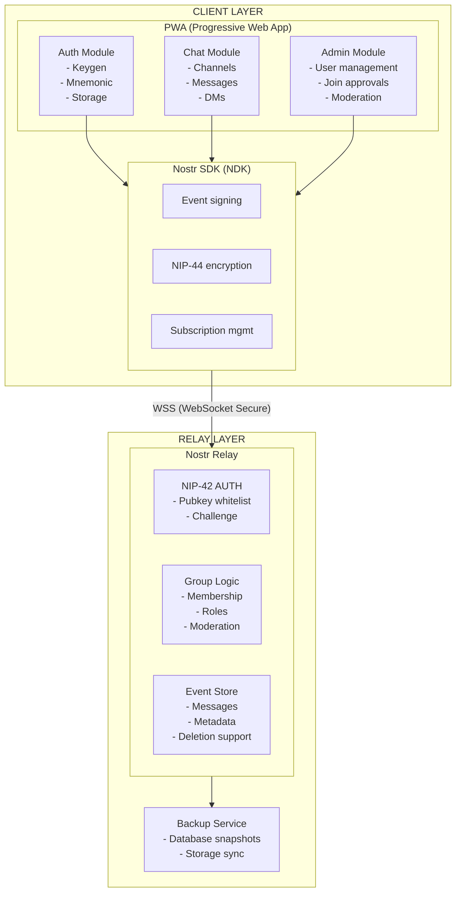
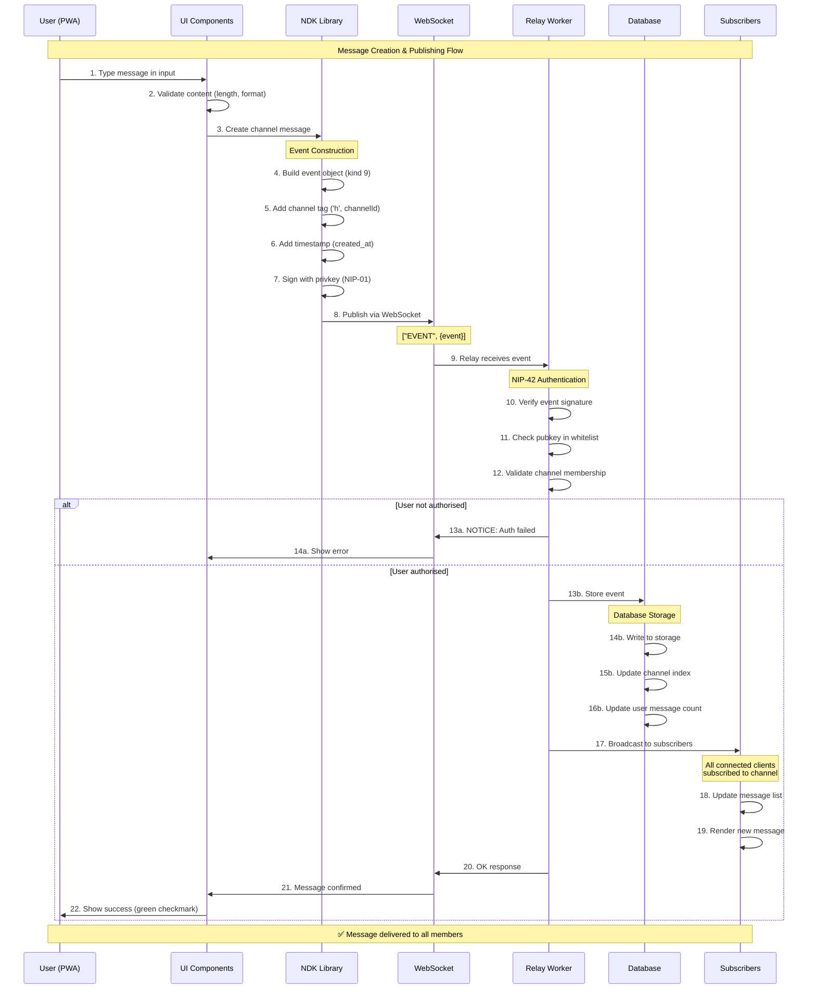
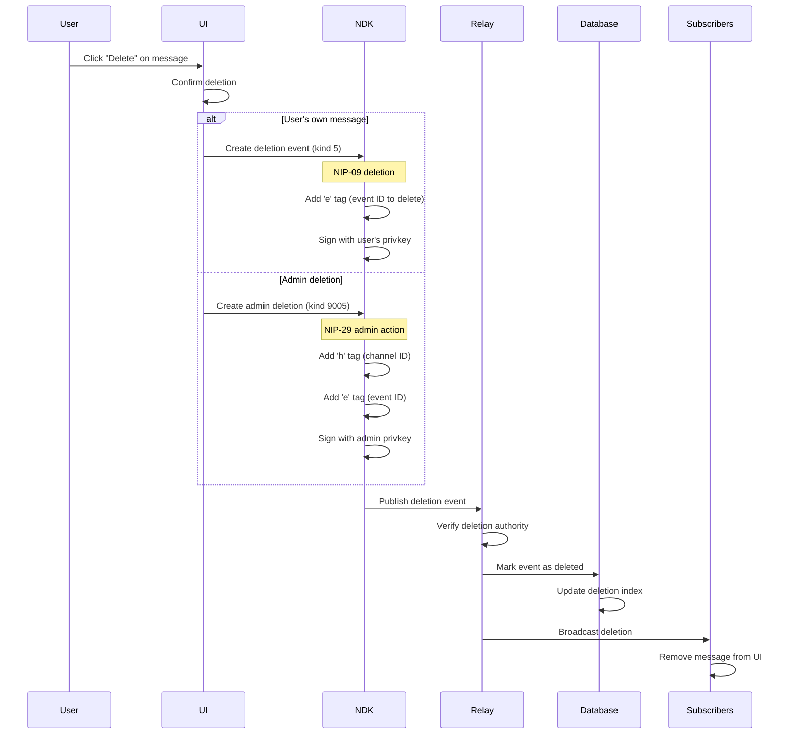
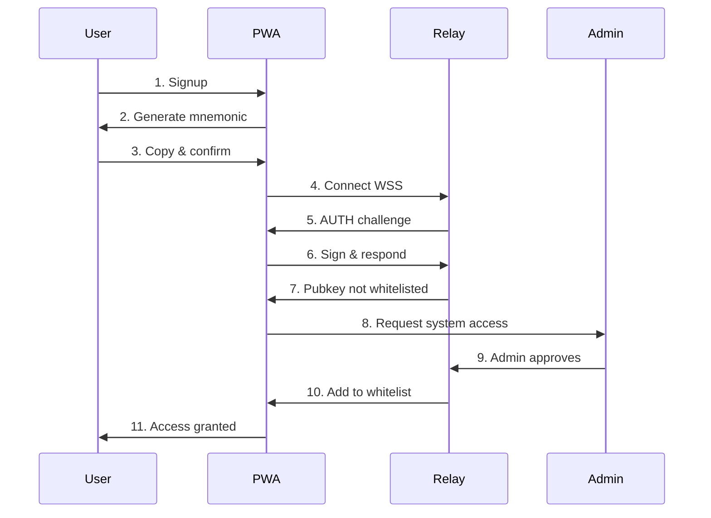
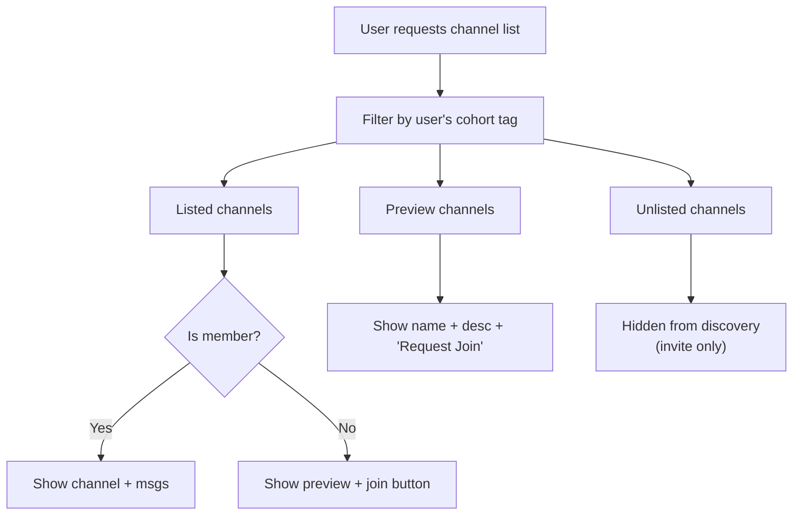
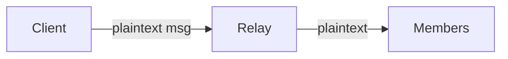
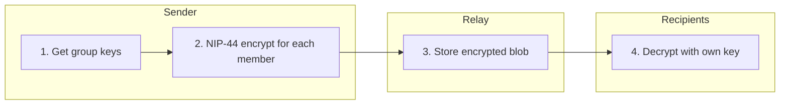
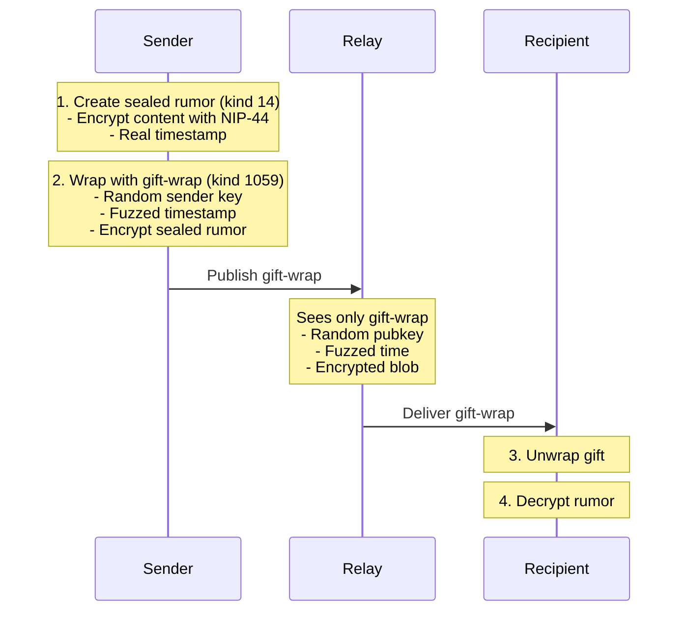
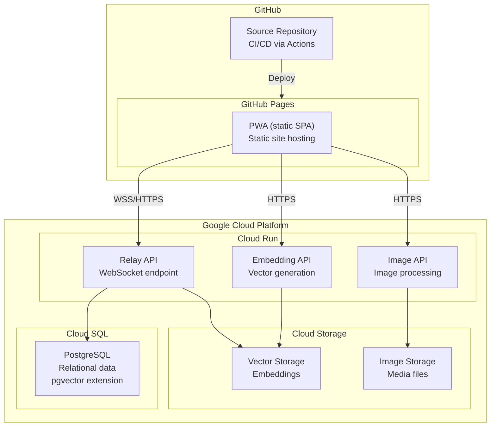

# System Architecture

Comprehensive overview of the platform's architecture, design decisions, and technical infrastructure.

---

## System Overview

The platform is a **Progressive Web Application (PWA)** built on the **Nostr protocol**, designed for community communication with strong privacy guarantees.



### Key Architectural Layers

| Layer | Responsibility | Technologies |
|-------|---------------|--------------|
| **Client** | User interface, local state, event creation | SvelteKit, NDK, IndexedDB |
| **Transport** | Secure WebSocket communication | WSS, NIP-42 AUTH |
| **Relay** | Event routing, storage, access control | Custom Nostr relay, PostgreSQL |
| **Infrastructure** | Hosting, CDN, monitoring | GitHub Pages, Cloud Run |

---

## Message Lifecycle

Understanding how messages flow through the system is essential for development and debugging.

### Complete Message Flow (Creation to Delivery)



### Message Flow Steps Explained

| Step | Layer | Description |
|------|-------|-------------|
| 1-3 | Client | User types message, UI validates, sends to NDK |
| 4-7 | NDK | Event creation: build, tag, timestamp, sign |
| 8-9 | Transport | WebSocket transmission to relay |
| 10-12 | Relay | NIP-42 AUTH: verify signature, whitelist, membership |
| 13-16 | Storage | Database: persist event, update indexes |
| 17-19 | Distribution | Broadcast to all channel subscribers |
| 20-22 | Confirmation | Relay confirms, UI shows success |

---

## Deletion Flow

The platform supports message deletion through NIP-09 (user deletion) and NIP-29 (admin deletion).



### Why Deletion Works

Because we operate a **private relay**, we can guarantee deletion:

| Public Nostr (Federated) | Private Relay |
|--------------------------|---------------|
| Message replicates to many relays | Message exists on one relay |
| Deletion request may be ignored | Deletion is enforced |
| No guarantee of removal | Complete removal guaranteed |
| Data can persist indefinitely | Data lifecycle controlled |

---

## Authentication Architecture

### Key-Based Identity

Users authenticate via cryptographic keys rather than passwords:



### Authentication Steps

1. **Key Generation** — BIP-39 mnemonic creates deterministic key pair
2. **Connection** — PWA connects to relay via secure WebSocket
3. **Challenge** — Relay issues NIP-42 authentication challenge
4. **Proof** — PWA signs challenge with private key
5. **Whitelist Check** — Relay verifies pubkey is authorised
6. **Session Established** — User gains access to their zones

---

## Channel Access Model

The platform uses a three-tier access model for channels:



### Channel Visibility Levels

| Level | Discovery | Access | Use Case |
|-------|-----------|--------|----------|
| **Listed** | Visible in channel list | Members can read/write | General channels |
| **Preview** | Visible with limited info | Request to join | Semi-private channels |
| **Unlisted** | Hidden from lists | Invite only | Private channels |

### Cohort-Based Filtering

Users are assigned cohorts that determine which zones they can access:

| Cohort | Zones | Purpose |
|--------|-------|---------|
| `moomaa-tribe` | Minimoonoir | Social community members |
| `business` | DreamLab | Business/creative members |
| `family` | Family | Family group members |
| `both` | Minimoonoir + DreamLab | Multi-zone members |

---

## Encryption Architecture

### Channel Messages

**Non-Encrypted Channels** (Public rooms, event channels):



- Relay can read content for moderation
- Simple, performant
- NIP-29 membership enforcement provides access control

**End-to-End Encrypted Channels** (Private rooms):



- Relay sees encrypted blob only
- O(n) encryption per message for n members
- Suitable for groups under 100 members

### Direct Messages (NIP-17 + NIP-59)

Private messages use "gift wrapping" for maximum privacy:



**What Gift Wrapping Protects:**

| Metadata | Protected? | How |
|----------|------------|-----|
| Message content | ✅ Yes | NIP-44 encryption |
| Sender identity | ✅ Yes | Random wrapper pubkey |
| Timestamp | ✅ Yes | Fuzzed/randomised |
| Recipient | ⚠️ Partially | Visible to relay (necessary for delivery) |

**Key Security Property:** Administrators cannot read DMs — they lack recipients' private keys.

---

## Deployment Architecture



### Infrastructure Components

| Component | Service | Purpose |
|-----------|---------|---------|
| **PWA Hosting** | GitHub Pages | Static site delivery |
| **Relay** | Cloud Run | WebSocket message handling |
| **Database** | Cloud SQL (PostgreSQL) | Event storage, user data |
| **Media Storage** | Cloud Storage | Images, files |
| **CI/CD** | GitHub Actions | Automated testing and deployment |

---

## Data Models

### Nostr Event Kinds Used

| Kind | NIP | Purpose |
|------|-----|---------|
| 0 | 01 | User metadata (profile) |
| 5 | 09 | Deletion request |
| 9 | 29 | Group chat message |
| 10 | 29 | Group metadata |
| 11 | 29 | Group admin list |
| 12 | 29 | Group members |
| 1059 | 59 | Gift-wrapped event (DMs) |
| 9000 | 29 | Group add user |
| 9001 | 29 | Group remove user |
| 9005 | 29 | Group delete event |
| 31922 | 52 | Calendar event (date-based) |
| 31923 | 52 | Calendar event (time-based) |
| 31925 | 52 | Calendar RSVP |

### Custom Tags

```typescript
// Cohort tag for zone filtering
interface CohortTag {
  tag: "cohort";
  values: ["business" | "moomaa-tribe" | "family" | "both"];
}

// Join request status
interface JoinRequestTag {
  tag: "join-request";
  values: [channelId: string, status: "pending" | "approved" | "rejected"];
}

// Channel visibility
interface VisibilityTag {
  tag: "visibility";
  values: ["listed" | "unlisted" | "preview"];
}
```

### Client-Side Storage (IndexedDB)

```typescript
interface LocalDatabase {
  // Cached messages for offline access
  messages: {
    id: string;           // Event ID
    channelId: string;
    pubkey: string;
    content: string;      // Decrypted content
    created_at: number;
    deleted: boolean;
  };

  // Channel metadata
  channels: {
    id: string;
    name: string;
    description: string;
    cohort: "business" | "moomaa-tribe" | "family" | "both";
    visibility: "listed" | "unlisted" | "preview";
    memberCount: number;
    isMember: boolean;
    isEncrypted: boolean;
  };

  // User's key material (encrypted)
  keys: {
    pubkey: string;
    encryptedPrivkey: string;  // Encrypted with PIN/passphrase
  };
}
```

---

## Performance Considerations

### Optimisations

| Area | Technique | Benefit |
|------|-----------|---------|
| **Subscriptions** | Filter by channel, limit count | Reduce bandwidth |
| **Caching** | IndexedDB message cache | Offline access, faster loads |
| **Rendering** | Virtual scrolling | Handle thousands of messages |
| **Connections** | Single WebSocket per relay | Reduce overhead |
| **Events** | Batch publishing | Fewer round trips |

### Scalability Limits

| Component | Practical Limit | Mitigation |
|-----------|-----------------|------------|
| E2E encrypted channels | ~100 members | Use non-encrypted for larger groups |
| Message history | ~10,000 per channel | Pagination, archiving |
| Concurrent connections | ~1,000 per relay | Horizontal scaling |
| Real-time subscriptions | ~50 per client | Aggregate subscriptions |

---

## Security Model

### Trust Boundaries

```
┌─────────────────────────────────────────────────────────┐
│  USER DEVICE (Trusted)                                  │
│  - Private keys                                         │
│  - Decrypted messages                                   │
│  - Local database                                       │
└───────────────────────────┬─────────────────────────────┘
                            │ WSS (Encrypted transport)
┌───────────────────────────▼─────────────────────────────┐
│  RELAY (Partially trusted)                              │
│  - Can see channel messages (non-E2E)                   │
│  - Cannot see DM content                                │
│  - Enforces access control                              │
└───────────────────────────┬─────────────────────────────┘
                            │
┌───────────────────────────▼─────────────────────────────┐
│  DATABASE (Untrusted for sensitive data)                │
│  - Stores encrypted DMs as opaque blobs                 │
│  - Stores plaintext channel messages                    │
│  - Indexes and metadata                                 │
└─────────────────────────────────────────────────────────┘
```

### Security Properties

| Property | Implementation |
|----------|----------------|
| **Authentication** | NIP-42 challenge-response with signing key |
| **Authorisation** | Pubkey whitelist + cohort membership |
| **Integrity** | Schnorr signatures on all events |
| **Confidentiality (DMs)** | NIP-44 ChaCha20-Poly1305 + NIP-59 gift wrap |
| **Forward secrecy** | Not implemented (key compromise exposes history) |

---

## Related Documentation

- [Component Architecture](components.md) — Frontend component structure
- [Data Flow](data-flow.md) — Detailed data flow patterns
- [NIP Protocol Reference](../reference/nip-protocol-reference.md) — Protocol specifications
- [Deployment Guide](../deployment/index.md) — Deployment instructions

---

[← Back to Developer Documentation](../index.md)
