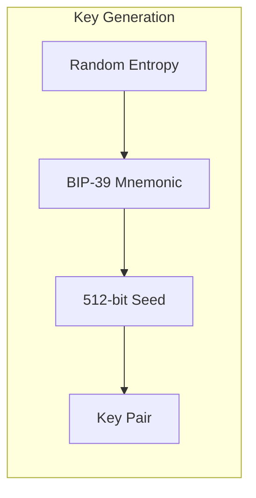
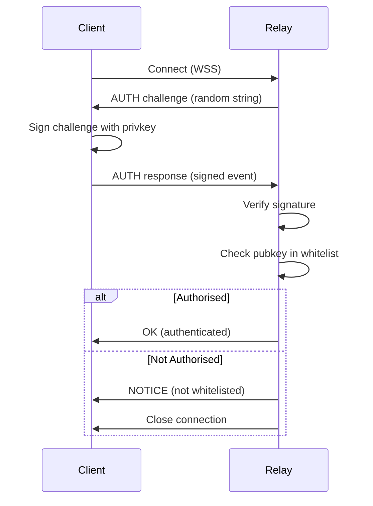
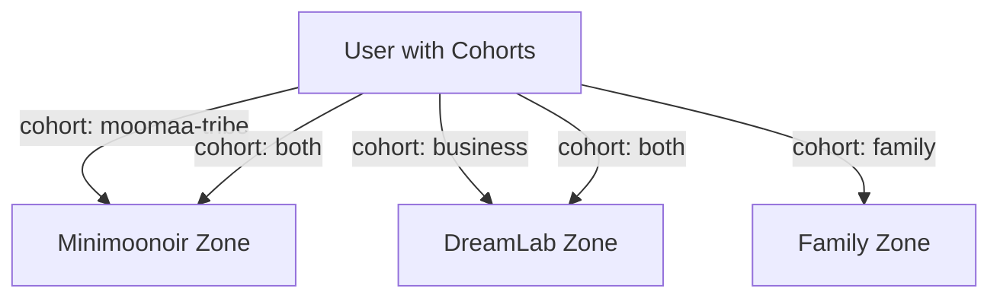
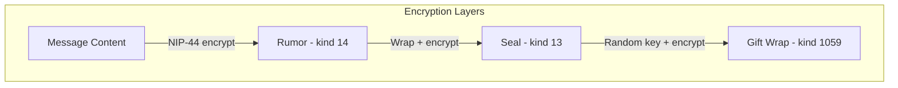

# Security Model

Authentication, encryption, and access control architecture.

---

## Overview

The platform implements multiple security layers:

1. **Identity** — Cryptographic key-based authentication
2. **Transport** — WebSocket Secure (WSS)
3. **Access Control** — Whitelist and cohort-based permissions
4. **Encryption** — End-to-end for private messages
5. **Integrity** — Schnorr signatures on all events

---

## Trust Model

```
┌─────────────────────────────────────────────────────────┐
│  USER DEVICE (Fully Trusted)                            │
│  ├── Private keys                                       │
│  ├── Decrypted messages                                 │
│  ├── Session data                                       │
│  └── Local database                                     │
└───────────────────────────┬─────────────────────────────┘
                            │ WSS (TLS 1.3)
┌───────────────────────────▼─────────────────────────────┐
│  RELAY (Partially Trusted)                              │
│  ├── Can read channel messages (non-E2E)               │
│  ├── Cannot read DM content (encrypted)                │
│  ├── Enforces access control                           │
│  └── May be compromised                                 │
└───────────────────────────┬─────────────────────────────┘
                            │
┌───────────────────────────▼─────────────────────────────┐
│  DATABASE (Untrusted for Sensitive Data)                │
│  ├── Stores encrypted DMs as opaque blobs              │
│  ├── Stores plaintext channel messages                 │
│  └── Indexes and metadata                              │
└─────────────────────────────────────────────────────────┘
```

---

## Authentication

### Key-Based Identity

Users authenticate via cryptographic key pairs, not passwords:



**Implementation:**

```typescript
// src/lib/services/auth/keygen.ts
import { generateMnemonic, mnemonicToSeed } from '@scure/bip39';
import { wordlist } from '@scure/bip39/wordlists/english';
import { HDKey } from '@scure/bip32';
import { bytesToHex } from '@noble/hashes/utils';

export function generateKeys(): {
  mnemonic: string;
  privkey: string;
  pubkey: string;
} {
  // 1. Generate BIP-39 mnemonic (12 words = 128 bits entropy)
  const mnemonic = generateMnemonic(wordlist, 128);

  // 2. Derive seed
  const seed = mnemonicToSeed(mnemonic);

  // 3. Derive key using NIP-06 path
  const hdKey = HDKey.fromMasterSeed(seed);
  const derived = hdKey.derive("m/44'/1237'/0'/0/0");

  const privkey = bytesToHex(derived.privateKey!);
  const pubkey = getPublicKey(privkey);

  return { mnemonic, privkey, pubkey };
}

export function recoverFromMnemonic(mnemonic: string): {
  privkey: string;
  pubkey: string;
} {
  const seed = mnemonicToSeed(mnemonic);
  const hdKey = HDKey.fromMasterSeed(seed);
  const derived = hdKey.derive("m/44'/1237'/0'/0/0");

  const privkey = bytesToHex(derived.privateKey!);
  const pubkey = getPublicKey(privkey);

  return { privkey, pubkey };
}
```

### NIP-42 Authentication Flow



**Implementation:**

```typescript
// src/lib/services/ndk/auth.ts
import type { NDKAuthPolicy } from '@nostr-dev-kit/ndk';

export const authPolicy: NDKAuthPolicy = async (relay, challenge) => {
  const $auth = get(auth);

  if (!$auth.privkey) {
    throw new Error('Not authenticated');
  }

  // Create NIP-42 auth event
  const event = {
    kind: 22242,
    created_at: Math.floor(Date.now() / 1000),
    tags: [
      ['relay', relay.url],
      ['challenge', challenge]
    ],
    content: ''
  };

  // Sign with user's key
  const signedEvent = finalizeEvent(event, $auth.privkey);

  return signedEvent;
};
```

---

## Access Control

### Whitelist Model

Only whitelisted public keys can access the relay:

```typescript
// Relay-side whitelist check (conceptual)
function isAuthorised(pubkey: string): boolean {
  // Check if pubkey is in whitelist
  return whitelist.has(pubkey);
}

function canAccessChannel(pubkey: string, channelId: string): boolean {
  // Check membership + cohort
  const user = users.get(pubkey);
  const channel = channels.get(channelId);

  if (!user || !channel) return false;

  // Check cohort match
  return user.cohorts.includes(channel.cohort);
}
```

### Cohort-Based Permissions



| Cohort | Zones Accessible |
|--------|------------------|
| `moomaa-tribe` | Minimoonoir |
| `business` | DreamLab |
| `family` | Family |
| `both` | Minimoonoir + DreamLab |

---

## Encryption

### Channel Messages (Non-E2E)

Standard channel messages are **not** end-to-end encrypted:

- Relay can read content for moderation
- Protected by NIP-42 authentication
- Access controlled by membership

### Private Messages (E2E)

DMs use NIP-17 + NIP-59 for full encryption:



**NIP-44 Encryption:**

```typescript
// Uses XChaCha20-Poly1305
import { nip44 } from 'nostr-tools';

function encryptMessage(
  plaintext: string,
  senderPrivkey: Uint8Array,
  recipientPubkey: string
): string {
  // Derive shared secret via ECDH
  const conversationKey = nip44.getConversationKey(
    senderPrivkey,
    recipientPubkey
  );

  // Encrypt with padding
  return nip44.encrypt(plaintext, conversationKey);
}
```

### Encryption Properties

| Property | Channel Messages | Private Messages |
|----------|------------------|------------------|
| **Content Encrypted** | No | Yes (NIP-44) |
| **Sender Hidden** | No | Yes (random wrapper) |
| **Timestamp Hidden** | No | Yes (randomised) |
| **Forward Secrecy** | N/A | No |
| **Relay Can Read** | Yes | No |

---

## Key Storage

### Client-Side Storage

```typescript
// src/lib/services/auth/storage.ts
import { openDB } from 'idb';

const DB_NAME = 'nostr-keys';
const STORE_NAME = 'keys';

export async function storeEncryptedKey(
  pubkey: string,
  encryptedPrivkey: string
): Promise<void> {
  const db = await openDB(DB_NAME, 1, {
    upgrade(db) {
      db.createObjectStore(STORE_NAME, { keyPath: 'pubkey' });
    }
  });

  await db.put(STORE_NAME, { pubkey, encryptedPrivkey });
}

export async function getEncryptedKey(pubkey: string): Promise<string | null> {
  const db = await openDB(DB_NAME, 1);
  const result = await db.get(STORE_NAME, pubkey);
  return result?.encryptedPrivkey || null;
}
```

### Key Encryption

```typescript
// Encrypt private key with user passphrase
export async function encryptPrivkey(
  privkey: string,
  passphrase: string
): Promise<string> {
  const encoder = new TextEncoder();
  const data = encoder.encode(privkey);

  // Derive key from passphrase
  const keyMaterial = await crypto.subtle.importKey(
    'raw',
    encoder.encode(passphrase),
    'PBKDF2',
    false,
    ['deriveBits', 'deriveKey']
  );

  const salt = crypto.getRandomValues(new Uint8Array(16));
  const iv = crypto.getRandomValues(new Uint8Array(12));

  const key = await crypto.subtle.deriveKey(
    { name: 'PBKDF2', salt, iterations: 100000, hash: 'SHA-256' },
    keyMaterial,
    { name: 'AES-GCM', length: 256 },
    false,
    ['encrypt']
  );

  const encrypted = await crypto.subtle.encrypt(
    { name: 'AES-GCM', iv },
    key,
    data
  );

  // Return salt + iv + ciphertext as base64
  return btoa(String.fromCharCode(
    ...salt, ...iv, ...new Uint8Array(encrypted)
  ));
}
```

---

## Event Integrity

### Schnorr Signatures

All Nostr events are signed with Schnorr signatures (BIP-340):

```typescript
interface SignedEvent {
  id: string;      // SHA256(serialised event)
  pubkey: string;  // Author's public key
  sig: string;     // Schnorr signature of id
  // ...
}
```

**Verification:**

```typescript
import { verifyEvent } from 'nostr-tools';

function isValidEvent(event: NostrEvent): boolean {
  // Verify signature matches pubkey and content
  return verifyEvent(event);
}
```

---

## Security Checklist

### Development

- [ ] Never log private keys
- [ ] Use secure random generation
- [ ] Validate all inputs
- [ ] Sanitise displayed content (XSS prevention)
- [ ] Implement CSRF protection

### Production

- [ ] HTTPS/WSS only
- [ ] Content Security Policy headers
- [ ] Rate limiting enabled
- [ ] CORS properly configured
- [ ] Security headers (HSTS, X-Frame-Options, etc.)

### User Data

- [ ] Private keys never leave device
- [ ] Session data encrypted at rest
- [ ] Clear sensitive data on logout
- [ ] Implement key rotation support

---

## Threat Model

| Threat | Mitigation |
|--------|------------|
| **Key Theft** | Encrypted storage, passphrase protection |
| **MITM Attack** | TLS 1.3, certificate pinning |
| **Relay Compromise** | E2E encryption for DMs |
| **Replay Attack** | Timestamp validation |
| **Impersonation** | Signature verification |
| **XSS** | Content sanitisation, CSP |
| **CSRF** | SameSite cookies, tokens |

---

## Related Documentation

- [NIP Protocol Reference](../reference/nip-protocol-reference.md) — NIP-42, NIP-44 specs
- [DM Implementation](../features/dm-implementation.md) — E2E encryption details
- [User Privacy Guide](../../user/safety/privacy.md) — User-facing privacy info

---

[← Back to Developer Documentation](../index.md)
