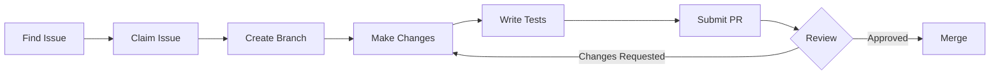

# Contributing Guide

How to contribute to the platform.

---

## Welcome

Thank you for your interest in contributing! This guide explains how to get involved.

---

## Ways to Contribute

### Code Contributions

- **Bug fixes** — Fix reported issues
- **Features** — Implement new functionality
- **Performance** — Optimisation improvements
- **Tests** — Increase test coverage

### Non-Code Contributions

- **Documentation** — Improve guides and references
- **Translations** — Help localise the platform
- **Bug reports** — Report issues with detail
- **Feature requests** — Suggest improvements
- **Code review** — Review pull requests

---

## Getting Started

### 1. Set Up Your Environment

Follow the [Development Setup](../getting-started/development-setup.md) guide.

### 2. Find an Issue

Look for issues labelled:
- `good first issue` — Suitable for newcomers
- `help wanted` — Ready for contribution
- `documentation` — Doc improvements needed

### 3. Claim the Issue

Comment on the issue to indicate you're working on it.

### 4. Make Your Changes

Follow our [Code Style](code-style.md) guidelines.

### 5. Submit a Pull Request

Follow our [Pull Request](pull-requests.md) process.

---

## Contribution Process



### Branch Naming

```
<type>/<short-description>

Examples:
- fix/message-timestamp-display
- feature/emoji-reactions
- docs/improve-setup-guide
- refactor/message-store
```

### Commit Messages

Use conventional commits:

```
<type>(<scope>): <description>

[optional body]

[optional footer]
```

**Types:**
- `feat` — New feature
- `fix` — Bug fix
- `docs` — Documentation
- `style` — Formatting
- `refactor` — Code restructuring
- `test` — Adding tests
- `chore` — Maintenance

**Example:**

```
fix(chat): correct message timestamp display

Use created_at (Nostr standard) instead of timestamp property.
Convert Unix timestamp to JavaScript Date.

Fixes #123
```

---

## Code of Conduct

### Our Standards

- Be respectful and inclusive
- Accept constructive criticism
- Focus on what's best for the community
- Show empathy towards others

### Unacceptable Behaviour

- Harassment or discrimination
- Trolling or insulting comments
- Personal or political attacks
- Publishing others' private information

### Enforcement

Violations may result in temporary or permanent bans from the project.

---

## Development Guidelines

### Code Quality

- Follow [Code Style](code-style.md) guidelines
- Write meaningful comments where needed
- Keep functions small and focused
- Use TypeScript types properly

### Testing

- Write tests for new features
- Ensure existing tests pass
- See [Testing Guide](testing.md)

### Documentation

- Update docs for user-facing changes
- Document new APIs
- Keep examples up to date

---

## Review Process

### What Reviewers Look For

1. **Correctness** — Does it work as intended?
2. **Code quality** — Is it maintainable?
3. **Tests** — Is it adequately tested?
4. **Documentation** — Is it documented?
5. **Security** — Are there vulnerabilities?

### Review Timeline

- Initial review within 2-3 working days
- Follow-up reviews within 1-2 days
- Simple changes may be merged quickly
- Complex changes may need multiple reviews

### Responding to Feedback

- Address all comments
- Ask clarifying questions if needed
- Update code as requested
- Re-request review when ready

---

## Communication

### Where to Ask Questions

- **GitHub Issues** — Bug reports, feature requests
- **GitHub Discussions** — Questions, ideas
- **Pull Request comments** — Code-specific questions
- **#development channel** — Real-time discussion

### Issue Templates

Use provided templates for:
- Bug reports
- Feature requests
- Documentation improvements

---

## Recognition

Contributors are recognised in:
- Release notes
- Contributors list
- Special thanks in documentation

---

## Related Documentation

- [Development Setup](../getting-started/development-setup.md) — Environment setup
- [Code Style](code-style.md) — Coding standards
- [Testing](testing.md) — Testing guidelines
- [Pull Requests](pull-requests.md) — PR process

---

[← Back to Developer Documentation](../index.md)
