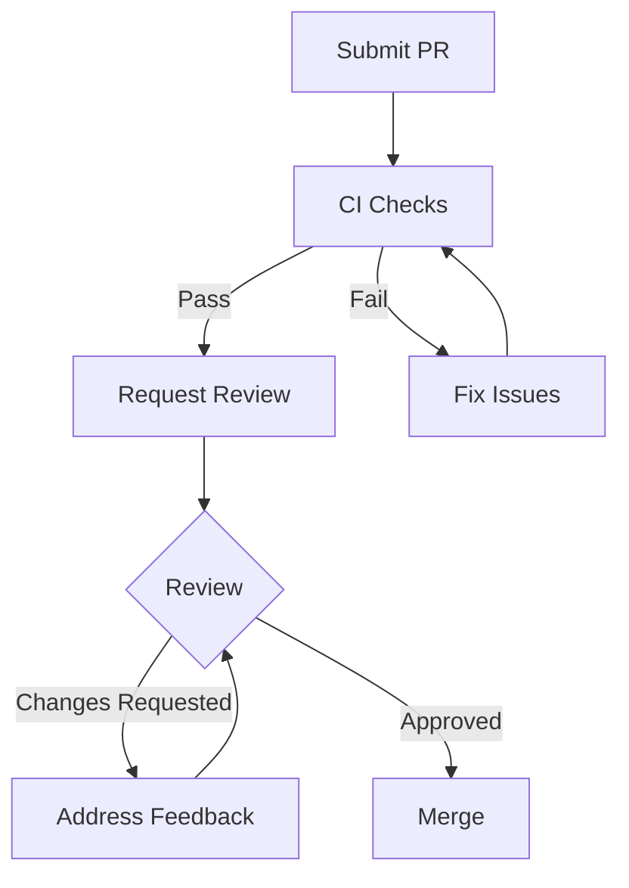

# Pull Request Guidelines

How to submit and review pull requests.

---

## Before You Submit

### Checklist

- [ ] Code follows [code style](code-style.md) guidelines
- [ ] Tests added/updated for changes
- [ ] All tests pass (`npm run test`)
- [ ] Type checking passes (`npm run check`)
- [ ] Linting passes (`npm run lint`)
- [ ] Documentation updated if needed
- [ ] Commit messages follow conventions

### Run All Checks

```bash
npm run check && npm run lint && npm run test
```

---

## Creating a Pull Request

### 1. Push Your Branch

```bash
git push -u origin feature/your-feature
```

### 2. Open PR on GitHub

Use the PR template:

```markdown
## Summary

Brief description of changes.

## Changes

- Change 1
- Change 2
- Change 3

## Testing

- [ ] Unit tests added
- [ ] Integration tests added
- [ ] Manual testing completed

## Screenshots

(If applicable)

## Related Issues

Fixes #123
```

### 3. Fill in Details

**Title format:**

```
<type>(<scope>): <description>

Examples:
- fix(chat): correct message timestamp display
- feat(calendar): add recurring events support
- docs(readme): update installation instructions
```

**Description should include:**

- What changes were made
- Why they were made
- How to test them
- Any breaking changes

---

## PR Size Guidelines

### Ideal PR Size

- **Small:** < 200 lines changed
- **Medium:** 200-500 lines changed
- **Large:** > 500 lines (try to split)

### When to Split PRs

Split if your PR:
- Touches multiple unrelated features
- Includes refactoring AND new features
- Has > 500 lines of changes
- Takes > 30 minutes to review

**Example split:**

Instead of one PR with:
1. Database schema changes
2. API changes
3. UI changes
4. Tests

Create three PRs:
1. PR 1: Database schema changes
2. PR 2: API changes (depends on PR 1)
3. PR 3: UI changes + tests (depends on PR 2)

---

## Review Process

### What Happens After Submission



### Timeline

- **Initial review:** 2-3 working days
- **Follow-up reviews:** 1-2 days
- **CI checks:** ~5-10 minutes

### CI Checks

Every PR runs:
1. **Lint** — Code style
2. **Type Check** — TypeScript
3. **Unit Tests** — Vitest
4. **Build** — Production build

All must pass before merge.

---

## Responding to Reviews

### Addressing Comments

```markdown
<!-- Acknowledge and explain -->
> Consider using a more descriptive variable name

Good point! Changed `x` to `messageCount` in abc123.

<!-- Ask for clarification -->
> This could be simplified

Could you elaborate? I tried X but it didn't handle Y case.

<!-- Respectfully disagree -->
> Use a different approach

I see the merit, but I chose this approach because [reason].
Happy to discuss further or change if you feel strongly.
```

### Making Changes

```bash
# Make changes
git add .
git commit -m "address review: improve variable naming"

# Push to update PR
git push
```

### Re-requesting Review

After addressing all comments, click "Re-request review" on GitHub.

---

## Merge Requirements

### Before Merge

- [ ] All CI checks pass
- [ ] At least one approval
- [ ] No unresolved conversations
- [ ] Branch is up to date with main

### Merge Strategy

We use **Squash and Merge**:
- All commits combined into one
- Clean history on main branch
- Original commits preserved in PR

### After Merge

- Delete your feature branch
- Close related issues
- Celebrate!

---

## PR Templates

### Feature PR

```markdown
## Summary

Add [feature] to enable [capability].

## Changes

- Added `NewComponent.svelte` for [purpose]
- Updated `service.ts` to support [feature]
- Added tests for new functionality

## Testing

- [x] Unit tests cover new code
- [x] Manual testing in development
- [ ] Tested on mobile viewport

## Screenshots

*[Screenshot of feature - add actual screenshot here]*

## Breaking Changes

None

## Related Issues

Implements #123
```

### Bug Fix PR

```markdown
## Summary

Fix [bug description] that caused [problem].

## Root Cause

[Explanation of what was wrong]

## Solution

[Explanation of the fix]

## Changes

- Fixed `function.ts` to handle [edge case]
- Added test to prevent regression

## Testing

- [x] Added test that reproduces bug
- [x] Test now passes with fix
- [x] Existing tests still pass

## Related Issues

Fixes #456
```

### Documentation PR

```markdown
## Summary

Update documentation for [topic].

## Changes

- Added section on [topic]
- Fixed broken links in [file]
- Updated examples in [file]

## Preview

[Link to preview if available]

## Related Issues

Addresses #789
```

---

## Common Issues

### CI Failing

```bash
# Check locally first
npm run check && npm run lint && npm run test

# Fix issues, then push
git add .
git commit -m "fix: resolve CI failures"
git push
```

### Merge Conflicts

```bash
# Update from main
git fetch origin
git rebase origin/main

# Resolve conflicts
# Edit conflicted files
git add .
git rebase --continue

# Force push (only to your branch!)
git push --force-with-lease
```

### Stale Branch

```bash
# Update and rebase
git fetch origin
git rebase origin/main
git push --force-with-lease
```

---

## Review Tips

### For Authors

- Keep PRs small and focused
- Write clear descriptions
- Respond to feedback promptly
- Be open to suggestions

### For Reviewers

- Review within 2-3 days
- Be constructive
- Explain the "why"
- Approve when ready

---

## Related Documentation

- [Code Style](code-style.md) — Coding standards
- [Testing](testing.md) — Testing guidelines
- [Contributing Guide](index.md) — Overall contribution process

---

[← Back to Developer Documentation](../index.md)
