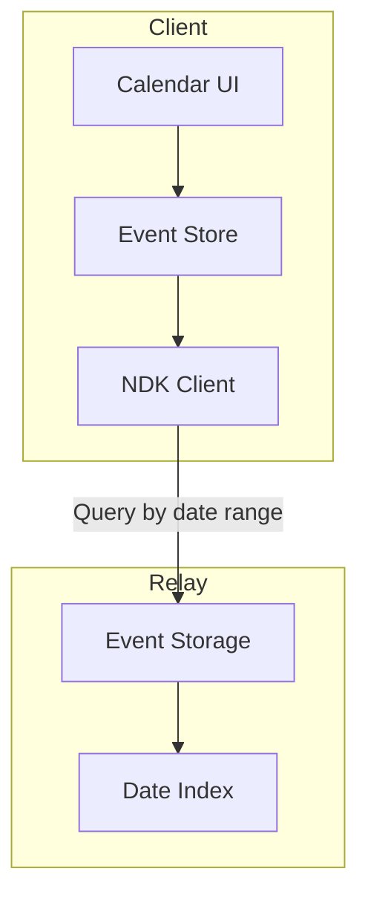

# Calendar & Events

Technical implementation of the calendar system using NIP-52.

---

## Overview

The calendar system implements NIP-52 (Calendar Events) providing:

- **Date-based events** — All-day events (kind 31922)
- **Time-based events** — Events with specific times (kind 31923)
- **RSVPs** — Attendance responses (kind 31925)
- **Recurring events** — Via RRULE support
- **Zone filtering** — Events filtered by cohort

---

## Event Kinds

### Date-Based Event (Kind 31922)

All-day events without specific times:

```typescript
interface DateBasedEvent {
  kind: 31922;
  content: string;  // Event description (markdown)
  tags: [
    ['d', '<unique-identifier>'],
    ['title', '<event-title>'],
    ['start', '<YYYY-MM-DD>'],
    ['end', '<YYYY-MM-DD>']?,        // Optional end date
    ['location', '<location>']?,
    ['g', '<geohash>']?,              // For location-based queries
    ['h', '<channel-id>']?,           // Associated channel
    ['cohort', '<cohort-tag>']?,      // Zone filtering
    ['t', '<hashtag>']?               // Categories/tags
  ];
}
```

### Time-Based Event (Kind 31923)

Events with specific start/end times:

```typescript
interface TimeBasedEvent {
  kind: 31923;
  content: string;  // Event description
  tags: [
    ['d', '<unique-identifier>'],
    ['title', '<event-title>'],
    ['start', '<unix-timestamp>'],
    ['end', '<unix-timestamp>']?,
    ['start_tzid', '<timezone>']?,    // e.g., 'Europe/London'
    ['end_tzid', '<timezone>']?,
    ['location', '<location>']?,
    ['g', '<geohash>']?,
    ['h', '<channel-id>']?,
    ['cohort', '<cohort-tag>']?,
    ['t', '<hashtag>']?
  ];
}
```

### RSVP (Kind 31925)

Attendance responses:

```typescript
interface RSVP {
  kind: 31925;
  content: string;  // Optional message
  tags: [
    ['d', '<event-d-tag>'],           // References the event
    ['a', '<kind>:<pubkey>:<d-tag>'], // Addressable reference
    ['status', 'accepted' | 'declined' | 'tentative'],
    ['L', 'status'],                  // Label namespace
    ['l', 'accepted', 'status']       // Label value
  ];
}
```

---

## Architecture



---

## Implementation

### Event Store

```typescript
// src/lib/stores/calendar.ts
import { writable, derived } from 'svelte/store';
import type { NDKEvent } from '@nostr-dev-kit/ndk';

interface CalendarEvent {
  id: string;
  dTag: string;
  title: string;
  description: string;
  start: Date;
  end?: Date;
  location?: string;
  timezone?: string;
  channelId?: string;
  cohort?: string;
  rsvps: Map<string, RSVPStatus>;
  pubkey: string;
}

type RSVPStatus = 'accepted' | 'declined' | 'tentative';

interface CalendarState {
  events: Map<string, CalendarEvent>;
  loading: boolean;
  viewDate: Date;
  viewMode: 'month' | 'week' | 'day';
}

function createCalendarStore() {
  const { subscribe, update, set } = writable<CalendarState>({
    events: new Map(),
    loading: false,
    viewDate: new Date(),
    viewMode: 'month'
  });

  return {
    subscribe,

    addEvent(event: CalendarEvent) {
      update(state => {
        state.events.set(event.dTag, event);
        return state;
      });
    },

    updateRSVP(eventDTag: string, pubkey: string, status: RSVPStatus) {
      update(state => {
        const event = state.events.get(eventDTag);
        if (event) {
          event.rsvps.set(pubkey, status);
        }
        return state;
      });
    },

    setViewDate(date: Date) {
      update(state => ({ ...state, viewDate: date }));
    },

    setViewMode(mode: 'month' | 'week' | 'day') {
      update(state => ({ ...state, viewMode: mode }));
    }
  };
}

export const calendar = createCalendarStore();

// Derived: events for current view
export const visibleEvents = derived(calendar, $cal => {
  const start = getViewStart($cal.viewDate, $cal.viewMode);
  const end = getViewEnd($cal.viewDate, $cal.viewMode);

  return Array.from($cal.events.values())
    .filter(e => e.start >= start && e.start <= end)
    .sort((a, b) => a.start.getTime() - b.start.getTime());
});
```

### Calendar Service

```typescript
// src/lib/services/calendar/events.ts
import { get } from 'svelte/store';
import { ndk } from '$stores/ndk';
import { calendar } from '$stores/calendar';
import type { NDKEvent, NDKFilter } from '@nostr-dev-kit/ndk';

export async function loadEvents(
  startDate: Date,
  endDate: Date,
  cohort?: string
): Promise<void> {
  const $ndk = get(ndk);
  if (!$ndk) return;

  calendar.setLoading(true);

  const filter: NDKFilter = {
    kinds: [31922, 31923],
    since: Math.floor(startDate.getTime() / 1000),
    until: Math.floor(endDate.getTime() / 1000)
  };

  if (cohort) {
    filter['#cohort'] = [cohort];
  }

  try {
    const events = await $ndk.fetchEvents(filter);

    for (const event of events) {
      const parsed = parseCalendarEvent(event);
      if (parsed) {
        calendar.addEvent(parsed);
        // Load RSVPs for this event
        await loadRSVPs(parsed.dTag);
      }
    }
  } finally {
    calendar.setLoading(false);
  }
}

function parseCalendarEvent(event: NDKEvent): CalendarEvent | null {
  const dTag = event.tags.find(t => t[0] === 'd')?.[1];
  const title = event.tags.find(t => t[0] === 'title')?.[1];
  const startTag = event.tags.find(t => t[0] === 'start')?.[1];

  if (!dTag || !title || !startTag) return null;

  const isDateBased = event.kind === 31922;
  const start = isDateBased
    ? new Date(startTag)  // YYYY-MM-DD
    : new Date(parseInt(startTag) * 1000);  // Unix timestamp

  const endTag = event.tags.find(t => t[0] === 'end')?.[1];
  const end = endTag
    ? (isDateBased ? new Date(endTag) : new Date(parseInt(endTag) * 1000))
    : undefined;

  return {
    id: event.id,
    dTag,
    title,
    description: event.content,
    start,
    end,
    location: event.tags.find(t => t[0] === 'location')?.[1],
    timezone: event.tags.find(t => t[0] === 'start_tzid')?.[1],
    channelId: event.tags.find(t => t[0] === 'h')?.[1],
    cohort: event.tags.find(t => t[0] === 'cohort')?.[1],
    rsvps: new Map(),
    pubkey: event.pubkey
  };
}

export async function createEvent(
  eventData: Omit<CalendarEvent, 'id' | 'rsvps' | 'pubkey'>
): Promise<string> {
  const $ndk = get(ndk);
  if (!$ndk) throw new Error('Not connected');

  const isDateBased = !eventData.timezone;
  const event = new NDKEvent($ndk);

  event.kind = isDateBased ? 31922 : 31923;
  event.content = eventData.description;
  event.tags = [
    ['d', eventData.dTag],
    ['title', eventData.title],
    ['start', isDateBased
      ? formatDate(eventData.start)
      : String(Math.floor(eventData.start.getTime() / 1000))
    ]
  ];

  if (eventData.end) {
    event.tags.push(['end', isDateBased
      ? formatDate(eventData.end)
      : String(Math.floor(eventData.end.getTime() / 1000))
    ]);
  }

  if (eventData.location) {
    event.tags.push(['location', eventData.location]);
  }

  if (eventData.timezone) {
    event.tags.push(['start_tzid', eventData.timezone]);
  }

  if (eventData.channelId) {
    event.tags.push(['h', eventData.channelId]);
  }

  if (eventData.cohort) {
    event.tags.push(['cohort', eventData.cohort]);
  }

  await event.publish();
  return event.id;
}

function formatDate(date: Date): string {
  return date.toISOString().split('T')[0];
}
```

### RSVP Service

```typescript
// src/lib/services/calendar/rsvp.ts
import { get } from 'svelte/store';
import { ndk } from '$stores/ndk';
import { auth } from '$stores/auth';
import { calendar } from '$stores/calendar';

type RSVPStatus = 'accepted' | 'declined' | 'tentative';

export async function loadRSVPs(eventDTag: string): Promise<void> {
  const $ndk = get(ndk);
  if (!$ndk) return;

  const events = await $ndk.fetchEvents({
    kinds: [31925],
    '#d': [eventDTag]
  });

  for (const event of events) {
    const status = event.tags.find(t => t[0] === 'status')?.[1] as RSVPStatus;
    if (status) {
      calendar.updateRSVP(eventDTag, event.pubkey, status);
    }
  }
}

export async function submitRSVP(
  eventDTag: string,
  eventRef: string,  // kind:pubkey:d-tag
  status: RSVPStatus,
  message?: string
): Promise<void> {
  const $ndk = get(ndk);
  const $auth = get(auth);

  if (!$ndk || !$auth.pubkey) {
    throw new Error('Not authenticated');
  }

  const event = new NDKEvent($ndk);
  event.kind = 31925;
  event.content = message || '';
  event.tags = [
    ['d', eventDTag],
    ['a', eventRef],
    ['status', status],
    ['L', 'status'],
    ['l', status, 'status']
  ];

  await event.publish();
  calendar.updateRSVP(eventDTag, $auth.pubkey, status);
}
```

---

## UI Components

### Calendar Grid

```svelte
<!-- src/lib/components/calendar/CalendarGrid.svelte -->
<script lang="ts">
  import { calendar, visibleEvents } from '$stores/calendar';
  import EventCard from './EventCard.svelte';
  import {
    startOfMonth,
    endOfMonth,
    eachDayOfInterval,
    isSameDay,
    format
  } from 'date-fns';

  $: monthDays = eachDayOfInterval({
    start: startOfMonth($calendar.viewDate),
    end: endOfMonth($calendar.viewDate)
  });

  function eventsForDay(day: Date) {
    return $visibleEvents.filter(e => isSameDay(e.start, day));
  }
</script>

<div class="calendar-grid">
  <header class="calendar-header">
    <button on:click={() => calendar.setViewDate(subMonths($calendar.viewDate, 1))}>
      &larr;
    </button>
    <h2>{format($calendar.viewDate, 'MMMM yyyy')}</h2>
    <button on:click={() => calendar.setViewDate(addMonths($calendar.viewDate, 1))}>
      &rarr;
    </button>
  </header>

  <div class="weekday-headers">
    {#each ['Mon', 'Tue', 'Wed', 'Thu', 'Fri', 'Sat', 'Sun'] as day}
      <div class="weekday">{day}</div>
    {/each}
  </div>

  <div class="days-grid">
    {#each monthDays as day}
      <div class="day-cell" class:today={isSameDay(day, new Date())}>
        <span class="day-number">{format(day, 'd')}</span>
        <div class="day-events">
          {#each eventsForDay(day) as event}
            <EventCard {event} compact />
          {/each}
        </div>
      </div>
    {/each}
  </div>
</div>

<style>
  .calendar-grid {
    display: flex;
    flex-direction: column;
    gap: 1rem;
  }

  .days-grid {
    display: grid;
    grid-template-columns: repeat(7, 1fr);
    gap: 1px;
    background: var(--border-color);
  }

  .day-cell {
    min-height: 100px;
    padding: 0.5rem;
    background: var(--bg-primary);
  }

  .day-cell.today {
    background: var(--bg-highlight);
  }
</style>
```

### Event Modal

```svelte
<!-- src/lib/components/calendar/EventModal.svelte -->
<script lang="ts">
  import { createEvent } from '$services/calendar/events';
  import Modal from '$components/ui/Modal.svelte';
  import Input from '$components/ui/Input.svelte';
  import Button from '$components/ui/Button.svelte';

  export let open = false;
  export let onClose: () => void;
  export let initialDate: Date | null = null;

  let title = '';
  let description = '';
  let date = initialDate?.toISOString().split('T')[0] || '';
  let time = '';
  let location = '';
  let isAllDay = true;

  async function handleSubmit() {
    const dTag = `${Date.now()}-${Math.random().toString(36).slice(2)}`;

    await createEvent({
      dTag,
      title,
      description,
      start: isAllDay ? new Date(date) : new Date(`${date}T${time}`),
      location: location || undefined,
      timezone: isAllDay ? undefined : Intl.DateTimeFormat().resolvedOptions().timeZone
    });

    onClose();
  }
</script>

<Modal {open} {onClose} title="Create Event">
  <form on:submit|preventDefault={handleSubmit}>
    <Input label="Title" bind:value={title} required />

    <div class="form-row">
      <Input type="date" label="Date" bind:value={date} required />
      {#if !isAllDay}
        <Input type="time" label="Time" bind:value={time} required />
      {/if}
    </div>

    <label class="checkbox">
      <input type="checkbox" bind:checked={isAllDay} />
      All day event
    </label>

    <Input label="Location" bind:value={location} />

    <textarea
      placeholder="Description (optional)"
      bind:value={description}
    ></textarea>

    <div class="actions">
      <Button type="button" variant="secondary" on:click={onClose}>
        Cancel
      </Button>
      <Button type="submit" variant="primary">
        Create Event
      </Button>
    </div>
  </form>
</Modal>
```

---

## Timezone Handling

```typescript
// src/lib/utils/timezone.ts
import { formatInTimeZone, zonedTimeToUtc } from 'date-fns-tz';

export function formatEventTime(
  timestamp: number,
  timezone?: string
): string {
  const date = new Date(timestamp * 1000);
  const tz = timezone || Intl.DateTimeFormat().resolvedOptions().timeZone;

  return formatInTimeZone(date, tz, 'HH:mm');
}

export function parseLocalTime(
  dateStr: string,
  timeStr: string,
  timezone: string
): number {
  const localDate = new Date(`${dateStr}T${timeStr}`);
  const utcDate = zonedTimeToUtc(localDate, timezone);
  return Math.floor(utcDate.getTime() / 1000);
}

export function getUserTimezone(): string {
  return Intl.DateTimeFormat().resolvedOptions().timeZone;
}
```

---

## Related Documentation

- [NIP Protocol Reference](../reference/nip-protocol-reference.md) — NIP-52 specification
- [Messaging System](messaging.md) — Event-channel integration
- [User Calendar Guide](../../user/features/calendar.md) — User documentation

---

[← Back to Developer Documentation](../index.md)
