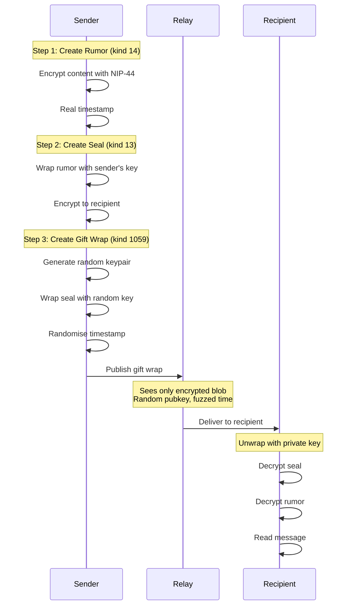

# Private Messages Implementation

Technical implementation of end-to-end encrypted direct messages using NIP-17 and NIP-59.

---

## Overview

Private messages use a two-layer encryption scheme:

1. **NIP-17** — Private Direct Messages (sealed rumor)
2. **NIP-59** — Gift Wrap (outer encryption layer)

This provides:
- **Content encryption** — Message text is encrypted
- **Sender anonymity** — Wrapper uses random key
- **Timestamp obfuscation** — Randomised timestamps
- **Metadata protection** — Relay sees only encrypted blobs

---

## Architecture



---

## Event Structure

### Rumor (Kind 14)

The actual message content (never published directly):

```typescript
interface Rumor {
  kind: 14;
  content: string;  // Encrypted message text
  tags: [
    ['p', '<recipient-pubkey>']
  ];
  created_at: number;  // Real timestamp
  pubkey: string;      // Sender's real pubkey
  // No id or sig - this is unsigned
}
```

### Seal (Kind 13)

Wraps the rumor (never published directly):

```typescript
interface Seal {
  kind: 13;
  content: string;  // NIP-44 encrypted rumor JSON
  tags: [];
  created_at: number;  // Random timestamp (±2 days)
  pubkey: string;      // Sender's real pubkey
  id: string;
  sig: string;
}
```

### Gift Wrap (Kind 1059)

The published event:

```typescript
interface GiftWrap {
  kind: 1059;
  content: string;  // NIP-44 encrypted seal JSON
  tags: [
    ['p', '<recipient-pubkey>']  // Required for delivery
  ];
  created_at: number;  // Random timestamp (±2 days)
  pubkey: string;      // Random throwaway pubkey
  id: string;
  sig: string;         // Signed by random key
}
```

---

## Implementation

### Encryption Service

```typescript
// src/lib/services/messaging/encryption.ts
import { nip44 } from 'nostr-tools';
import { generateSecretKey, getPublicKey } from 'nostr-tools';

/**
 * Encrypt content using NIP-44 (ChaCha20-Poly1305)
 */
export function encrypt(
  plaintext: string,
  senderPrivkey: Uint8Array,
  recipientPubkey: string
): string {
  const conversationKey = nip44.getConversationKey(
    senderPrivkey,
    recipientPubkey
  );
  return nip44.encrypt(plaintext, conversationKey);
}

/**
 * Decrypt content using NIP-44
 */
export function decrypt(
  ciphertext: string,
  recipientPrivkey: Uint8Array,
  senderPubkey: string
): string {
  const conversationKey = nip44.getConversationKey(
    recipientPrivkey,
    senderPubkey
  );
  return nip44.decrypt(ciphertext, conversationKey);
}

/**
 * Generate a random timestamp within ±2 days
 */
export function randomiseTimestamp(baseTime: number): number {
  const twoDays = 2 * 24 * 60 * 60;
  const offset = Math.floor(Math.random() * twoDays * 2) - twoDays;
  return baseTime + offset;
}
```

### Gift Wrap Creation

```typescript
// src/lib/services/messaging/dm.ts
import { generateSecretKey, getPublicKey, finalizeEvent } from 'nostr-tools';
import { encrypt, randomiseTimestamp } from './encryption';

interface SendDMOptions {
  content: string;
  recipientPubkey: string;
  senderPrivkey: Uint8Array;
}

export async function createGiftWrap(
  options: SendDMOptions
): Promise<Event> {
  const { content, recipientPubkey, senderPrivkey } = options;
  const senderPubkey = getPublicKey(senderPrivkey);
  const now = Math.floor(Date.now() / 1000);

  // Step 1: Create rumor (unsigned)
  const rumor = {
    kind: 14,
    content,
    tags: [['p', recipientPubkey]],
    created_at: now,
    pubkey: senderPubkey
  };

  // Step 2: Create seal
  const sealContent = encrypt(
    JSON.stringify(rumor),
    senderPrivkey,
    recipientPubkey
  );

  const seal = finalizeEvent({
    kind: 13,
    content: sealContent,
    tags: [],
    created_at: randomiseTimestamp(now)
  }, senderPrivkey);

  // Step 3: Create gift wrap with random key
  const wrapperPrivkey = generateSecretKey();
  const wrapperPubkey = getPublicKey(wrapperPrivkey);

  const wrapContent = encrypt(
    JSON.stringify(seal),
    wrapperPrivkey,
    recipientPubkey
  );

  const giftWrap = finalizeEvent({
    kind: 1059,
    content: wrapContent,
    tags: [['p', recipientPubkey]],
    created_at: randomiseTimestamp(now),
    pubkey: wrapperPubkey
  }, wrapperPrivkey);

  return giftWrap;
}
```

### Gift Wrap Unwrapping

```typescript
export async function unwrapGiftWrap(
  giftWrap: Event,
  recipientPrivkey: Uint8Array
): Promise<{ sender: string; content: string; timestamp: number }> {
  // Step 1: Decrypt gift wrap to get seal
  const sealJson = decrypt(
    giftWrap.content,
    recipientPrivkey,
    giftWrap.pubkey
  );
  const seal = JSON.parse(sealJson);

  // Step 2: Decrypt seal to get rumor
  const rumorJson = decrypt(
    seal.content,
    recipientPrivkey,
    seal.pubkey
  );
  const rumor = JSON.parse(rumorJson);

  return {
    sender: rumor.pubkey,
    content: rumor.content,
    timestamp: rumor.created_at
  };
}
```

---

## DM Store

```typescript
// src/lib/stores/dm.ts
import { writable, derived } from 'svelte/store';

interface Conversation {
  pubkey: string;
  messages: DMMessage[];
  lastMessage: number;
  unreadCount: number;
}

interface DMMessage {
  id: string;
  sender: string;
  content: string;
  timestamp: number;
  isOwn: boolean;
}

interface DMState {
  conversations: Map<string, Conversation>;
  loading: boolean;
}

function createDMStore() {
  const { subscribe, update } = writable<DMState>({
    conversations: new Map(),
    loading: false
  });

  return {
    subscribe,

    addMessage(
      conversationPubkey: string,
      message: DMMessage
    ) {
      update(state => {
        let conv = state.conversations.get(conversationPubkey);

        if (!conv) {
          conv = {
            pubkey: conversationPubkey,
            messages: [],
            lastMessage: 0,
            unreadCount: 0
          };
        }

        // Prevent duplicates
        if (!conv.messages.find(m => m.id === message.id)) {
          conv.messages.push(message);
          conv.messages.sort((a, b) => a.timestamp - b.timestamp);
          conv.lastMessage = Math.max(conv.lastMessage, message.timestamp);

          if (!message.isOwn) {
            conv.unreadCount++;
          }
        }

        state.conversations.set(conversationPubkey, conv);
        return state;
      });
    },

    markRead(conversationPubkey: string) {
      update(state => {
        const conv = state.conversations.get(conversationPubkey);
        if (conv) {
          conv.unreadCount = 0;
        }
        return state;
      });
    }
  };
}

export const dmStore = createDMStore();

// Derived: conversations sorted by last message
export const sortedConversations = derived(dmStore, $dm => {
  return Array.from($dm.conversations.values())
    .sort((a, b) => b.lastMessage - a.lastMessage);
});
```

---

## DM Service

```typescript
// src/lib/services/messaging/dm-service.ts
import { get } from 'svelte/store';
import { ndk } from '$stores/ndk';
import { auth } from '$stores/auth';
import { dmStore } from '$stores/dm';
import { createGiftWrap, unwrapGiftWrap } from './dm';

export async function sendDM(
  recipientPubkey: string,
  content: string
): Promise<void> {
  const $ndk = get(ndk);
  const $auth = get(auth);

  if (!$ndk || !$auth.privkey) {
    throw new Error('Not authenticated');
  }

  const giftWrap = await createGiftWrap({
    content,
    recipientPubkey,
    senderPrivkey: $auth.privkey
  });

  await $ndk.publish(giftWrap);

  // Add to local store
  dmStore.addMessage(recipientPubkey, {
    id: giftWrap.id,
    sender: $auth.pubkey,
    content,
    timestamp: Math.floor(Date.now() / 1000),
    isOwn: true
  });
}

export async function loadDMs(): Promise<void> {
  const $ndk = get(ndk);
  const $auth = get(auth);

  if (!$ndk || !$auth.privkey) return;

  dmStore.setLoading(true);

  try {
    // Fetch gift wraps addressed to us
    const events = await $ndk.fetchEvents({
      kinds: [1059],
      '#p': [$auth.pubkey],
      limit: 100
    });

    for (const event of events) {
      try {
        const { sender, content, timestamp } = await unwrapGiftWrap(
          event,
          $auth.privkey
        );

        dmStore.addMessage(sender, {
          id: event.id,
          sender,
          content,
          timestamp,
          isOwn: false
        });
      } catch (e) {
        // Skip messages we can't decrypt
        console.warn('Failed to decrypt DM:', e);
      }
    }
  } finally {
    dmStore.setLoading(false);
  }
}

export function subscribeToDMs(): void {
  const $ndk = get(ndk);
  const $auth = get(auth);

  if (!$ndk || !$auth.privkey) return;

  const sub = $ndk.subscribe({
    kinds: [1059],
    '#p': [$auth.pubkey],
    since: Math.floor(Date.now() / 1000)
  });

  sub.on('event', async (event) => {
    try {
      const { sender, content, timestamp } = await unwrapGiftWrap(
        event,
        $auth.privkey
      );

      dmStore.addMessage(sender, {
        id: event.id,
        sender,
        content,
        timestamp,
        isOwn: false
      });
    } catch (e) {
      console.warn('Failed to decrypt incoming DM:', e);
    }
  });
}
```

---

## Security Considerations

### What's Protected

| Metadata | Protected | How |
|----------|-----------|-----|
| Message content | Yes | NIP-44 encryption |
| Sender identity | Yes | Random wrapper pubkey |
| Timestamp | Yes | Randomised ±2 days |
| Recipient | Partially | Visible to relay (needed for delivery) |

### What's NOT Protected

- **Recipient pubkey** — Relay must know where to deliver
- **Message existence** — Relay knows a DM was sent
- **Approximate timing** — Within 2-day window

### Key Management

```typescript
// Never expose private key
// Use secure storage with encryption at rest
export async function storePrivkey(
  privkey: Uint8Array,
  passphrase: string
): Promise<void> {
  const encrypted = await encryptWithPassphrase(privkey, passphrase);
  await secureStorage.set('privkey', encrypted);
}
```

### Forward Secrecy Limitation

**NIP-17/59 does NOT provide forward secrecy.** If a private key is compromised:
- All past messages can be decrypted
- All future messages can be decrypted

**Mitigation:** Users should rotate keys periodically.

---

## UI Components

### Conversation List

```svelte
<!-- src/lib/components/dm/ConversationList.svelte -->
<script lang="ts">
  import { sortedConversations } from '$stores/dm';
  import { getUserProfile } from '$services/users';
  import Avatar from '$components/ui/Avatar.svelte';

  function formatTime(timestamp: number): string {
    return new Date(timestamp * 1000).toLocaleDateString();
  }
</script>

<div class="conversation-list">
  {#each $sortedConversations as conv}
    {@const profile = getUserProfile(conv.pubkey)}
    <a
      href="/messages/{conv.pubkey}"
      class="conversation-item"
      class:unread={conv.unreadCount > 0}
    >
      <Avatar pubkey={conv.pubkey} size="md" />
      <div class="conversation-info">
        <span class="name">{profile?.name || conv.pubkey.slice(0, 8)}</span>
        <span class="time">{formatTime(conv.lastMessage)}</span>
      </div>
      {#if conv.unreadCount > 0}
        <span class="badge">{conv.unreadCount}</span>
      {/if}
    </a>
  {/each}
</div>
```

---

## Testing

### Unit Tests

```typescript
// tests/unit/dm.test.ts
import { describe, it, expect } from 'vitest';
import { createGiftWrap, unwrapGiftWrap } from '$services/messaging/dm';
import { generateSecretKey, getPublicKey } from 'nostr-tools';

describe('Gift Wrap DMs', () => {
  it('should encrypt and decrypt message', async () => {
    const senderPrivkey = generateSecretKey();
    const recipientPrivkey = generateSecretKey();
    const recipientPubkey = getPublicKey(recipientPrivkey);

    const message = 'Hello, secret world!';

    const giftWrap = await createGiftWrap({
      content: message,
      recipientPubkey,
      senderPrivkey
    });

    const unwrapped = await unwrapGiftWrap(giftWrap, recipientPrivkey);

    expect(unwrapped.content).toBe(message);
    expect(unwrapped.sender).toBe(getPublicKey(senderPrivkey));
  });

  it('should have randomised timestamp', async () => {
    // ... test timestamp randomisation
  });

  it('should use random wrapper key', async () => {
    // ... test wrapper key is different each time
  });
});
```

---

## Related Documentation

- [NIP Protocol Reference](../reference/nip-protocol-reference.md) — NIP-17, NIP-44, NIP-59 specs
- [Messaging System](messaging.md) — Channel messaging
- [Security Model](../architecture/security.md) — Security architecture

---

[← Back to Developer Documentation](../index.md)
