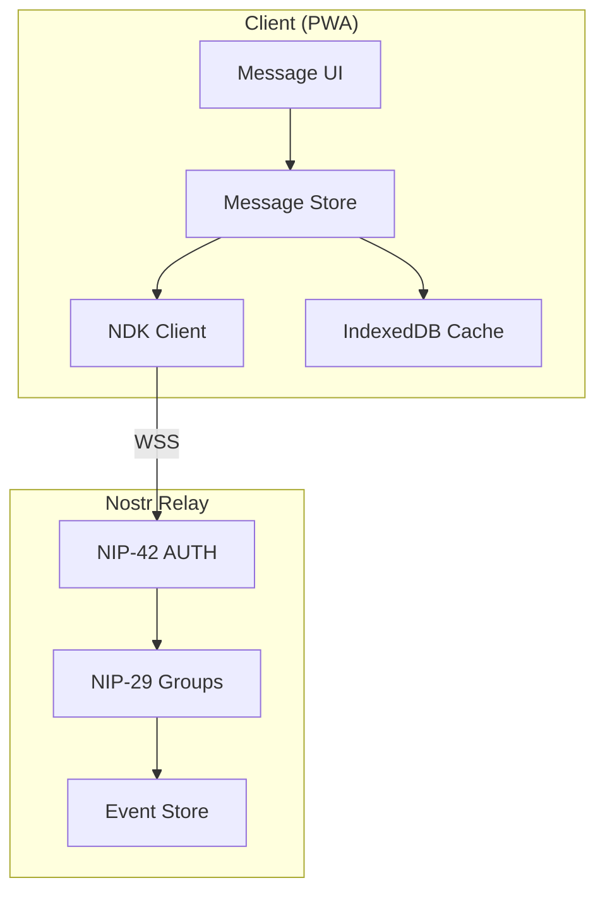

# Messaging System

Technical implementation of the channel messaging system using NIP-29 relay-based groups.

---

## Overview

The messaging system implements NIP-29 (Relay-based Groups) for channel communication, providing:

- **Group membership** — Admin-controlled channel access
- **Moderation** — Message deletion and user removal
- **Real-time updates** — WebSocket subscriptions
- **Offline support** — IndexedDB message caching

---

## Architecture



---

## Event Kinds

### Channel Message (Kind 9)

Standard group chat message:

```typescript
interface ChannelMessage {
  kind: 9;
  content: string;
  tags: [
    ['h', '<channel-id>'],           // Channel identifier
    ['previous', '<event-id>']?      // Optional: reply threading
  ];
  created_at: number;
  pubkey: string;
  id: string;
  sig: string;
}
```

### Channel Metadata (Kind 39000)

Channel configuration:

```typescript
interface ChannelMetadata {
  kind: 39000;
  content: JSON.stringify({
    name: string;
    about: string;
    picture?: string;
  });
  tags: [
    ['d', '<channel-id>'],
    ['cohort', '<cohort-tag>']?,      // Zone filtering
    ['visibility', 'listed' | 'unlisted' | 'preview']?
  ];
}
```

### Admin Actions

| Kind | Purpose | Tags |
|------|---------|------|
| 9000 | Add user to group | `['p', pubkey]`, `['h', channel]` |
| 9001 | Remove user from group | `['p', pubkey]`, `['h', channel]` |
| 9005 | Delete message | `['e', event-id]`, `['h', channel]` |

---

## Implementation

### Message Store

```typescript
// src/lib/stores/messages.ts
import { writable, derived } from 'svelte/store';
import type { NDKEvent } from '@nostr-dev-kit/ndk';

interface MessageState {
  messages: Map<string, NDKEvent[]>;  // channelId -> messages
  loading: Map<string, boolean>;
  hasMore: Map<string, boolean>;
}

function createMessageStore() {
  const { subscribe, update } = writable<MessageState>({
    messages: new Map(),
    loading: new Map(),
    hasMore: new Map()
  });

  return {
    subscribe,

    addMessage(channelId: string, event: NDKEvent) {
      update(state => {
        const messages = state.messages.get(channelId) || [];
        // Prevent duplicates
        if (!messages.find(m => m.id === event.id)) {
          messages.push(event);
          messages.sort((a, b) => a.created_at - b.created_at);
          state.messages.set(channelId, messages);
        }
        return state;
      });
    },

    removeMessage(channelId: string, eventId: string) {
      update(state => {
        const messages = state.messages.get(channelId) || [];
        state.messages.set(
          channelId,
          messages.filter(m => m.id !== eventId)
        );
        return state;
      });
    },

    setLoading(channelId: string, loading: boolean) {
      update(state => {
        state.loading.set(channelId, loading);
        return state;
      });
    }
  };
}

export const messages = createMessageStore();

// Derived store for specific channel
export function channelMessages(channelId: string) {
  return derived(messages, $messages =>
    $messages.messages.get(channelId) || []
  );
}
```

### Message Service

```typescript
// src/lib/services/messaging/messages.ts
import { get } from 'svelte/store';
import { ndk } from '$stores/ndk';
import { messages } from '$stores/messages';
import type { NDKEvent, NDKFilter } from '@nostr-dev-kit/ndk';

const MESSAGE_LIMIT = 50;

export async function loadMessages(
  channelId: string,
  until?: number
): Promise<void> {
  const $ndk = get(ndk);
  if (!$ndk) return;

  messages.setLoading(channelId, true);

  const filter: NDKFilter = {
    kinds: [9],
    '#h': [channelId],
    limit: MESSAGE_LIMIT
  };

  if (until) {
    filter.until = until;
  }

  try {
    const events = await $ndk.fetchEvents(filter);
    events.forEach(event => {
      messages.addMessage(channelId, event);
    });
  } finally {
    messages.setLoading(channelId, false);
  }
}

export async function sendMessage(
  channelId: string,
  content: string,
  replyTo?: string
): Promise<NDKEvent | null> {
  const $ndk = get(ndk);
  if (!$ndk) return null;

  const event = new NDKEvent($ndk);
  event.kind = 9;
  event.content = content;
  event.tags = [['h', channelId]];

  if (replyTo) {
    event.tags.push(['previous', replyTo]);
  }

  await event.publish();
  messages.addMessage(channelId, event);

  return event;
}

export async function deleteMessage(
  channelId: string,
  eventId: string,
  isAdmin: boolean
): Promise<void> {
  const $ndk = get(ndk);
  if (!$ndk) return;

  const event = new NDKEvent($ndk);

  if (isAdmin) {
    // NIP-29 admin deletion
    event.kind = 9005;
    event.tags = [
      ['h', channelId],
      ['e', eventId]
    ];
  } else {
    // NIP-09 self-deletion
    event.kind = 5;
    event.tags = [['e', eventId]];
  }

  await event.publish();
  messages.removeMessage(channelId, eventId);
}
```

### Real-time Subscription

```typescript
// src/lib/services/messaging/subscriptions.ts
import { get } from 'svelte/store';
import { ndk } from '$stores/ndk';
import { messages } from '$stores/messages';
import type { NDKSubscription } from '@nostr-dev-kit/ndk';

const subscriptions = new Map<string, NDKSubscription>();

export function subscribeToChannel(channelId: string): void {
  if (subscriptions.has(channelId)) return;

  const $ndk = get(ndk);
  if (!$ndk) return;

  const sub = $ndk.subscribe({
    kinds: [9, 5, 9005],  // Messages, deletions, admin deletions
    '#h': [channelId],
    since: Math.floor(Date.now() / 1000)
  });

  sub.on('event', (event) => {
    if (event.kind === 9) {
      messages.addMessage(channelId, event);
    } else if (event.kind === 5 || event.kind === 9005) {
      // Handle deletion
      const deletedId = event.tags.find(t => t[0] === 'e')?.[1];
      if (deletedId) {
        messages.removeMessage(channelId, deletedId);
      }
    }
  });

  subscriptions.set(channelId, sub);
}

export function unsubscribeFromChannel(channelId: string): void {
  const sub = subscriptions.get(channelId);
  if (sub) {
    sub.stop();
    subscriptions.delete(channelId);
  }
}
```

---

## Message Component

```svelte
<!-- src/lib/components/chat/MessageList.svelte -->
<script lang="ts">
  import { onMount, onDestroy } from 'svelte';
  import { channelMessages } from '$stores/messages';
  import { loadMessages, subscribeToChannel, unsubscribeFromChannel } from '$services/messaging';
  import MessageBubble from './MessageBubble.svelte';
  import VirtualList from '$components/ui/VirtualList.svelte';

  export let channelId: string;

  $: messages = channelMessages(channelId);

  onMount(() => {
    loadMessages(channelId);
    subscribeToChannel(channelId);
  });

  onDestroy(() => {
    unsubscribeFromChannel(channelId);
  });

  async function loadMore() {
    const oldest = $messages[0];
    if (oldest) {
      await loadMessages(channelId, oldest.created_at - 1);
    }
  }
</script>

<VirtualList items={$messages} let:item on:loadMore={loadMore}>
  <MessageBubble message={item} {channelId} />
</VirtualList>
```

---

## Caching Strategy

### IndexedDB Schema

```typescript
// src/lib/services/storage/indexeddb.ts
import Dexie from 'dexie';

interface CachedMessage {
  id: string;
  channelId: string;
  pubkey: string;
  content: string;
  created_at: number;
  tags: string[][];
  deleted: boolean;
}

class MessageDatabase extends Dexie {
  messages!: Dexie.Table<CachedMessage, string>;

  constructor() {
    super('nostr-bbs');
    this.version(1).stores({
      messages: 'id, channelId, created_at, pubkey'
    });
  }
}

export const db = new MessageDatabase();
```

### Cache-First Loading

```typescript
export async function loadMessagesWithCache(
  channelId: string
): Promise<void> {
  // 1. Load from cache first (instant)
  const cached = await db.messages
    .where('channelId')
    .equals(channelId)
    .reverse()
    .limit(MESSAGE_LIMIT)
    .toArray();

  cached.forEach(msg => {
    messages.addMessage(channelId, msg as any);
  });

  // 2. Fetch from relay (background)
  const latest = cached[0]?.created_at || 0;
  await loadMessages(channelId, undefined, latest);
}
```

---

## Performance Optimisations

### Virtual Scrolling

For channels with many messages, use virtual scrolling:

```svelte
<script lang="ts">
  import { VirtualList } from 'svelte-virtual-list-ce';
</script>

<VirtualList
  items={$messages}
  height="100%"
  itemHeight={60}
  let:item
>
  <MessageBubble message={item} />
</VirtualList>
```

### Subscription Batching

Aggregate subscriptions to reduce WebSocket overhead:

```typescript
// Instead of one subscription per channel
// Batch into time-windowed subscriptions
const batchedFilter = {
  kinds: [9],
  '#h': activeChannelIds,
  since: lastSeen
};
```

### Message Deduplication

Prevent duplicate messages from multiple relay responses:

```typescript
const seenIds = new Set<string>();

function isDuplicate(event: NDKEvent): boolean {
  if (seenIds.has(event.id)) return true;
  seenIds.add(event.id);
  return false;
}
```

---

## Error Handling

### Connection Recovery

```typescript
ndk.on('disconnect', () => {
  // Attempt reconnection with exponential backoff
  reconnectWithBackoff();
});

ndk.on('connect', () => {
  // Resubscribe to active channels
  activeChannels.forEach(subscribeToChannel);
});
```

### Optimistic Updates

```typescript
export async function sendMessage(channelId: string, content: string) {
  // 1. Create optimistic message
  const optimisticEvent = createOptimisticEvent(content);
  messages.addMessage(channelId, optimisticEvent);

  try {
    // 2. Publish to relay
    const event = await publishMessage(channelId, content);
    // 3. Replace optimistic with real
    messages.replaceMessage(channelId, optimisticEvent.id, event);
  } catch (error) {
    // 4. Remove optimistic on failure
    messages.removeMessage(channelId, optimisticEvent.id);
    throw error;
  }
}
```

---

## Related Documentation

- [NIP Protocol Reference](../reference/nip-protocol-reference.md) — Protocol specifications
- [DM Implementation](dm-implementation.md) — Private messaging
- [Data Flow](../architecture/data-flow.md) — Message lifecycle

---

[← Back to Developer Documentation](../index.md)
