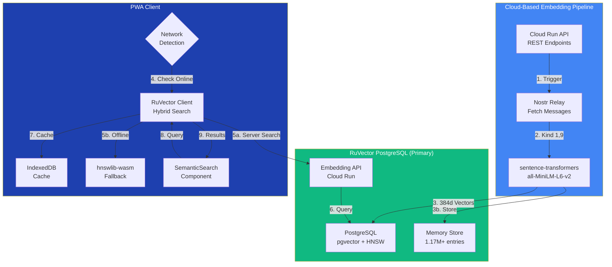
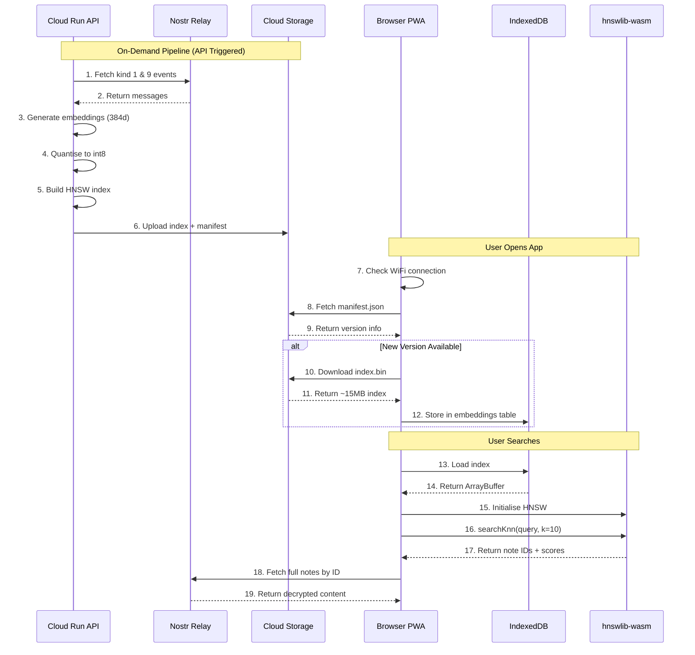

# Semantic Vector Search

AI-powered search that understands meaning, not just keywords.

---

## Overview

Semantic search enables users to find messages by meaning rather than exact keywords. Search for "schedule tomorrow's meeting" and find messages about "planning the session for Friday"—the system understands context and intent.

**Search Backends:**
- **Primary**: RuVector PostgreSQL (server-side, 150x-12,500x faster)
- **Fallback**: hnswlib-wasm (client-side, offline-only mode)

---

## Architecture



---

## Key Features

| Feature | Implementation | Benefit |
|---------|----------------|---------|
| **Semantic Understanding** | sentence-transformers/all-MiniLM-L6-v2 | Find by meaning, not just keywords |
| **RuVector Server Search** | PostgreSQL with HNSW indexing | 150x-12,500x faster than brute-force |
| **Hybrid Mode** | Server + local cache | Best of both worlds |
| **HNSW Fallback** | hnswlib-wasm (client-side) | Works fully offline |
| **Int8 Quantisation** | 75% storage reduction | 100k messages = ~15MB index |
| **Smart Sync** | Network-aware sync | Respects mobile data caps |
| **Cross-Device** | RuVector PostgreSQL | Shared embeddings across devices |

---

## Data Flow



---

## Technical Specifications

```yaml
Embedding Model:
  name: sentence-transformers/all-MiniLM-L6-v2
  dimensions: 384
  performance: ~30 sec per 1,000 messages
  quantisation: int8 (75% size reduction)

HNSW Index:
  library: hnswlib (Python) + hnswlib-wasm (Browser)
  space: cosine similarity
  ef_construction: 200
  M: 16
  ef_search: 50

Storage:
  platform: Google Cloud Storage
  bucket: nostr-bbs-embeddings
  structure:
    - latest/manifest.json
    - latest/index.bin
    - latest/index_mapping.json
  versioning: Incremental (v1, v2, ...)

Client Sync:
  trigger: WiFi or unmetered connection
  storage: IndexedDB (embeddings table)
  lazy_load: true (background, non-blocking)
```

---

## Usage

### Component Integration

```svelte
<script>
  import { SemanticSearch } from '$lib/semantic';

  function handleSelect(noteId: string) {
    navigateToMessage(noteId);
  }
</script>

<SemanticSearch
  onSelect={handleSelect}
  placeholder="Search by meaning..."
/>
```

### Programmatic API

```typescript
import { searchSimilar, syncEmbeddings, isSearchAvailable } from '$lib/semantic';

// Sync index (automatic on WiFi)
await syncEmbeddings();

// Check availability
if (isSearchAvailable()) {
  // Search for similar messages
  const results = await searchSimilar('meeting tomorrow', 10, 0.5);
  // Returns: [{ noteId: 'abc123', score: 0.89, distance: 0.11 }, ...]
}
```

---

## API Reference

### syncEmbeddings()

Synchronises the local index with Cloud Storage.

```typescript
async function syncEmbeddings(): Promise<boolean>
```

**Returns:** `true` if sync successful, `false` if skipped (not on WiFi) or failed.

**Behaviour:**
1. Checks network type (WiFi/unmetered only)
2. Fetches manifest.json from GCS
3. Compares version with local cache
4. Downloads new index if newer version available
5. Stores in IndexedDB

### searchSimilar()

Performs semantic search on cached index.

```typescript
async function searchSimilar(
  query: string,
  k?: number,       // Default: 10
  threshold?: number // Default: 0.3 (minimum similarity)
): Promise<SearchResult[]>
```

**Parameters:**

| Parameter | Type | Description |
|-----------|------|-------------|
| `query` | `string` | Natural language search query |
| `k` | `number` | Maximum results to return |
| `threshold` | `number` | Minimum similarity score (0-1) |

**Returns:**

```typescript
interface SearchResult {
  noteId: string;    // Nostr event ID
  score: number;     // Similarity score (0-1)
  distance: number;  // Cosine distance
}
```

### isSearchAvailable()

Checks if semantic search is ready.

```typescript
function isSearchAvailable(): boolean
```

**Returns:** `true` if index is loaded and ready.

---

## Privacy Considerations

| Aspect | Implementation |
|--------|----------------|
| **No Content Storage** | Only embeddings stored, not message text |
| **Encrypted Messages Excluded** | NIP-17/59 DMs not indexed |
| **Local Processing** | Search runs entirely in browser via WASM |
| **User Control** | Manual sync button, no automatic uploads |
| **No Query Logging** | Searches never leave the device |

---

## Free Tier Budget

| Resource | Limit | Usage (100k msgs) | Headroom |
|----------|-------|-------------------|----------|
| **Cloud Run** | 2M requests/month | ~10k/month | 99.5% free |
| **Cloud Storage** | 5 GB storage | ~20 MB | 99.6% free |
| **GCS Reads** | 50k Class B ops/month | ~10k/month | 80% free |
| **GCS Egress** | 1 GB/month (free tier) | ~500 MB | 50% free |

---

## Embedding Pipeline

### Cloud Run API Endpoints

| Endpoint | Method | Description |
|----------|--------|-------------|
| `/health` | GET | Health check endpoint |
| `/api/embeddings/generate` | POST | Generate embeddings for messages |
| `/api/embeddings/index` | POST | Build and upload HNSW index |
| `/api/embeddings/manifest` | GET | Get current index version |
| `/api/embeddings/sync` | POST | Trigger full sync pipeline |

### Pipeline Trigger

The pipeline runs on demand via API trigger or scheduled via GitHub Actions:

```yaml
# .github/workflows/update-embeddings.yml
name: Update Embeddings Index

on:
  schedule:
    - cron: '0 2 * * *'  # 2 AM daily
  workflow_dispatch:     # Manual trigger

jobs:
  update-index:
    runs-on: ubuntu-latest
    steps:
      - name: Trigger embedding pipeline
        run: |
          curl -X POST \
            -H "Authorization: Bearer ${{ secrets.API_TOKEN }}" \
            https://embedding-api.run.app/api/embeddings/sync
```

---

## Troubleshooting

### Index Not Loading

```typescript
// Check IndexedDB
const db = await openDB('semantic-search', 1);
const manifest = await db.get('embeddings', 'manifest');
console.log('Local version:', manifest?.version);
```

### Search Returns No Results

1. **Index not synced** — Call `syncEmbeddings()` manually
2. **Threshold too high** — Lower the similarity threshold
3. **Query too short** — Provide more context in search

### High Memory Usage

The HNSW index loads entirely into memory. For 100k messages (~15MB index), expect ~30-50MB memory usage after decompression.

```typescript
// Check memory usage
if (performance.memory) {
  console.log('Used heap:', performance.memory.usedJSHeapSize / 1024 / 1024, 'MB');
}
```

---

## Related Documentation

- [Messaging](messaging.md) — Message system
- [PWA Features](pwa.md) — Offline capabilities
- [Data Flow](../architecture/data-flow.md) — State flow patterns

---

[← Back to Developer Documentation](../index.md)
