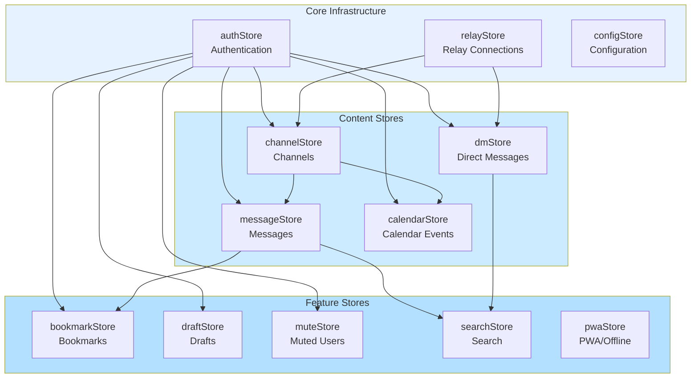

# Store Reference

Svelte stores managing application state throughout the platform.

---

## Overview

Stores provide reactive state management using Svelte's built-in store system. This reference covers all stores, their interfaces, and usage patterns.

---

## Store Dependency Graph



---

## Core Stores

### authStore

**Location:** `src/lib/stores/auth.ts`

Core authentication state.

```typescript
interface AuthState {
  publicKey: string | null;
  isAuthenticated: boolean;
  displayName?: string;
}

// Usage
import { authStore } from '$lib/stores';

authStore.subscribe(state => {
  console.log('Authenticated:', state.isAuthenticated);
  console.log('Public Key:', state.publicKey);
});

authStore.set({
  publicKey: '7f8e...',
  isAuthenticated: true,
  displayName: 'Alice'
});
```

### userStore

**Location:** `src/lib/stores/user.ts`

Extended user profile and permissions.

```typescript
interface UserProfile {
  name?: string;
  about?: string;
  picture?: string;
  nip05?: string;
  lud16?: string;
}

interface UserState {
  profile: UserProfile | null;
  cohorts: CohortType[];
  globalRole: RoleId;
  sectionRoles: UserSectionRole[];
  permissions: string[];
}

type RoleId = 'guest' | 'member' | 'moderator' | 'section-admin' | 'admin';
type CohortType = 'cohort-a' | 'cohort-b' | 'cohort-c';
```

#### Derived Stores

```typescript
// Check if user is authenticated
isAuthenticated: Readable<boolean>

// Check if user has admin role
isAdmin: Readable<boolean>

// Check if admin privileges verified on relay
isAdminVerified: Readable<boolean>

// Current user's public key
currentPubkey: Readable<string | null>

// User's cohort memberships
currentCohorts: Readable<CohortType[]>

// Display name (fallback to pubkey)
currentDisplayName: Readable<string>
```

---

## Content Stores

### channelStore

**Location:** `src/lib/stores/channelStore.ts`

Channel and message state management.

```typescript
interface Channel {
  id: string;
  name: string;
  description?: string;
  visibility: 'public' | 'cohort' | 'invite';
  cohorts: string[];
  encrypted: boolean;
  section: ChannelSection;
  admins: string[];
  members: string[];
  pendingRequests: string[];
  createdAt: number;
  creatorPubkey: string;
}

interface ChannelState {
  channels: Channel[];
  messages: Record<string, Message[]>;
  selectedChannelId: string | null;
  joinRequests: JoinRequest[];
  isLoading: boolean;
}
```

#### Methods

```typescript
// Channel management
channelStore.setChannels(channels: Channel[]): void
channelStore.addChannel(channel: Channel): void
channelStore.selectChannel(channelId: string | null): void

// Message management
channelStore.setMessages(channelId: string, messages: Message[]): void
channelStore.addMessage(message: Message): void
channelStore.deleteMessage(channelId: string, messageId: string): void

// Membership
channelStore.requestJoin(channelId: string, requesterPubkey: string): void
channelStore.getMemberStatus(channelId: string, userPubkey: string | null): MemberStatus
```

### messageStore

**Location:** `src/lib/stores/messages.ts`

Message state and subscriptions.

```typescript
interface MessageState {
  messages: Record<string, Message[]>;
  subscriptions: Record<string, () => void>;
  loading: Record<string, boolean>;
}

// Methods
messagesStore.subscribe(channelId: string): void
messagesStore.unsubscribe(channelId: string): void
messagesStore.addMessage(message: Message): void
messagesStore.removeMessage(channelId: string, messageId: string): void
messagesStore.getMessages(channelId: string): Message[]
```

### dmStore

**Location:** `src/lib/stores/dm.ts`

Direct message conversations.

```typescript
interface DMConversation {
  peerPubkey: string;
  messages: DMMessage[];
  unreadCount: number;
  lastMessageAt: number;
}

interface DMMessage {
  id: string;
  sender: string;
  recipient: string;
  content: string;
  timestamp: number;
  read: boolean;
}

interface DMState {
  conversations: Record<string, DMConversation>;
  selectedPeer: string | null;
  loading: boolean;
}

// Methods
dmStore.selectConversation(peerPubkey: string): void
dmStore.sendMessage(recipient: string, content: string): Promise<void>
dmStore.markAsRead(peerPubkey: string): void

// Derived stores
totalUnreadDMs: Readable<number>
activeConversations: Readable<DMConversation[]>
selectedConversation: Readable<DMConversation | null>
```

---

## Feature Stores

### notificationStore

**Location:** `src/lib/stores/notifications.ts`

User notification management.

```typescript
type NotificationType =
  | 'mention'
  | 'reply'
  | 'reaction'
  | 'dm'
  | 'channel_invite'
  | 'join_request_approved'
  | 'admin_message';

interface Notification {
  id: string;
  type: NotificationType;
  message: string;
  timestamp: number;
  read: boolean;
  eventId?: string;
  senderPubkey?: string;
  channelId?: string;
}

// Methods
notificationStore.add(notification: Omit<Notification, 'id'>): void
notificationStore.markAsRead(notificationId: string): void
notificationStore.markAllAsRead(): void
notificationStore.remove(notificationId: string): void
notificationStore.clear(): void

// Derived stores
unreadNotifications: Readable<Notification[]>
unreadCount: Readable<number>
recentNotifications: Readable<Notification[]>
```

### pwaStore

**Location:** `src/lib/stores/pwa.ts`

Progressive Web App state.

```typescript
interface PWAState {
  installPrompt: BeforeInstallPromptEvent | null;
  updateAvailable: boolean;
  isOnline: boolean;
  swRegistration: ServiceWorkerRegistration | null;
  queuedMessages: QueuedMessage[];
}

// Derived stores
isPWAInstalled: Readable<boolean>
queuedMessageCount: Readable<number>
canInstall: Readable<boolean>

// Methods
initPWA(): void
triggerInstall(): Promise<void>
registerServiceWorker(): Promise<void>
queueMessage(message: QueuedMessage): void
triggerBackgroundSync(): Promise<void>
```

### muteStore

**Location:** `src/lib/stores/mute.ts`

User muting functionality.

```typescript
interface MutedUser {
  pubkey: string;
  mutedAt: number;
  reason?: string;
  expiresAt?: number;
}

// Methods
muteStore.mute(pubkey: string, reason?: string, duration?: number): void
muteStore.unmute(pubkey: string): void
muteStore.isMuted(pubkey: string): boolean

// Derived stores
mutedCount: Readable<number>
mutedUsersList: Readable<MutedUser[]>

// Factory for reactive mute check
createIsMutedStore(pubkey: string): Readable<boolean>
```

### draftsStore

**Location:** `src/lib/stores/drafts.ts`

Message draft persistence.

```typescript
interface Draft {
  content: string;
  timestamp: number;
}

interface DraftState {
  drafts: Record<string, Draft>;
}

// Methods
draftsStore.saveDraft(channelId: string, content: string): void
draftsStore.loadDraft(channelId: string): string | null
draftsStore.clearDraft(channelId: string): void
```

### bookmarkStore

**Location:** `src/lib/stores/bookmarks.ts`

Bookmarked messages.

```typescript
interface Bookmark {
  messageId: string;
  channelId: string;
  content: string;
  author: string;
  savedAt: number;
}

// Methods
bookmarkStore.add(message: Message): void
bookmarkStore.remove(messageId: string): void
bookmarkStore.isBookmarked(messageId: string): boolean

// Derived
bookmarkCount: Readable<number>
```

---

## Store Patterns

### Subscription Pattern

```typescript
onMount(() => {
  const unsubscribe = someStore.subscribe(value => {
    console.log('Store updated:', value);
  });

  return () => {
    unsubscribe();
  };
});
```

### Derived Store Pattern

```typescript
import { derived } from 'svelte/store';

const filteredMessages = derived(
  [messagesStore, currentChannel],
  ([$messages, $channel]) => {
    return $messages.filter(m => m.channelId === $channel);
  }
);

// Use in component
$: messages = $filteredMessages;
```

### Custom Store Pattern

```typescript
function createCustomStore() {
  const { subscribe, set, update } = writable(initialValue);

  return {
    subscribe,
    customMethod: () => update(n => n + 1),
    reset: () => set(initialValue)
  };
}

export const customStore = createCustomStore();
```

### Persistent Store Pattern

```typescript
import { writable } from 'svelte/store';
import { browser } from '$app/environment';

function persistentStore<T>(key: string, initial: T) {
  const stored = browser ? localStorage.getItem(key) : null;
  const data = stored ? JSON.parse(stored) : initial;

  const store = writable<T>(data);

  store.subscribe(value => {
    if (browser) {
      localStorage.setItem(key, JSON.stringify(value));
    }
  });

  return store;
}

export const settings = persistentStore('settings', defaultSettings);
```

---

## Best Practices

### Immutable Updates

```typescript
// Correct
store.update(state => ({ ...state, field: newValue }));

// Incorrect - mutates state
store.update(state => {
  state.field = newValue;
  return state;
});
```

### Selective Subscriptions

```typescript
// Subscribe to specific slice
const channelName = derived(
  channelStore,
  $store => $store.channels.get(channelId)?.name
);

// Avoid subscribing to entire store when only needing one field
```

### Cleanup

```typescript
// Auto-cleanup with reactive statement
$: messages = $channelMessages;

// Manual cleanup
let unsubscribe: () => void;

onMount(() => {
  unsubscribe = store.subscribe(handleUpdate);
});

onDestroy(() => {
  unsubscribe?.();
});
```

---

## Related Documentation

- [API Reference](api.md) — Service API documentation
- [Data Flow](../architecture/data-flow.md) — State flow patterns
- [Component Architecture](../architecture/components.md) — UI integration

---

[← Back to Developer Documentation](../index.md)
