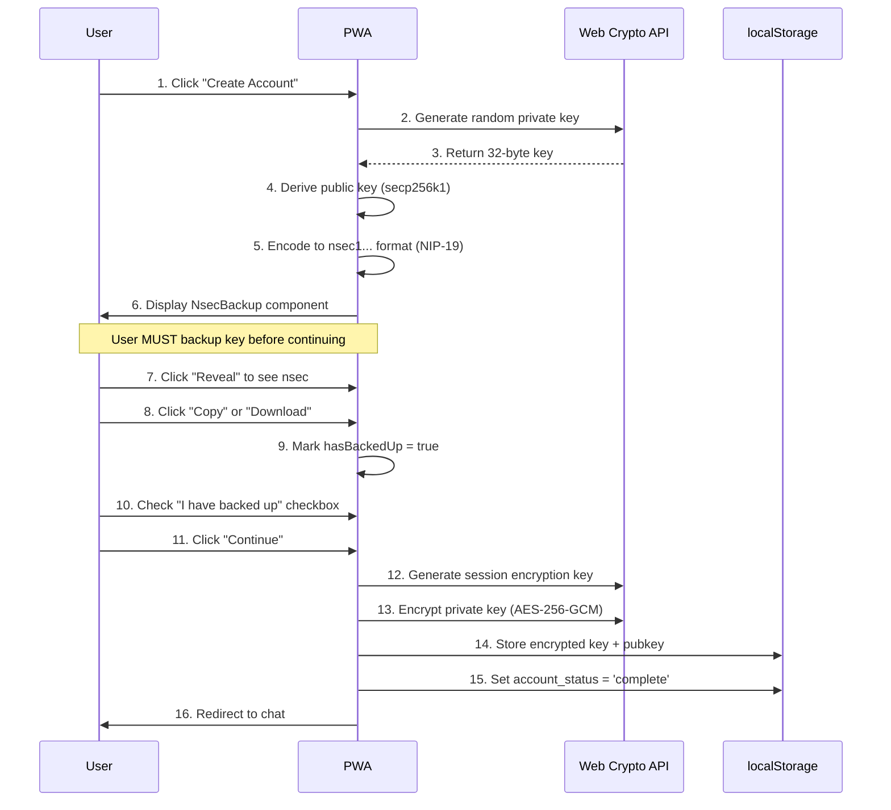
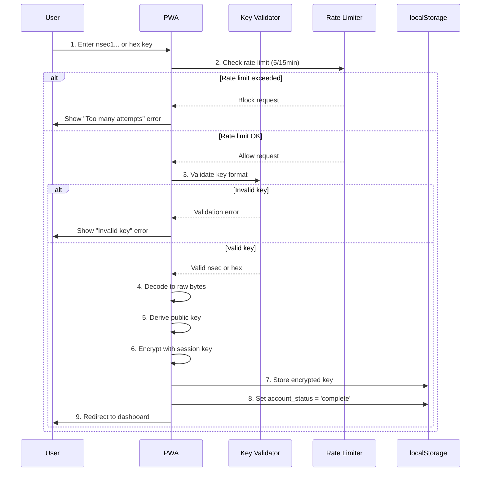
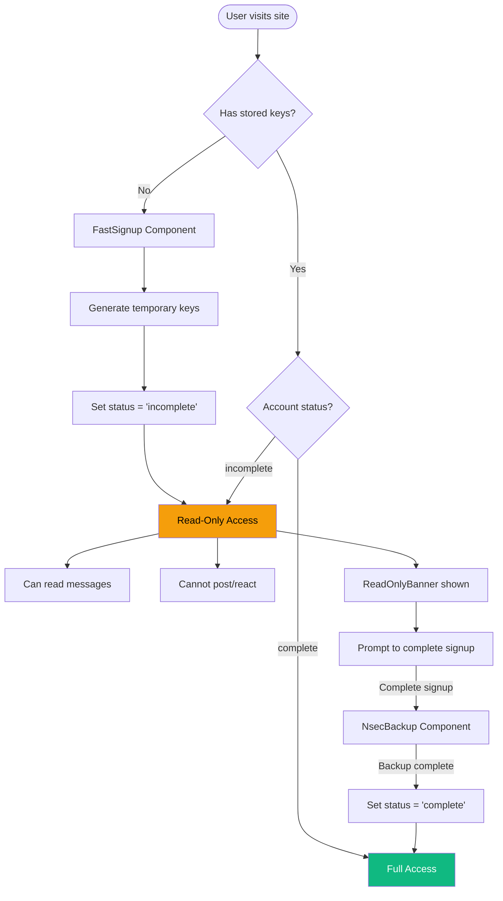

# Authentication System

Fairfield uses a Nostr-native authentication system based on nsec private keys with secure local storage and optional read-only access.

## Overview

The authentication system provides:
- **Nsec/Hex Key-Based Login** - Direct Nostr private key authentication (no mnemonic phrases)
- **Session-Based Key Encryption** - Private keys encrypted with session tokens using AES-256-GCM
- **Account Status System** - Differentiated access for complete vs incomplete accounts
- **Read-Only Mode** - Allows browsing without full signup completion
- **Rate Limiting** - Protection against brute-force attacks

## Authentication Flows

### New User Signup



### Login with Existing Key



### Read-Only Mode (Incomplete Account)

Users who start browsing without completing signup get read-only access:



## Key Formats

### Supported Input Formats

| Format | Example | Description |
|--------|---------|-------------|
| **nsec** | `nsec1abc...xyz` | Bech32-encoded private key (NIP-19) |
| **hex** | `64-char hex string` | Raw 32-byte private key in hex |

### Key Validation

```typescript
// Validation rules
- nsec: Must start with 'nsec1', be lowercase, valid bech32
- hex: Must be exactly 64 hexadecimal characters
- Whitespace is trimmed automatically
- Input is normalized to lowercase for nsec
```

## Security Features

### Key Encryption

Private keys are never stored in plaintext. The encryption process:

1. **Session Key Generation**: Random 256-bit key via `crypto.getRandomValues()`
2. **Encryption**: AES-256-GCM with random 12-byte IV
3. **Storage**: Base64-encoded ciphertext stored in localStorage
4. **Session Token**: Stored in sessionStorage (cleared on tab close)

```typescript
// Encryption parameters
Algorithm: AES-256-GCM
Key Size: 256 bits
IV Size: 96 bits (12 bytes)
Tag Size: 128 bits (16 bytes)
Key Derivation: PBKDF2-SHA256 (optional PIN protection)
```

### Rate Limiting

Login attempts are rate-limited using a token bucket algorithm:

| Action | Capacity | Refill Rate | Window |
|--------|----------|-------------|--------|
| Login | 5 attempts | 5 per 15 minutes | 15 min |
| Signup | 3 attempts | 3 per hour | 1 hour |
| Key operations | 10 attempts | 10 per minute | 1 min |

### Privacy Protections

- **No Server Storage**: Keys exist only in browser localStorage
- **Session-Bound Encryption**: Keys encrypted with session tokens
- **No Analytics**: No key-related data sent to external services
- **Local Derivation**: Public keys derived locally using secp256k1

## Components

### NsecBackup

Displays the private key with mandatory backup enforcement:

```svelte
<NsecBackup
  nsec="nsec1..."
  onConfirm={() => completeSignup()}
/>
```

**Features:**
- Key hidden by default (click to reveal)
- Copy to clipboard with confirmation
- Download as `.txt` backup file
- Checkbox confirmation required
- Continue button disabled until backup confirmed

### ReadOnlyBanner

Shows a dismissible warning for incomplete accounts:

```svelte
{#if $isReadOnly}
  <ReadOnlyBanner />
{/if}
```

**Features:**
- Appears at top of chat/DM pages
- Dismissible (for 1 hour) via localStorage
- Links to signup completion
- Yellow warning styling

### Login Component

Handles nsec/hex key input with validation:

**Features:**
- Password-type input (hidden by default)
- Real-time format detection (nsec vs hex)
- Whitespace trimming
- Error messages for invalid keys
- Rate limit feedback
- Loading state during authentication

## Account Status System

### Status Values

| Status | Description | Capabilities |
|--------|-------------|--------------|
| `complete` | Full signup completed with key backup | Full access to all features |
| `incomplete` | Quick start without backup | Read-only access, can browse |
| `null` | No account | Must signup or login |

### Derived Stores

```typescript
// In auth.ts
export const isAuthenticated = derived(authStore, ($auth) => !!$auth.pubkey);

export const isReadOnly = derived(authStore, ($auth) =>
  $auth.accountStatus === 'incomplete'
);

export const accountStatus = derived(authStore, ($auth) =>
  $auth.accountStatus
);
```

### Access Control by Feature

| Feature | Complete | Incomplete | Unauthenticated |
|---------|----------|------------|-----------------|
| Browse channels | Yes | Yes | No |
| Read messages | Yes | Yes | No |
| Send messages | Yes | No | No |
| React to messages | Yes | No | No |
| Send DMs | Yes | No | No |
| Create events | Yes | No | No |
| Edit profile | Yes | No | No |
| Admin panel | Yes (admin only) | No | No |

## Storage Schema

### localStorage Keys

| Key | Type | Description |
|-----|------|-------------|
| `nostr_bbs_nostr_pubkey` | string | 64-char hex public key |
| `nostr_bbs_nostr_encrypted_privkey` | string | Base64 encrypted private key |
| `nostr_bbs_nostr_account_status` | string | 'complete' or 'incomplete' |
| `nostr_bbs_nostr_relay_url` | string | Preferred relay URL |

### sessionStorage Keys

| Key | Type | Description |
|-----|------|-------------|
| `nostr_bbs_session_key` | string | Base64 session encryption key |

## Migration Notes

### From Mnemonic to Nsec (v2.0)

The authentication system was refactored in v2.0 to remove BIP-39 mnemonic phrases:

**What Changed:**
- Removed 12-word recovery phrase generation
- Removed mnemonic display and verification UI
- Removed mnemonic-based key derivation
- Added direct nsec/hex key backup
- Added NsecBackup component with copy/download
- Added account status system
- Added read-only mode for incomplete accounts

**Why:**
- Simpler UX (no word verification step)
- Faster signup flow
- Native Nostr key format (nsec)
- Better cross-client compatibility
- Reduced code complexity

**Backward Compatibility:**
- Existing users with mnemonic-derived keys can still login with their nsec
- Keys derived from mnemonics remain valid
- No data migration required

## Admin Security Hardening (v2.1)

The authentication system includes hardened admin workflows:

### Server-Side Verification

All admin pages now use server-side verification via the relay API:

```typescript
import { verifyWhitelistStatus } from '$lib/nostr/whitelist';

// In admin route/component
const status = await verifyWhitelistStatus(userPubkey);

if (!status.isAdmin) {
  goto('/events');  // Redirect non-admins
  return;
}
```

**Important**: Never rely solely on client-side `$isAdmin` store for authorization.

### Rate Limiting with Exponential Backoff

Admin actions are protected by rate limiting:

| Action Type | Max Attempts | Window | Backoff |
|-------------|--------------|--------|---------|
| Section Access | 5 | 1 minute | 2x |
| Cohort Change | 3 | 1 hour | 3x |
| Admin Action | 10 | 1 minute | 1.5x |

```typescript
import { checkRateLimit } from '$lib/nostr/admin-security';

const result = checkRateLimit('cohortChange', userPubkey);
if (!result.allowed) {
  console.log(`Rate limited. Retry in ${result.retryAfterMs}ms`);
}
```

### NIP-51 Pin List Verification

Admin pin list events (kind 30001) are cryptographically verified:

```typescript
import { verifyPinListSignature } from '$lib/nostr/admin-security';

const isValid = await verifyPinListSignature(pinListEvent);
```

### Signed Admin Requests

Privileged operations require cryptographic signatures:

```typescript
import { createSignedAdminRequest, verifySignedAdminRequest } from '$lib/nostr/admin-security';

const request = await createSignedAdminRequest({
  action: 'cohort_change',
  targetPubkey: userPubkey,
  data: { cohort: 'approved' },
  adminPrivkey: adminPrivateKey
});
```

### Suspicious Activity Detection

The system tracks and logs suspicious activity:

| Event Type | Trigger |
|------------|---------|
| `rate_limit_exceeded` | Too many requests |
| `invalid_signature` | Signature verification failed |
| `unauthorized_action` | Non-admin attempting admin action |
| `replay_attack` | Duplicate nonce detected |
| `timestamp_drift` | Request timestamp too old/future |

See [Admin Security](../security/admin-security.md) for complete documentation.

## QE Audit Findings (v2.0)

Security audit identified these items for the authentication system:

### Implemented
- AES-256-GCM key encryption
- Rate limiting infrastructure
- Account status differentiation
- Read-only access control
- Server-side admin verification (HIGH-001, HIGH-002 fixed)
- URL injection prevention (MED-001 fixed)
- NIP-51 signature verification
- Suspicious activity logging

### Recommendations (Future)
- Add session timeout handling
- Implement key backup reminders
- Add password/PIN protection option

## Testing

### E2E Test Coverage

The authentication system has comprehensive E2E tests:

- `tests/e2e/auth.spec.ts` - Admin and user authentication flows
- `tests/e2e/login.spec.ts` - Login validation and error handling
- `tests/e2e/signup.spec.ts` - Signup flow and key backup
- `tests/e2e/auth-extended.spec.ts` - Edge cases and cross-browser testing

### Test Commands

```bash
# Run all auth tests
npm run test:e2e -- --grep "auth|login|signup"

# Run specific test file
npm run test:e2e tests/e2e/auth.spec.ts

# Run with UI
npm run test:e2e -- --ui
```

## API Reference

### authStore

```typescript
import { authStore, isReadOnly, isAuthenticated } from '$lib/stores/auth';

// Read current state
$authStore.pubkey      // Current public key
$authStore.accountStatus // 'complete' | 'incomplete' | null

// Actions
authStore.setKeys(pubkey, privkey)  // Store encrypted keys
authStore.clear()                    // Logout, clear all keys
authStore.completeSignup()          // Mark account as complete
```

### Key Utilities

```typescript
import { generatePrivateKey, getPublicKey, nsecEncode, nsecDecode } from '$lib/nostr/keys';

// Generate new keypair
const privkey = generatePrivateKey();     // 32-byte Uint8Array
const pubkey = getPublicKey(privkey);     // 64-char hex string

// Encode/decode nsec
const nsec = nsecEncode(privkey);         // 'nsec1...'
const bytes = nsecDecode(nsec);           // Uint8Array
```

### Key Encryption

```typescript
import { encryptPrivateKey, decryptPrivateKey } from '$lib/utils/key-encryption';

// Encrypt for storage
const encrypted = await encryptPrivateKey(privkeyHex, sessionKey);

// Decrypt for signing
const decrypted = await decryptPrivateKey(encrypted, sessionKey);
```

### DID Integration

```typescript
import { pubkeyToDID, generateDIDDocument } from '$lib/nostr/did';

// Convert pubkey to W3C DID
const did = pubkeyToDID(pubkey);
// Result: 'did:nostr:7e7e9c42...'

// Generate DID Document
const didDoc = generateDIDDocument(pubkey);
```

## Related Documentation

- [Admin Security](../security/admin-security.md) - Admin workflow hardening
- [Security Audit Report](../security-audit-report.md) - Full security findings
