# Documentation

**Welcome to the Community Platform Documentation**

*A private, secure space for three distinct communities to connect, organise, and communicate.*

---

## Platform Preview

### Quick Start Signup

*Get started in seconds with a simple nickname and auto-generated password*

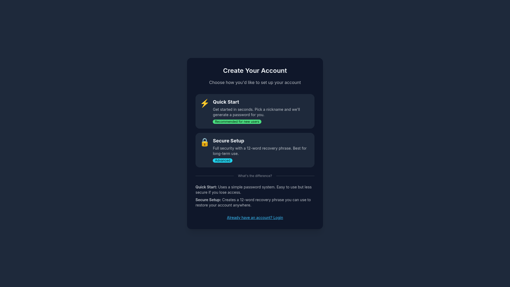

<strong>📱 View All Device Sizes — Signup Flow</strong>

| Desktop | Tablet | Mobile |
|:-------:|:------:|:------:|
| 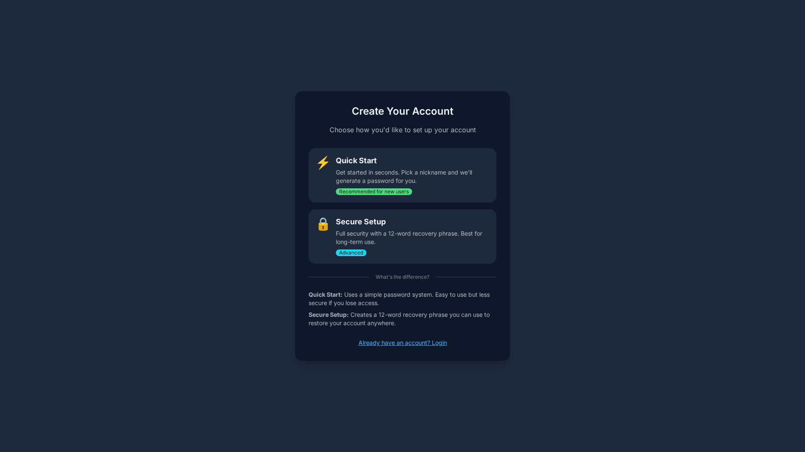 | 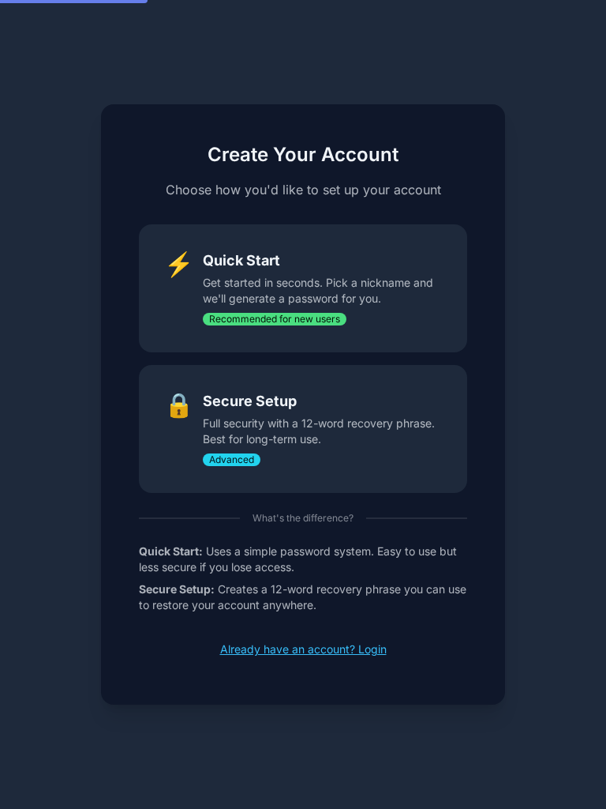 | 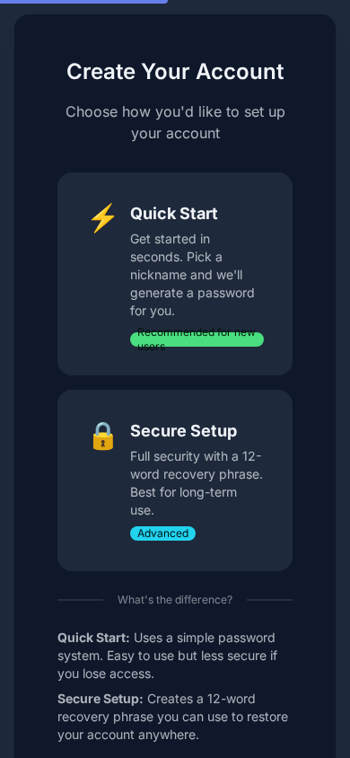 |

---

### Channels Hub

*Browse and join public conversation channels*

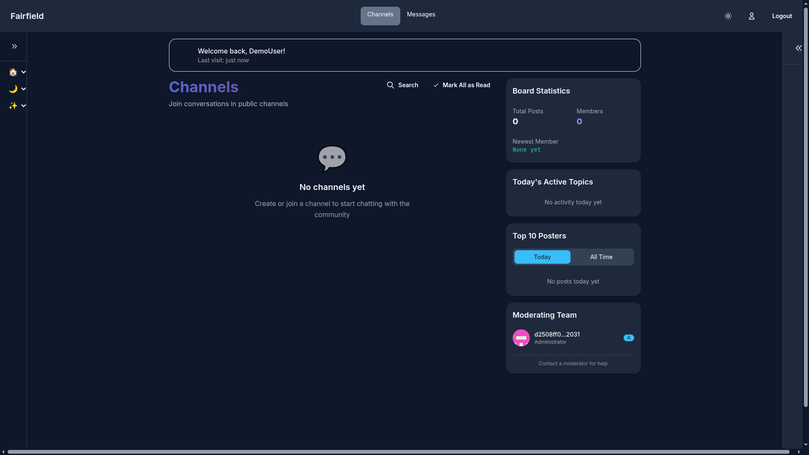

<strong>📱 View All Device Sizes — Channels</strong>

| Desktop | Tablet | Mobile |
|:-------:|:------:|:------:|
|  |  |  |

---

### Forums Overview

*Navigate community zones and discussion areas*

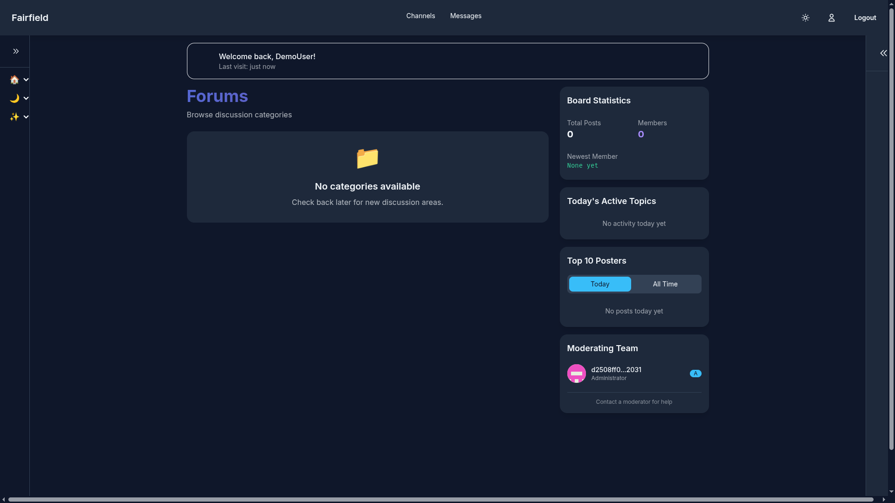

<strong>📱 View All Device Sizes — Forums</strong>

| Desktop | Tablet | Mobile |
|:-------:|:------:|:------:|
|  |  |  |

---

### Events Calendar

*Plan and track community events*

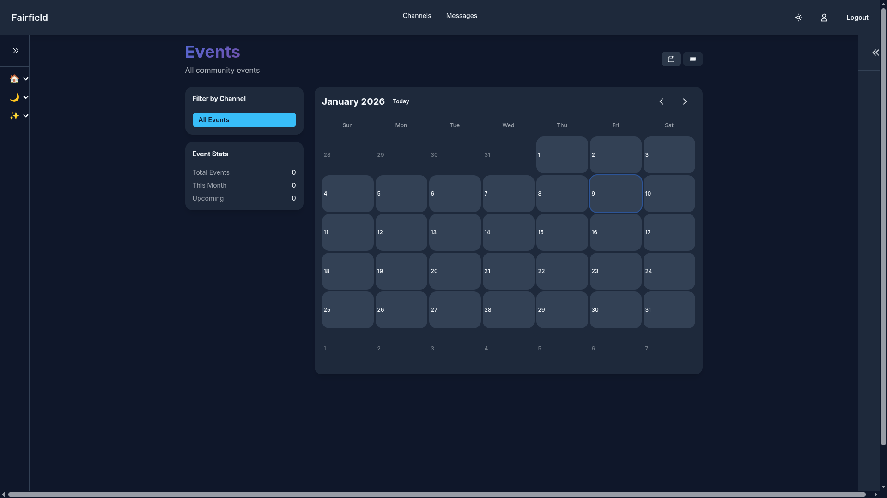

<strong>📱 View All Device Sizes — Events</strong>

| Desktop | Tablet | Mobile |
|:-------:|:------:|:------:|
|  |  |  |

---

### Direct Messages

*Private encrypted conversations*

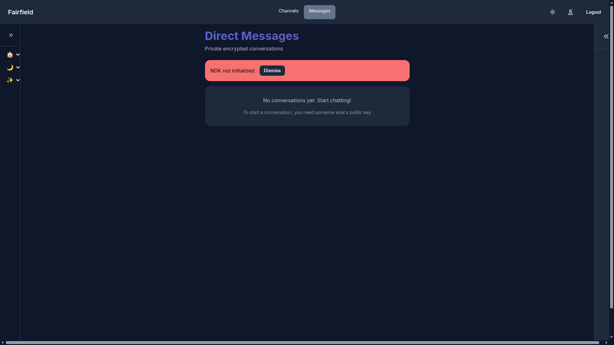

<strong>📱 View All Device Sizes — Direct Messages</strong>

| Desktop | Tablet | Mobile |
|:-------:|:------:|:------:|
| 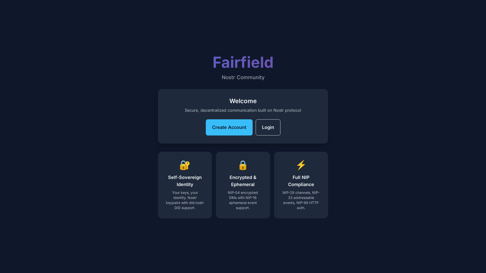 |  |  |

---

### Quick Login

*Simple password-based authentication*

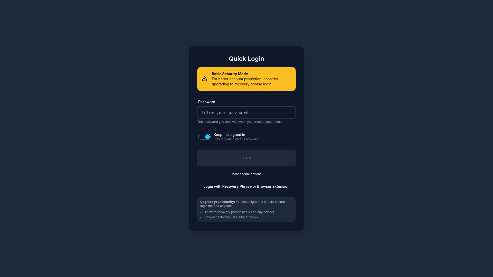

<strong>📱 View All Device Sizes — Login</strong>

| Desktop | Tablet | Mobile |
|:-------:|:------:|:------:|
|  | 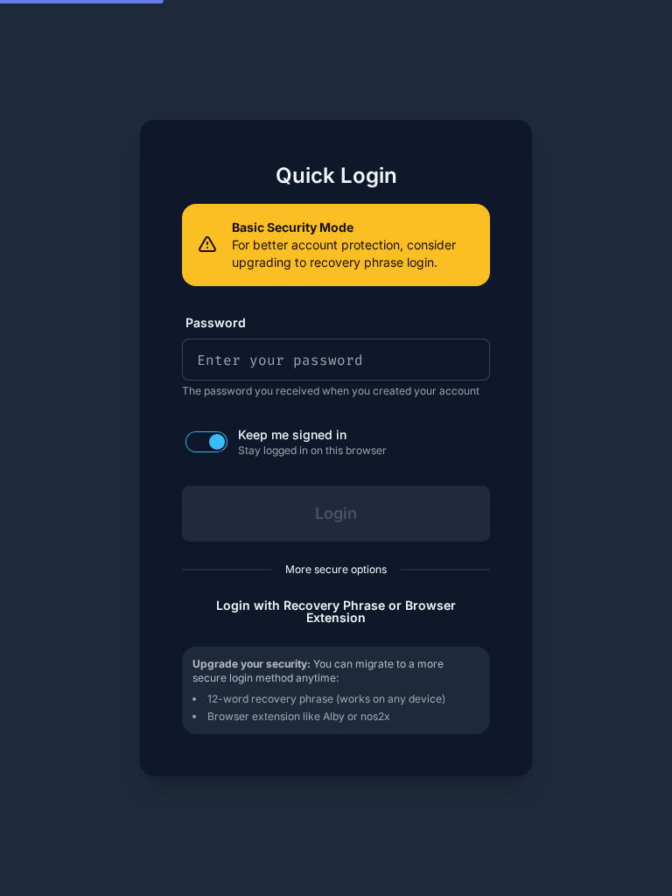 | 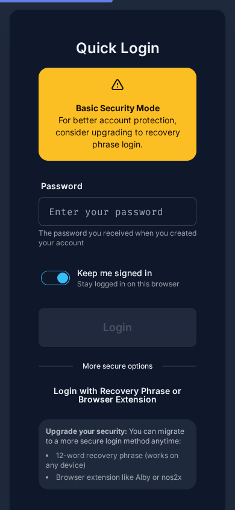 |

---

## Your Community

This platform serves three interconnected but distinct communities, each with their own space, purpose, and character:

<table>
<tr>
<td width="33%" valign="top">

### Minimoonoir

*UK Social Community*

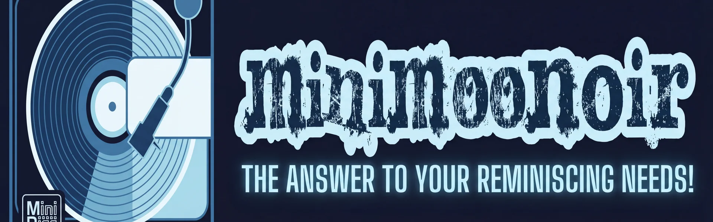

Social events, meetups, and community building across the United Kingdom.

[Explore Minimoonoir](user/zones/minimoonoir/index.md)

</td>
<td width="33%" valign="top">

### DreamLab

*Creative Technology*

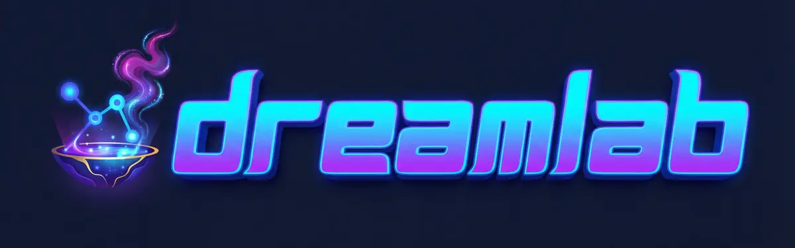

Business collaboration and creative tech community in the North West.

[Explore DreamLab](user/zones/dreamlab/index.md)

</td>
<td width="33%" valign="top">

### Family

*Private Family Space*

Property organisation and family communication in a private space.

[Explore Family](user/zones/family/index.md)

</td>
</tr>
</table>

---

## For Users

Everything you need to get started and make the most of the platform:

| Section | Purpose | You'll Learn |
|---------|---------|--------------|
| [Getting Started](user/getting-started/index.md) | **Tutorials** | How to create an account and navigate the platform |
| [Zone Guides](user/zones/index.md) | **Tutorials** | What each community space offers and how to use it |
| [Features](user/features/index.md) | **How-to Guides** | How to accomplish specific tasks |
| [Safety & Privacy](user/safety/index.md) | **Explanation** | How your data is protected |

### Quick Start

- [Create an Account](user/getting-started/creating-account.md) — Set up your secure identity
- [Send a Message](user/features/messaging.md) — Connect with your community
- [Use the Calendar](user/features/calendar.md) — Plan and join events
- [Privacy & Security](user/safety/privacy.md) — Understand your protections

---

## Platform Principles

### Privacy First

Your conversations are protected by modern cryptographic protocols. Private messages use end-to-end encryption with metadata protection—even the platform administrators cannot read your private conversations.

### Community Focused

Each zone is designed for its specific community's needs. Access controls ensure that the right people see the right content, whilst cross-zone features like the shared calendar enable coordination where needed.

### Open Standards

Built on the Nostr protocol, this platform uses open standards that ensure your data remains portable and your identity remains yours. No vendor lock-in, no data silos.

---

<strong>For Developers</strong>

## Developer Documentation

Technical documentation for contributors and self-hosters.

| Section | Purpose | You'll Learn |
|---------|---------|--------------|
| [Getting Started](developer/getting-started/index.md) | **Tutorials** | How to set up the development environment |
| [Architecture](developer/architecture/index.md) | **Explanation** | How the system is designed and why |
| [ADR (Decision Records)](adr/README.md) | **Reference** | Architectural decisions and rationale |
| [DDD (Domain Model)](ddd/README.md) | **Reference** | Domain-driven design patterns and entities |
| [Feature Guides](developer/features/messaging.md) | **How-to Guides** | How to implement and extend features |
| [Reference](developer/reference/api.md) | **Reference** | API documentation, protocols, configuration |
| [Deployment](developer/deployment/index.md) | **How-to Guides** | How to deploy and maintain the platform |
| [Contributing](developer/contributing/index.md) | **Guidelines** | How to contribute to the project |

### Developer Quick Links

- [Local Development Setup](developer/getting-started/development-setup.md)
- [System Architecture](developer/architecture/index.md)
- [Architecture Decision Records](adr/README.md) - Technical decisions and rationale
- [Domain Model](ddd/README.md) - Entities, aggregates, and bounded contexts
- [API Reference](developer/reference/api.md)
- [Contributing Guidelines](developer/contributing/index.md)

### Technology Stack

| Layer | Technology |
|-------|------------|
| Frontend | SvelteKit 5.x, TypeScript, TailwindCSS |
| Protocol | Nostr (NIPs 01, 17, 28, 29, 44, 52, 59) |
| Storage | IndexedDB (client), SQLite (relay) |
| Deployment | GitHub Pages, Google Cloud Run |
| Search | HNSW vector indexing, sentence-transformers |

---

<strong>Credits & Attribution</strong>

## Credits and Attribution

This project builds upon exceptional open-source work from the Nostr ecosystem and broader web development community.

### Core Technologies

- **[Nostr Protocol](https://github.com/nostr-protocol/nostr)** — The foundation protocol enabling decentralised, censorship-resistant communication
- **[NDK (Nostr Dev Kit)](https://github.com/nostr-dev-kit/ndk)** — Comprehensive Nostr development toolkit by Pablo Fernandez
- **[nostr-tools](https://github.com/nbd-wtf/nostr-tools)** — Essential Nostr utilities by fiatjaf

### Frontend Framework

- **[SvelteKit](https://kit.svelte.dev)** — Application framework by the Svelte team
- **[DaisyUI](https://daisyui.com)** — Component library by Pouya Saadeghi
- **[TailwindCSS](https://tailwindcss.com)** — Utility-first CSS framework
- **[Dexie.js](https://dexie.org)** — IndexedDB wrapper by David Fahlander

### Machine Learning & Search

- **[sentence-transformers](https://www.sbert.net/)** — Multilingual sentence embeddings
- **[all-MiniLM-L6-v2](https://huggingface.co/sentence-transformers/all-MiniLM-L6-v2)** — Compact 384d embedding model
- **[hnswlib](https://github.com/nmslib/hnswlib)** — Fast approximate nearest neighbour search
- **[hnswlib-wasm](https://github.com/yoshoku/hnswlib-wasm)** — WASM-based vector similarity search

### Infrastructure

- **[Google Cloud Run](https://cloud.google.com/run)** — Serverless container platform
- **[Google Cloud Storage](https://cloud.google.com/storage)** — Object storage for vector embeddings
- **[GitHub Pages](https://pages.github.com)** — Static site hosting
- **[GitHub Actions](https://github.com/features/actions)** — Deployment automation

### NIPs Implemented

| NIP | Name | Description |
|-----|------|-------------|
| [NIP-01](https://github.com/nostr-protocol/nips/blob/master/01.md) | Basic Protocol | Core event format and relay communication |
| [NIP-17](https://github.com/nostr-protocol/nips/blob/master/17.md) | Private DMs | Sealed rumours for private messaging |
| [NIP-28](https://github.com/nostr-protocol/nips/blob/master/28.md) | Public Chat | Group channels with moderation |
| [NIP-29](https://github.com/nostr-protocol/nips/blob/master/29.md) | Relay Groups | Relay-based access control |
| [NIP-42](https://github.com/nostr-protocol/nips/blob/master/42.md) | Authentication | Relay authentication challenges |
| [NIP-44](https://github.com/nostr-protocol/nips/blob/master/44.md) | Versioned Encryption | Modern encryption for DMs |
| [NIP-52](https://github.com/nostr-protocol/nips/blob/master/52.md) | Calendar Events | Event scheduling with RSVP |
| [NIP-59](https://github.com/nostr-protocol/nips/blob/master/59.md) | Gift Wrap | Metadata protection layer |

### Contributors

- John O'Hare ([@jjohare](https://github.com/jjohare)) — Project lead
- Claude Opus 4.5 / Claude Sonnet 4.5 — AI development assistance

---

<strong>Third-Party Licences</strong>

## Third-Party Dependencies

This project incorporates the following third-party open-source components:

---

## Version Information

| Component | Version |
|-----------|---------|
| Platform | 1.0.0 |
| Documentation | 2025-01 |
| Last Updated | January 2025 |

---

**Need Help?**

Check the [User Guides](user/index.md) or ask in your zone's support channel

