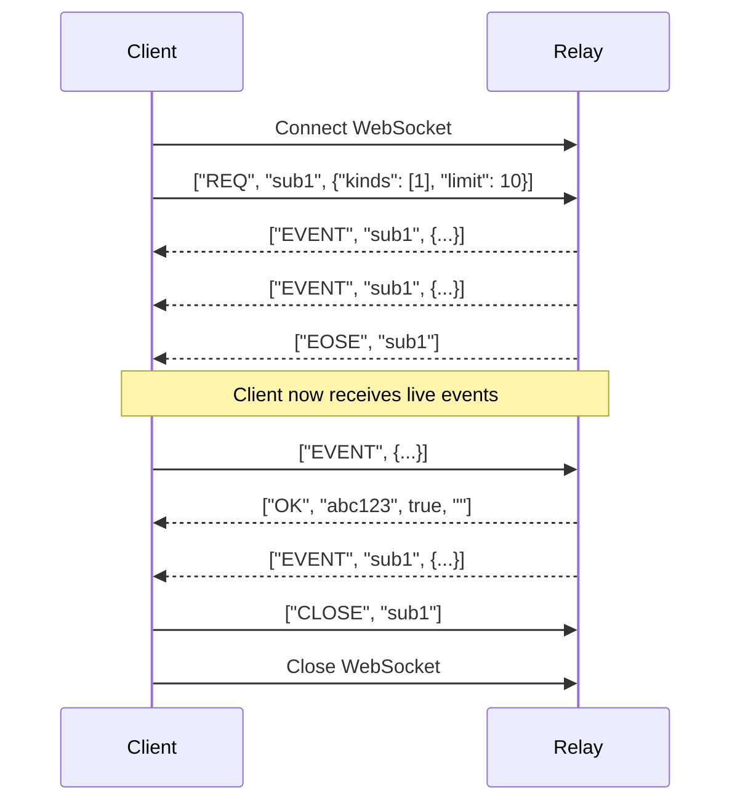

# API Reference

Complete API documentation for internal services, utilities, and the Fairfield Nostr Relay.

---

## Overview

The platform's APIs are organized into:

- **[Client-Side APIs](#client-side-apis)** - Stores, services, and utilities for the PWA
- **[Relay WebSocket API](#relay-websocket-api)** - Nostr protocol implementation
- **[Relay HTTP API](#relay-http-api)** - REST endpoints for relay management
- **[NIP-98 Authentication](#nip-98-authentication)** - HTTP authentication using Nostr events

---

## Client-Side APIs

### Stores

Reactive state containers using Svelte stores.

#### Auth Store

```typescript
// src/lib/stores/auth.ts

interface AuthState {
  user: NDKUser | null;
  pubkey: string | null;
  privkey: Uint8Array | null;
  isAuthenticated: boolean;
  isLoading: boolean;
  cohorts: string[];
}

const auth: Writable<AuthState>;

// Derived stores
const currentUser: Readable<NDKUser | null>;
const isAuthenticated: Readable<boolean>;
const userCohorts: Readable<string[]>;
```

**Methods:**

| Method | Parameters | Returns | Description |
|--------|------------|---------|-------------|
| `login` | `privkey: string` | `Promise<void>` | Authenticate with private key |
| `loginWithMnemonic` | `mnemonic: string` | `Promise<void>` | Authenticate with recovery phrase |
| `logout` | — | `void` | Clear session |
| `updateProfile` | `profile: Partial<Profile>` | `Promise<void>` | Update user metadata |

---

#### Messages Store

```typescript
// src/lib/stores/messages.ts

interface MessagesState {
  messages: Map<string, NDKEvent[]>;
  loading: Map<string, boolean>;
  hasMore: Map<string, boolean>;
}

const messages: CustomStore<MessagesState>;

// Derived
function channelMessages(channelId: string): Readable<NDKEvent[]>;
```

**Methods:**

| Method | Parameters | Description |
|--------|------------|-------------|
| `addMessage` | `channelId: string, event: NDKEvent` | Add message to channel |
| `removeMessage` | `channelId: string, eventId: string` | Remove message |
| `replaceMessage` | `channelId: string, oldId: string, newEvent: NDKEvent` | Replace (for optimistic updates) |
| `setLoading` | `channelId: string, loading: boolean` | Set loading state |
| `clearChannel` | `channelId: string` | Clear all messages |

---

#### Channels Store

```typescript
// src/lib/stores/channels.ts

interface Channel {
  id: string;
  name: string;
  description: string;
  cohort: string;
  visibility: 'listed' | 'unlisted' | 'preview';
  memberCount: number;
  isMember: boolean;
  isAdmin: boolean;
}

interface ChannelsState {
  channels: Map<string, Channel>;
  loading: boolean;
}

const channels: CustomStore<ChannelsState>;

// Derived
const channelList: Readable<Channel[]>;
function channelById(id: string): Readable<Channel | undefined>;
function channelsByCohort(cohort: string): Readable<Channel[]>;
```

---

#### Calendar Store

```typescript
// src/lib/stores/calendar.ts

interface CalendarEvent {
  id: string;
  dTag: string;
  title: string;
  description: string;
  start: Date;
  end?: Date;
  location?: string;
  timezone?: string;
  channelId?: string;
  cohort?: string;
  rsvps: Map<string, RSVPStatus>;
  pubkey: string;
}

type RSVPStatus = 'accepted' | 'declined' | 'tentative';

interface CalendarState {
  events: Map<string, CalendarEvent>;
  loading: boolean;
  viewDate: Date;
  viewMode: 'month' | 'week' | 'day';
}

const calendar: CustomStore<CalendarState>;
const visibleEvents: Readable<CalendarEvent[]>;
```

---

#### DM Store

```typescript
// src/lib/stores/dm.ts

interface DMMessage {
  id: string;
  sender: string;
  content: string;
  timestamp: number;
  isOwn: boolean;
}

interface Conversation {
  pubkey: string;
  messages: DMMessage[];
  lastMessage: number;
  unreadCount: number;
}

interface DMState {
  conversations: Map<string, Conversation>;
  loading: boolean;
}

const dmStore: CustomStore<DMState>;
const sortedConversations: Readable<Conversation[]>;
```

---

### Services

Business logic functions for core operations.

#### Authentication Service

```typescript
// src/lib/services/auth/index.ts

/**
 * Generate new keypair with mnemonic
 */
function generateKeys(): {
  mnemonic: string;
  privkey: string;
  pubkey: string;
}

/**
 * Recover keypair from mnemonic
 */
function recoverFromMnemonic(mnemonic: string): {
  privkey: string;
  pubkey: string;
}

/**
 * Validate mnemonic phrase
 */
function validateMnemonic(mnemonic: string): boolean;

/**
 * Store encrypted private key
 */
async function storeEncryptedKey(
  pubkey: string,
  privkey: string,
  passphrase: string
): Promise<void>

/**
 * Retrieve and decrypt private key
 */
async function getDecryptedKey(
  pubkey: string,
  passphrase: string
): Promise<string | null>
```

---

#### Messaging Service

```typescript
// src/lib/services/messaging/messages.ts

/**
 * Load messages for a channel
 */
async function loadMessages(
  channelId: string,
  options?: {
    limit?: number;
    until?: number;
    since?: number;
  }
): Promise<void>

/**
 * Send a message to a channel
 */
async function sendMessage(
  channelId: string,
  content: string,
  options?: {
    replyTo?: string;
  }
): Promise<NDKEvent>

/**
 * Delete a message
 */
async function deleteMessage(
  channelId: string,
  eventId: string,
  isAdmin?: boolean
): Promise<void>

/**
 * Edit a message (delete + republish)
 */
async function editMessage(
  channelId: string,
  eventId: string,
  newContent: string
): Promise<NDKEvent>
```

---

#### Subscription Service

```typescript
// src/lib/services/messaging/subscriptions.ts

/**
 * Subscribe to real-time channel updates
 */
function subscribeToChannel(channelId: string): void

/**
 * Unsubscribe from channel updates
 */
function unsubscribeFromChannel(channelId: string): void

/**
 * Check if subscribed to a channel
 */
function isSubscribed(channelId: string): boolean

/**
 * Get all active subscriptions
 */
function getActiveSubscriptions(): string[]
```

---

#### DM Service

```typescript
// src/lib/services/messaging/dm-service.ts

/**
 * Send an encrypted direct message
 */
async function sendDM(
  recipientPubkey: string,
  content: string
): Promise<void>

/**
 * Load all DM conversations
 */
async function loadDMs(): Promise<void>

/**
 * Subscribe to incoming DMs
 */
function subscribeToDMs(): void

/**
 * Get conversation with a specific user
 */
function getConversation(pubkey: string): Conversation | undefined
```

---

#### Calendar Service

```typescript
// src/lib/services/calendar/events.ts

/**
 * Load events for a date range
 */
async function loadEvents(
  startDate: Date,
  endDate: Date,
  cohort?: string
): Promise<void>

/**
 * Create a new calendar event
 */
async function createEvent(
  eventData: Omit<CalendarEvent, 'id' | 'rsvps' | 'pubkey'>
): Promise<string>

/**
 * Update an existing event
 */
async function updateEvent(
  dTag: string,
  updates: Partial<CalendarEvent>
): Promise<void>

/**
 * Delete a calendar event
 */
async function deleteEvent(dTag: string): Promise<void>
```

---

#### RSVP Service

```typescript
// src/lib/services/calendar/rsvp.ts

/**
 * Submit RSVP for an event
 */
async function submitRSVP(
  eventDTag: string,
  eventRef: string,
  status: RSVPStatus,
  message?: string
): Promise<void>

/**
 * Load RSVPs for an event
 */
async function loadRSVPs(eventDTag: string): Promise<void>

/**
 * Get user's RSVP for an event
 */
function getUserRSVP(eventDTag: string): RSVPStatus | null
```

---

### Utilities

Helper functions for common operations.

#### Crypto Utilities

```typescript
// src/lib/utils/crypto.ts

/**
 * NIP-44 encryption
 */
function encrypt(
  plaintext: string,
  senderPrivkey: Uint8Array,
  recipientPubkey: string
): string

/**
 * NIP-44 decryption
 */
function decrypt(
  ciphertext: string,
  recipientPrivkey: Uint8Array,
  senderPubkey: string
): string

/**
 * Generate random bytes
 */
function randomBytes(length: number): Uint8Array

/**
 * Hash data with SHA-256
 */
function sha256(data: string | Uint8Array): Uint8Array
```

---

#### Formatting Utilities

```typescript
// src/lib/utils/formatting.ts

/**
 * Format relative time (e.g., "5 minutes ago")
 */
function formatRelativeTime(timestamp: number): string

/**
 * Format absolute date
 */
function formatDate(
  date: Date,
  format?: 'short' | 'medium' | 'long'
): string

/**
 * Format user display name
 */
function formatDisplayName(
  pubkey: string,
  profile?: Profile
): string

/**
 * Truncate text with ellipsis
 */
function truncate(text: string, maxLength: number): string

/**
 * Format file size
 */
function formatFileSize(bytes: number): string
```

---

#### Validation Utilities

```typescript
// src/lib/utils/validation.ts

/**
 * Validate public key format
 */
function isValidPubkey(pubkey: string): boolean

/**
 * Validate event ID format
 */
function isValidEventId(id: string): boolean

/**
 * Validate relay URL
 */
function isValidRelayUrl(url: string): boolean

/**
 * Sanitise HTML content
 */
function sanitiseHtml(html: string): string

/**
 * Validate message content
 */
function validateMessageContent(content: string): {
  valid: boolean;
  error?: string;
}
```

---

#### Nostr Utilities

```typescript
// src/lib/utils/nostr.ts

/**
 * Parse NIP-19 encoded string (npub, nsec, note, etc.)
 */
function parseNip19(encoded: string): {
  type: 'npub' | 'nsec' | 'note' | 'nevent' | 'nprofile' | 'naddr';
  data: any;
}

/**
 * Encode to NIP-19 format
 */
function encodeNpub(pubkey: string): string
function encodeNote(eventId: string): string

/**
 * Extract tags from event
 */
function getTagValue(event: NDKEvent, tagName: string): string | undefined
function getTagValues(event: NDKEvent, tagName: string): string[]

/**
 * Create event filter
 */
function createFilter(options: {
  kinds?: number[];
  authors?: string[];
  tags?: Record<string, string[]>;
  since?: number;
  until?: number;
  limit?: number;
}): NDKFilter
```

---

## Relay WebSocket API

Connect via WebSocket at `ws://<host>:<port>/`

### Event Types

#### EVENT - Publish an event

```json
["EVENT", <event>]
```

**Event Structure:**
| Field | Type | Description |
|-------|------|-------------|
| `id` | string | 64-char hex SHA-256 of serialised event |
| `pubkey` | string | 64-char hex public key |
| `created_at` | number | Unix timestamp |
| `kind` | number | Event kind |
| `tags` | array | Array of tag arrays |
| `content` | string | Event content |
| `sig` | string | 128-char hex Schnorr signature |

**Response:**
```json
["OK", "<event-id>", true|false, "<message>"]
```

**Error Messages:**
- `"invalid: event validation failed"` - Malformed event
- `"blocked: pubkey not whitelisted"` - Access denied
- `"invalid: event id verification failed"` - Hash mismatch
- `"invalid: signature verification failed"` - Bad signature
- `"rate limit exceeded"` - Too many events

---

#### REQ - Subscribe to events

```json
["REQ", "<subscription-id>", <filter>, ...]
```

**Filter Structure:**
| Field | Type | Description |
|-------|------|-------------|
| `ids` | array | Event IDs to match |
| `authors` | array | Pubkeys to match |
| `kinds` | array | Event kinds to match |
| `since` | number | Events after timestamp |
| `until` | number | Events before timestamp |
| `limit` | number | Maximum events (default: 500, max: 5000) |
| `#<tag>` | array | Tag values to match |

**Response:**
```json
["EVENT", "<subscription-id>", <event>]
...
["EOSE", "<subscription-id>"]
```

---

#### CLOSE - Unsubscribe

```json
["CLOSE", "<subscription-id>"]
```

No response is sent.

---

### Protocol Flow



---

## Relay HTTP API

### GET /health

Health check and relay statistics.

**Response:**
```json
{
  "status": "healthy",
  "version": "2.2.0",
  "database": "postgresql",
  "events": 1234,
  "whitelisted": 56,
  "dbSizeBytes": 10485760,
  "uptime": 3600.5,
  "nips": [1, 11, 16, 33, 98]
}
```

---

### GET /api/check-whitelist

Check whitelist status for a pubkey.

**Query Parameters:**
| Parameter | Required | Description |
|-----------|----------|-------------|
| `pubkey` | Yes | 64-char hex public key |

**Response (200 OK):**
```json
{
  "isWhitelisted": true,
  "isAdmin": false,
  "cohorts": ["members", "early-access"],
  "verifiedAt": 1704067200000,
  "source": "relay"
}
```

**Response (400 Bad Request):**
```json
{
  "error": "Invalid pubkey format"
}
```

---

### GET /api/authenticated

Example NIP-98 authenticated endpoint.

**Headers:**
```
Authorization: Nostr <base64-encoded-event>
```

The event must be kind 27235 with:
- `u` tag: URL being accessed
- `method` tag: HTTP method (or `*`)
- `created_at`: Within ±60 seconds of current time

**Response (200 OK):**
```json
{
  "authenticated": true,
  "pubkey": "abc123...",
  "didNostr": "did:nostr:abc123..."
}
```

**Response (401 Unauthorized):**
```json
{
  "error": "Invalid Schnorr signature"
}
```

---

### GET /.well-known/nostr.json

Relay information document (NIP-11).

**Request Headers:**
```
Accept: application/nostr+json
```

**Response:**
```json
{
  "name": "Fairfield Nostr Relay",
  "description": "Private whitelist-only relay with NIP-16/98 support",
  "pubkey": "admin-pubkey-here",
  "supported_nips": [1, 11, 16, 33, 98],
  "software": "fairfield-nostr-relay",
  "version": "2.2.0",
  "limitation": {
    "auth_required": false,
    "payment_required": false,
    "restricted_writes": true
  }
}
```

---

## NIP-98 Authentication

### Creating an Auth Event

```typescript
import { schnorr } from '@noble/curves/secp256k1';
import crypto from 'crypto';

function createAuthEvent(privateKey: string, url: string, method: string) {
  const pubkey = schnorr.getPublicKey(privateKey);
  const created_at = Math.floor(Date.now() / 1000);

  const event = {
    pubkey: Buffer.from(pubkey).toString('hex'),
    created_at,
    kind: 27235,
    tags: [
      ['u', url],
      ['method', method]
    ],
    content: ''
  };

  // Compute event ID
  const serialised = JSON.stringify([
    0, event.pubkey, event.created_at, event.kind, event.tags, event.content
  ]);
  const id = crypto.createHash('sha256').update(serialised).digest('hex');

  // Sign
  const sig = schnorr.sign(id, privateKey);

  return { ...event, id, sig: Buffer.from(sig).toString('hex') };
}

// Usage
const event = createAuthEvent(privateKey, 'http://localhost:8080/api/authenticated', 'GET');
const token = Buffer.from(JSON.stringify(event)).toString('base64');

fetch('http://localhost:8080/api/authenticated', {
  headers: { 'Authorization': `Nostr ${token}` }
});
```

### Alternative: Basic Auth Format

For git clients that only support Basic auth:

```
Authorization: Basic <base64(nostr:<token>)>
```

---

## Event Kinds

### Regular Events (Stored Permanently)

| Kind | Description |
|------|-------------|
| 1 | Short text note |
| 4 | Encrypted direct message |
| 5 | Event deletion |
| 6 | Repost |
| 7 | Reaction |

### Replaceable Events (Latest Only)

| Kind | Description |
|------|-------------|
| 0 | Profile metadata |
| 3 | Contact list |
| 10002 | Relay list metadata |

### Ephemeral Events (Broadcast, Not Stored)

| Kind | Description |
|------|-------------|
| 20000-29999 | Application-specific ephemeral |

### Parameterized Replaceable (By d-tag)

| Kind | Description |
|------|-------------|
| 30023 | Long-form content |
| 30078 | Application-specific data |

---

## Rate Limits

| Limit | Default | Description |
|-------|---------|-------------|
| Events per second | 10 | Per IP address |
| Concurrent connections | 10 | Per IP address |
| Query limit | 500 | Events per REQ filter |
| Maximum query limit | 5000 | Hard cap |

---

## Error Codes

| HTTP Status | WebSocket | Description |
|-------------|-----------|-------------|
| 200 | `["OK", id, true, ""]` | Success |
| 400 | `["NOTICE", "..."]` | Bad request |
| 401 | - | NIP-98 auth failed |
| 404 | - | Endpoint not found |
| - | `["OK", id, false, "blocked: ..."]` | Whitelist rejected |
| - | `["OK", id, false, "invalid: ..."]` | Validation failed |
| - | `["NOTICE", "rate limit exceeded"]` | Rate limited |

---

## Related Documentation

- [Authentication Reference](./authentication.md) - Authentication system
- [Configuration Reference](./configuration.md) - Environment variables
- [NIP Protocol Reference](./nip-protocol-reference.md) - Protocol specs
- [Event Kinds](./event-kinds.md) - Nostr event types

---

[← Back to Reference](../index.md)
