# System Architecture Reference

Complete system architecture documentation for the Nostr-based chat system, consolidated from SPARC methodology specifications.

## Overview

This architecture implements a decentralized chat system built on Nostr protocol with:
- **Three-zone structure**: Minimoonoir (social), DreamLab (business), Fairfield Family (family)
- **Zone → Section → Forum hierarchy** for content organization
- **PWA-based client** with offline support
- **Private relay** with deletion capability
- **E2E encrypted private rooms** and DMs

### Key Architecture Decisions

| Decision | Rationale |
|----------|-----------|
| **SvelteKit Framework** | Smallest runtime (~15KB), compile-time reactivity, NDK integration |
| **Cloudflare Workers Relay** | Serverless auto-scaling, Durable Objects for state |
| **No Federation** | Enables true message deletion, full privacy control |
| **Direct Key Generation** | crypto.getRandomValues for instant nsec creation |
| **Hierarchical Topology** | Zone → Section → Forum provides clear structure |

---

## System Overview

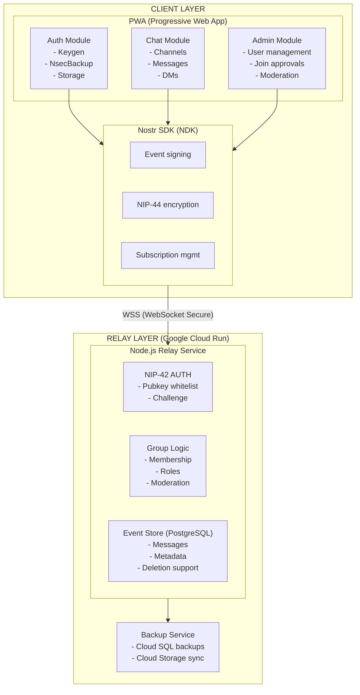

---

## Message Lifecycle & Data Flow

### Complete Message Flow (Creation to Delivery)

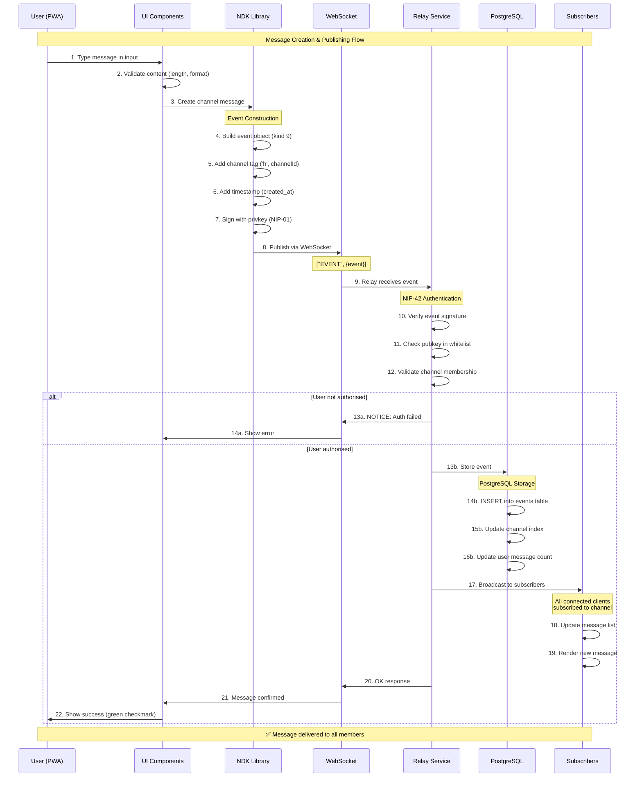

**Key Steps Explained:**

| Step | Layer | Description |
|------|-------|-------------|
| 1-3 | Client | User types message, UI validates, sends to NDK |
| 4-7 | NDK | Event creation: build, tag, timestamp, sign |
| 8-9 | Transport | WebSocket transmission to relay |
| 10-12 | Relay | NIP-42 AUTH: verify signature, whitelist, membership |
| 13-16 | Storage | PostgreSQL: persist event, update indexes |
| 17-19 | Distribution | Broadcast to all channel subscribers |
| 20-22 | Confirmation | Relay confirms, UI shows success |

### Deletion Flow (NIP-09 + NIP-29)

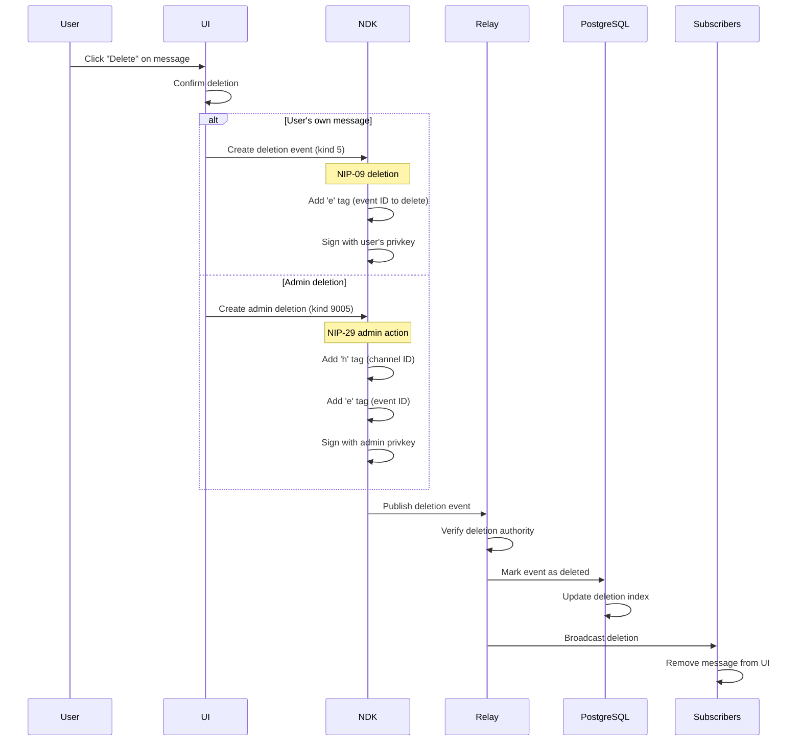

---

## Component Architecture

### Frontend Components

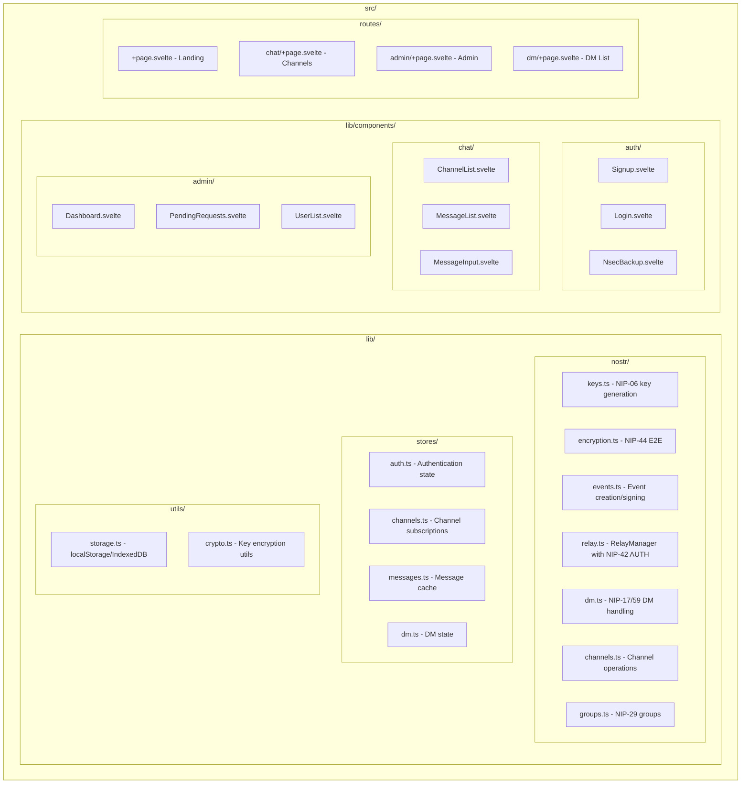

### Relay Configuration (Google Cloud Run)

```typescript
// services/nostr-relay/src/config.ts
export const relayConfig = {
  info: {
    name: "Nostr-BBS Private Relay",
    description: "Private relay for Nostr-BBS community",
    supported_nips: [1, 2, 9, 11, 29, 42, 44, 59],
  },

  // NIP-42 Authentication Required
  auth: {
    enabled: true,
    challenge_timeout: 60,
  },

  // Write Policy
  writePolicy: {
    // Only authenticated users can write
    require_auth: true,
    // Whitelist managed by admin
    use_pubkey_whitelist: true,
  },

  // No federation
  upstream: [],

  // Storage via PostgreSQL (Cloud SQL)
  storage: {
    type: 'postgresql',
    connectionString: process.env.DATABASE_URL,
    pool: { max: 20, idleTimeoutMillis: 30000 },
  },
};
```

---

## Data Models

### Nostr Event Kinds Used

| Kind | NIP | Purpose |
|------|-----|---------|
| 0 | 01 | User metadata (profile) |
| 1 | 01 | Short text note (channel messages) |
| 4 | 04 | Encrypted DM (legacy, read-only) |
| 5 | 09 | Deletion request |
| 9 | 29 | Group chat message |
| 10 | 29 | Group metadata |
| 11 | 29 | Group admin list |
| 12 | 29 | Group members |
| 1059 | 59 | Gift-wrapped event (DMs) |
| 9000 | 29 | Group add user |
| 9001 | 29 | Group remove user |
| 9005 | 29 | Group delete event |

### IndexedDB Schema (Client-side Cache)

```typescript
interface NostrBBSDB {
  // Cached messages for offline access
  messages: {
    id: string;           // Event ID
    channelId: string;
    pubkey: string;
    content: string;      // Decrypted content
    created_at: number;
    deleted: boolean;
  };

  // Channel metadata
  channels: {
    id: string;
    name: string;
    description: string;
    cohort: "business" | "moomaa-tribe" | "both";
    visibility: "listed" | "unlisted" | "preview";
    memberCount: number;
    isMember: boolean;
    isEncrypted: boolean;
  };

  // Pending requests
  joinRequests: {
    id: string;
    channelId: string;
    requestedAt: number;
    status: "pending" | "approved" | "rejected";
  };

  // User's key material (encrypted)
  keys: {
    pubkey: string;
    encryptedPrivkey: string;  // Encrypted with PIN/passphrase
  };
}
```

---

## Technology Stack

### Frontend

| Layer | Technology | Rationale |
|-------|------------|-----------|
| Framework | SvelteKit | Lightweight, PWA-friendly, good DX |
| Nostr SDK | NDK (@nostr-dev-kit/ndk) | High-level, well-maintained |
| Styling | Tailwind CSS | Rapid UI development |
| Storage | IndexedDB (Dexie) | Offline message cache |
| Build | Vite | Fast HMR, PWA plugin |

### Relay

| Component | Technology | Rationale |
|-----------|------------|-----------|
| Core Relay | Node.js + Express + WS | WebSocket support, npm ecosystem |
| Storage | PostgreSQL (Cloud SQL) | ACID compliance, pgvector for semantic search |
| Group Logic | Custom NIP-29 impl | Full control over group features |
| Hosting | Google Cloud Run | Auto-scaling containers, managed infrastructure |

### Infrastructure

| Component | Technology | Rationale |
|-----------|------------|-----------|
| PWA Hosting | GitHub Pages | Free, fast CDN, simple deployment |
| Relay Hosting | Google Cloud Run | Serverless containers, auto-scaling |
| Database | Cloud SQL PostgreSQL | Managed DB, automatic backups, pgvector |
| File Storage | Google Cloud Storage | Media files, vector indices |
| Monitoring | Cloud Logging + Monitoring | Built-in GCP observability |

---

## Encryption Architecture

### Channel Messages (NIP-29 Groups)

**Non-Encrypted Channels** (Common Rooms, Event Channels)

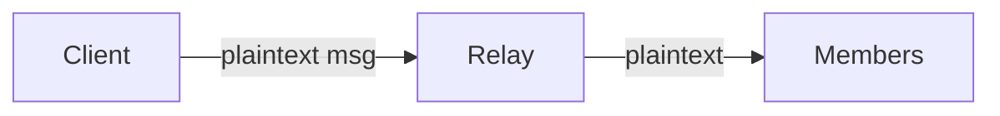

- Relay can read content
- Admin implicitly has access (relay owner)
- Simple, performant
- NIP-29 membership enforcement

**E2E Encrypted Channels** (Private Course Rooms)

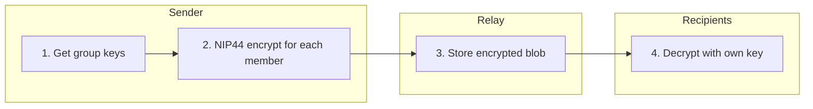

- Relay sees encrypted blob only
- Admin in room = admin has key = can decrypt
- O(n) encryption per message for n members
- Suitable for <100 member groups

### Direct Messages (NIP-17 + NIP-59)

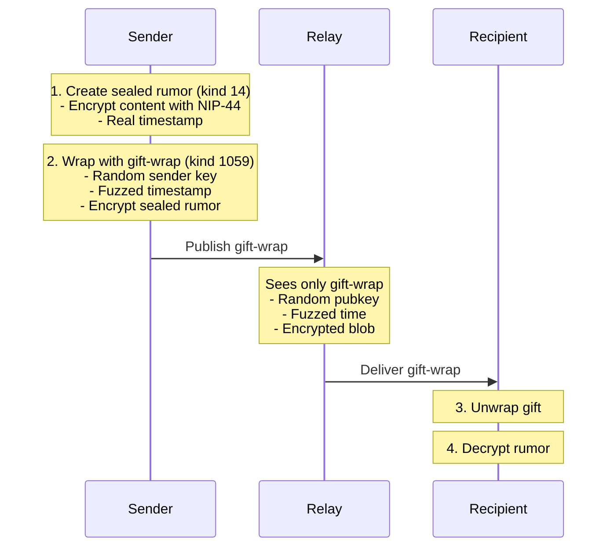

**Admin CANNOT read DMs** (no access to recipient's privkey)

---

## Deletion Strategy

### Local Relay Deletion (Supported)

```typescript
// User deletes their own message
async function deleteMessage(eventId: string, privkey: string) {
  // Create NIP-09 deletion event
  const deletionEvent = {
    kind: 5,
    pubkey: getPublicKey(privkey),
    created_at: Math.floor(Date.now() / 1000),
    tags: [
      ["e", eventId],  // Event to delete
    ],
    content: "Deleted by user",
  };

  // Sign and publish
  const signed = await signEvent(deletionEvent, privkey);
  await relay.publish(signed);

  // Local relay WILL honour deletion
  // (configured to respect NIP-09 from event author)
}

// Admin force-delete (NIP-29 kind 9005)
async function adminDeleteMessage(eventId: string, channelId: string) {
  const deletionEvent = {
    kind: 9005,
    tags: [
      ["h", channelId],
      ["e", eventId],
    ],
    content: "Removed by admin",
  };
  // Sign event with admin private key
  return finalizeEvent(event, adminPrivateKey);
}
```

### Why Local-Only Enables True Deletion

**Public Nostr (Federation)**

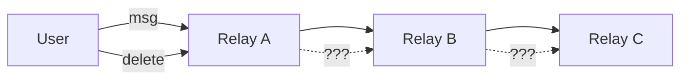

*Problem: No guarantee other relays honour deletion*

**Nostr-BBS (Closed Relay)**

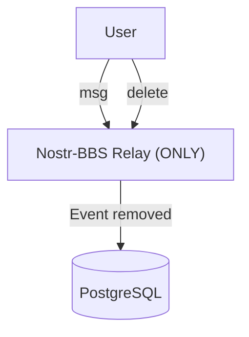

*Guarantee: We control the only relay, deletion is real*

---

## Deployment Architecture

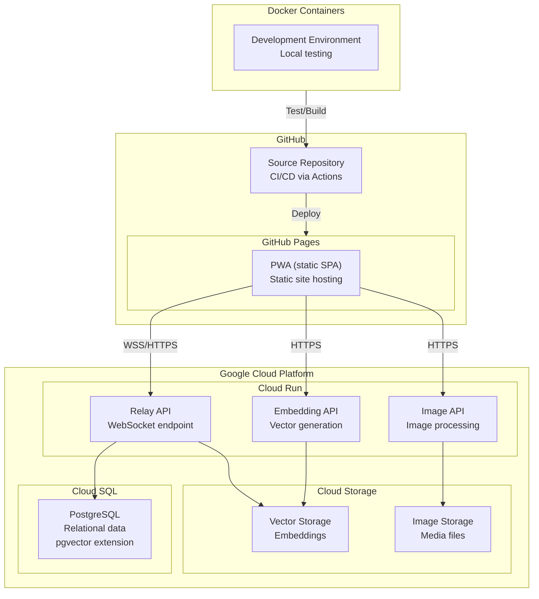

---

## Security Considerations

### Threat Model

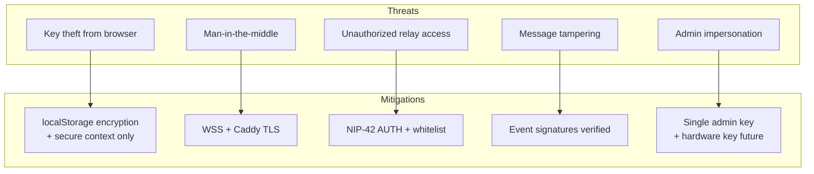

### Security Checklist

- All relay connections via WSS (TLS)
- NIP-42 AUTH enforced on relay
- Pubkey whitelist managed by admin
- Private keys never leave browser
- E2E encryption for private channels
- Gift-wrap for DM metadata protection
- Content Security Policy headers
- HSTS enabled on Caddy

---

## Related Documentation

- [API Reference](./api-reference.md) - Complete API documentation
- [Authentication Reference](./authentication.md) - Auth system specification
- [Configuration Reference](./configuration.md) - Configuration options
- [NIP Protocol Reference](../developer/reference/nip-protocol-reference.md) - Nostr protocol implementations
- [PRD](../PRD.md) - Product requirements document
- [Deployment Guide](../deployment/deployment-guide.md) - Deployment procedures

---

## Legacy SPARC Documentation

This document consolidates content from the following legacy SPARC methodology files (now superseded):

- `docs/architecture/01-specification.md` - Original requirements specification
- `docs/architecture/02-architecture.md` - System architecture design
- `docs/architecture/03-pseudocode.md` - Algorithm design and flows
- `docs/architecture/04-refinement.md` - Technology selection and testing
- `docs/architecture/05-completion.md` - Deployment and verification

**Note**: The SPARC files remain for historical reference but should not be used for current implementation. This consolidated reference is the authoritative source for architectural documentation.

For current requirements and features, see [PRD](../PRD.md) v2.1.0.
