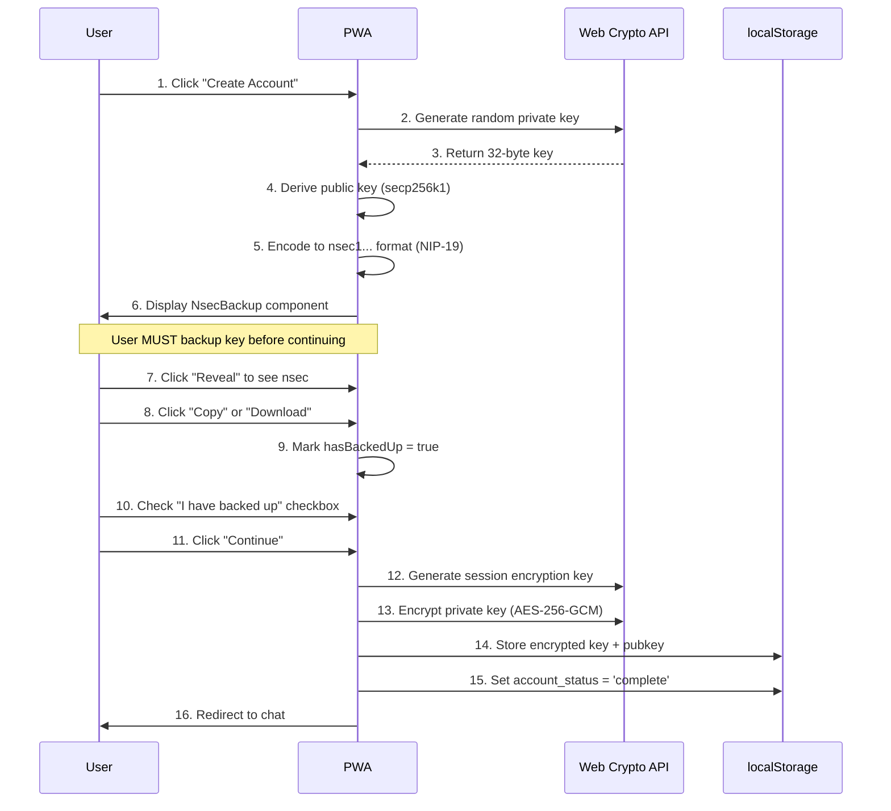
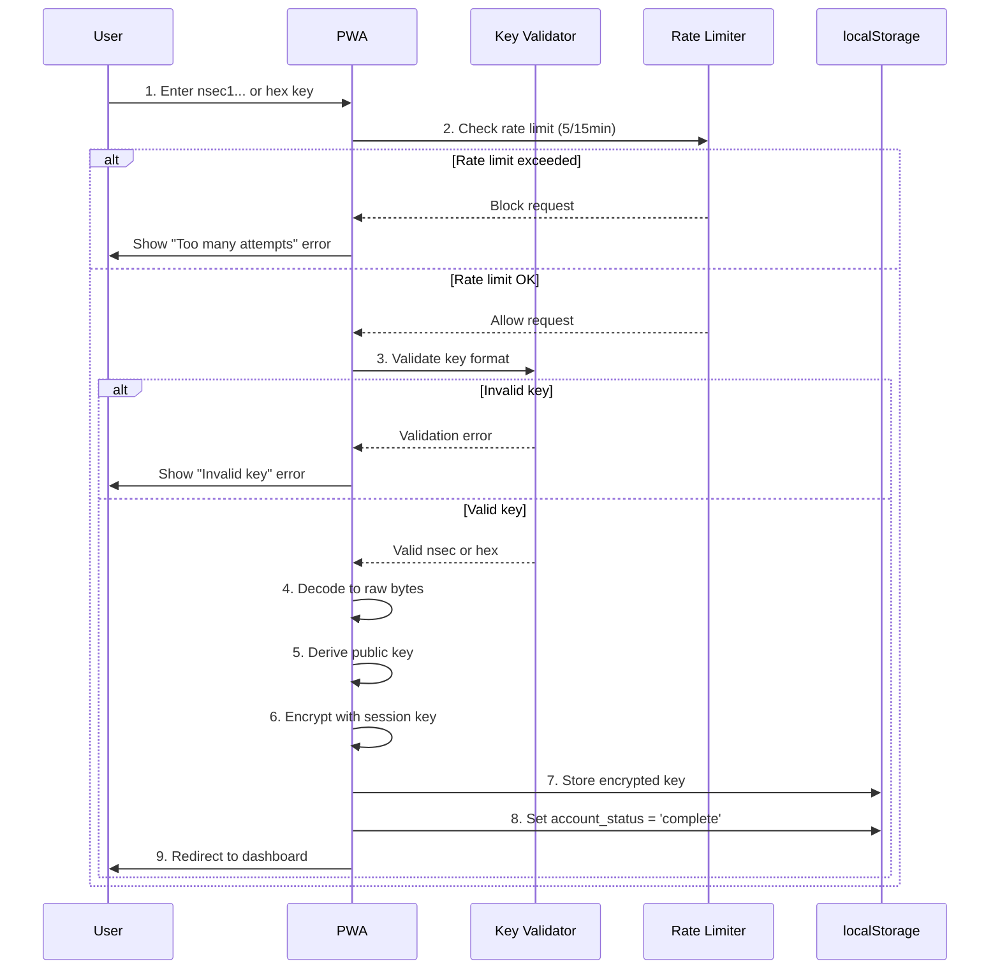
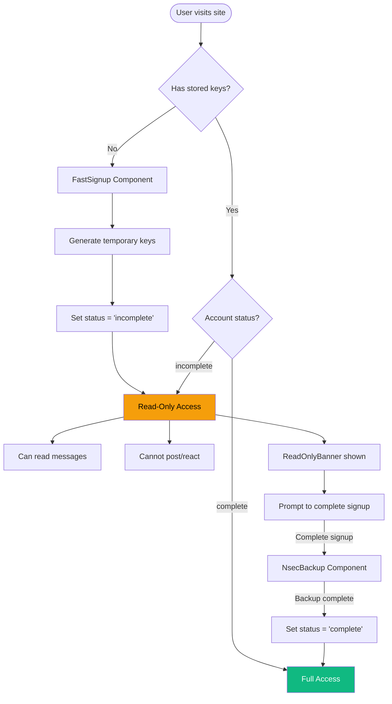

# Authentication Reference

Complete authentication system specification for Nostr-based signup and login.

## Overview

Fairfield uses a **Nostr-native authentication system** based on nsec private keys with:
- Direct Nostr private key authentication (nsec/hex format)
- Session-based AES-256-GCM key encryption
- Account status differentiation (complete/incomplete)
- Read-only mode for incomplete accounts
- Rate limiting and security hardening

**No backend authentication** - pure Nostr decentralization with user sovereignty.

---

## Quick Reference

### Supported Key Formats

| Format | Example | Usage |
|--------|---------|-------|
| **nsec** | `nsec1abc...xyz` | Bech32-encoded private key (NIP-19) |
| **hex** | `64-char hex string` | Raw 32-byte private key in hex |

### Account Status Types

| Status | Capabilities | Access Level |
|--------|-------------|--------------|
| `complete` | Full access to all features | ✅ Send messages, DMs, reactions, profile edits |
| `incomplete` | Read-only browsing | ✅ Read messages ❌ Post/react |
| `null` | No access | ❌ Must signup or login |

### Security Features

- **Encryption**: AES-256-GCM with session tokens
- **Rate Limiting**: 5 login attempts per 15 minutes
- **Key Storage**: Encrypted in localStorage, session token in sessionStorage
- **Admin Hardening**: Server-side verification, NIP-51 signature checks
- **Privacy**: No server storage, local key derivation

---

## Authentication Flows

### New User Signup



### Login with Existing Key



### Read-Only Mode (Incomplete Account)



---

## Components

### NsecBackup

Displays the private key with mandatory backup enforcement.

**Props:**
```typescript
{
  nsec: string;           // nsec1... encoded key
  onConfirm: () => void;  // Called after backup confirmed
}
```

**Features:**
- Key hidden by default (click to reveal)
- Copy to clipboard with confirmation
- Download as `.txt` backup file
- Checkbox confirmation required
- Continue button disabled until backup confirmed

### ReadOnlyBanner

Dismissible warning banner for incomplete accounts.

**Features:**
- Appears at top of chat/DM pages
- Dismissible (for 1 hour) via localStorage
- Links to signup completion
- Yellow warning styling

**Usage:**
```svelte
{#if $isReadOnly}
  <ReadOnlyBanner />
{/if}
```

### Login Component

Handles nsec/hex key input with validation.

**Features:**
- Password-type input (hidden by default)
- Real-time format detection (nsec vs hex)
- Whitespace trimming
- Error messages for invalid keys
- Rate limit feedback
- Loading state during authentication

---

## Security Implementation

### Key Encryption

Private keys are encrypted before storage using:

```typescript
// Encryption parameters
Algorithm: AES-256-GCM
Key Size: 256 bits
IV Size: 96 bits (12 bytes)
Tag Size: 128 bits (16 bytes)
Key Derivation: PBKDF2-SHA256 (optional PIN protection)
```

**Process:**
1. Generate random 256-bit session key via `crypto.getRandomValues()`
2. Encrypt private key using AES-256-GCM with random 12-byte IV
3. Store Base64-encoded ciphertext in localStorage
4. Store session token in sessionStorage (cleared on tab close)

### Rate Limiting

Token bucket algorithm protects against brute-force attacks:

| Action | Capacity | Refill Rate | Window |
|--------|----------|-------------|--------|
| Login | 5 attempts | 5 per 15 minutes | 15 min |
| Signup | 3 attempts | 3 per hour | 1 hour |
| Key operations | 10 attempts | 10 per minute | 1 min |

### Admin Security Hardening (v2.1)

**Server-Side Verification:**
```typescript
import { verifyWhitelistStatus } from '$lib/nostr/whitelist';

const status = await verifyWhitelistStatus(userPubkey);
if (!status.isAdmin) {
  goto('/events');  // Redirect non-admins
}
```

**Rate Limiting with Exponential Backoff:**

| Action Type | Max Attempts | Window | Backoff |
|-------------|--------------|--------|---------|
| Section Access | 5 | 1 minute | 2x |
| Cohort Change | 3 | 1 hour | 3x |
| Admin Action | 10 | 1 minute | 1.5x |

**NIP-51 Pin List Verification:**
```typescript
import { verifyPinListSignature } from '$lib/nostr/admin-security';
const isValid = await verifyPinListSignature(pinListEvent);
```

**Signed Admin Requests:**
```typescript
import { createSignedAdminRequest } from '$lib/nostr/admin-security';
const request = await createSignedAdminRequest({
  action: 'cohort_change',
  targetPubkey: userPubkey,
  data: { cohort: 'approved' },
  adminPrivkey: adminPrivateKey
});
```

---

## Storage Schema

### localStorage Keys

| Key | Type | Description |
|-----|------|-------------|
| `nostr_bbs_nostr_pubkey` | string | 64-char hex public key |
| `nostr_bbs_nostr_encrypted_privkey` | string | Base64 encrypted private key |
| `nostr_bbs_nostr_account_status` | string | 'complete' or 'incomplete' |
| `nostr_bbs_nostr_relay_url` | string | Preferred relay URL |

### sessionStorage Keys

| Key | Type | Description |
|-----|------|-------------|
| `nostr_bbs_session_key` | string | Base64 session encryption key |

---

## API Reference

### authStore

```typescript
import { authStore, isReadOnly, isAuthenticated } from '$lib/stores/auth';

// Read current state
$authStore.pubkey      // Current public key
$authStore.accountStatus // 'complete' | 'incomplete' | null

// Actions
authStore.setKeys(pubkey, privkey)  // Store encrypted keys
authStore.clear()                    // Logout, clear all keys
authStore.completeSignup()          // Mark account as complete
```

### Key Utilities

```typescript
import { generatePrivateKey, getPublicKey, nsecEncode, nsecDecode } from '$lib/nostr/keys';

// Generate new keypair
const privkey = generatePrivateKey();     // 32-byte Uint8Array
const pubkey = getPublicKey(privkey);     // 64-char hex string

// Encode/decode nsec
const nsec = nsecEncode(privkey);         // 'nsec1...'
const bytes = nsecDecode(nsec);           // Uint8Array
```

### Key Encryption

```typescript
import { encryptPrivateKey, decryptPrivateKey } from '$lib/utils/key-encryption';

// Encrypt for storage
const encrypted = await encryptPrivateKey(privkeyHex, sessionKey);

// Decrypt for signing
const decrypted = await decryptPrivateKey(encrypted, sessionKey);
```

### DID Integration

```typescript
import { pubkeyToDID, generateDIDDocument } from '$lib/nostr/did';

// Convert pubkey to W3C DID
const did = pubkeyToDID(pubkey);
// Result: 'did:nostr:7e7e9c42...'

// Generate DID Document
const didDoc = generateDIDDocument(pubkey);
```

---

## Migration Notes

### From Mnemonic to Nsec (v2.0)

**What Changed:**
- ❌ Removed 12-word recovery phrase generation
- ❌ Removed mnemonic display and verification UI
- ❌ Removed mnemonic-based key derivation
- ✅ Added direct nsec/hex key backup
- ✅ Added NsecBackup component with copy/download
- ✅ Added account status system
- ✅ Added read-only mode for incomplete accounts

**Why:**
- Simpler UX (no word verification step)
- Faster signup flow
- Native Nostr key format (nsec)
- Better cross-client compatibility
- Reduced code complexity

**Backward Compatibility:**
- Existing users with mnemonic-derived keys can still login with their nsec
- Keys derived from mnemonics remain valid
- No data migration required

---

## Testing

### E2E Test Coverage

Authentication system has comprehensive E2E tests:

- `tests/e2e/auth.spec.ts` - Admin and user authentication flows
- `tests/e2e/login.spec.ts` - Login validation and error handling
- `tests/e2e/signup.spec.ts` - Signup flow and key backup
- `tests/e2e/auth-extended.spec.ts` - Edge cases and cross-browser testing

### Test Commands

```bash
# Run all auth tests
npm run test:e2e -- --grep "auth|login|signup"

# Run specific test file
npm run test:e2e tests/e2e/auth.spec.ts

# Run with UI
npm run test:e2e -- --ui
```

---

## Access Control by Feature

| Feature | Complete | Incomplete | Unauthenticated |
|---------|----------|------------|-----------------|
| Browse channels | ✅ Yes | ✅ Yes | ❌ No |
| Read messages | ✅ Yes | ✅ Yes | ❌ No |
| Send messages | ✅ Yes | ❌ No | ❌ No |
| React to messages | ✅ Yes | ❌ No | ❌ No |
| Send DMs | ✅ Yes | ❌ No | ❌ No |
| Create events | ✅ Yes | ❌ No | ❌ No |
| Edit profile | ✅ Yes | ❌ No | ❌ No |
| Admin panel | ✅ Yes (admin only) | ❌ No | ❌ No |

---

## Related Documentation

- [Admin Security](../security/admin-security.md) - Admin workflow hardening
- [Security Audit Report](../security/security-audit-report.md) - Full security findings
- [DM Implementation](../features/dm-implementation.md) - Private messaging
- [API Reference](./api.md) - Full API documentation
