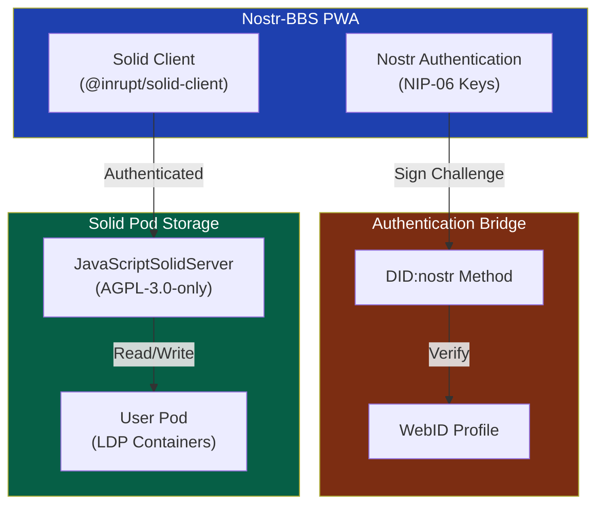
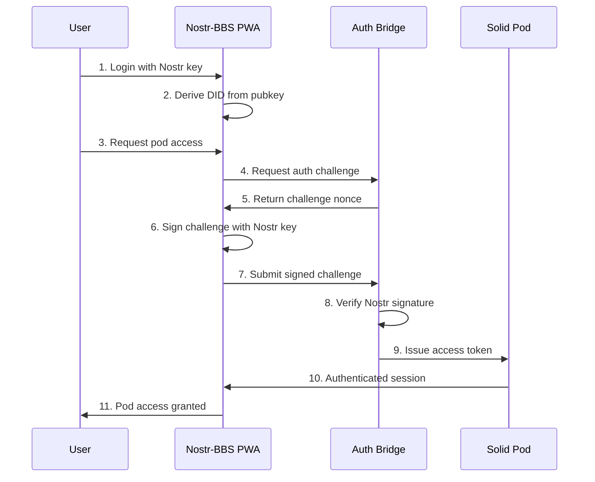

# Solid Integration

This document describes the integration of Solid pod storage with Nostr-BBS, enabling decentralized personal data storage with Nostr DID authentication.

## Overview

Nostr-BBS integrates with [JavaScriptSolidServer](https://github.com/JavaScriptSolidServer/JavaScriptSolidServer) to provide personal data pods for users. This allows users to:

- Store personal data in their own Solid pod
- Authenticate using their existing Nostr keypair
- Maintain data sovereignty and portability
- Access data across Solid-compatible applications

## Architecture



## Nostr DID Authentication

Users authenticate to Solid pods using their Nostr keypair through the `did:nostr` method:

### DID Format

```
did:nostr:<hex-pubkey>
```

Example:
```
did:nostr:3bf0c63fcb93463407af97a5e5ee64fa883d107ef9e558472c4eb9aaaefa459d
```

### Authentication Flow



## Data Storage

### Pod Structure

```
/pod/
├── profile/
│   └── card.ttl           # WebID profile
├── nostr/
│   ├── settings.json      # App preferences
│   ├── contacts.json      # NIP-02 contact list backup
│   └── bookmarks.json     # Saved messages
├── private/
│   └── keys/              # Encrypted key backups
└── public/
    └── posts/             # Shared content
```

### Linked Data Platform (LDP)

Solid uses LDP containers for resource organisation:

| Container | Access | Purpose |
|-----------|--------|---------|
| `/profile/` | Public | WebID document and public profile |
| `/nostr/` | Owner-only | Application-specific settings |
| `/private/` | Owner-only | Sensitive data (encrypted) |
| `/public/` | Public | Content for sharing |

## Configuration

### Environment Variables

```bash
# Solid Pod Server URL
VITE_SOLID_POD_URL=https://pod.example.com

# Enable Solid integration (optional)
VITE_SOLID_ENABLED=true
```

### Server Configuration

The JavaScriptSolidServer is configured in `services/solid-server/config.json`:

```json
{
  "@context": "https://linkedsoftwaredependencies.org/bundles/npm/@solid/community-server/^7.0.0/components/context.jsonld",
  "import": [
    "css:config/file.json",
    "css:config/http.json",
    "css:config/identity.json"
  ],
  "authentication": {
    "nostr": {
      "enabled": true,
      "challengeTimeout": 300
    }
  }
}
```

## API Usage

### Initializing Solid Client

```typescript
import { getSolidDataset, saveSolidDatasetAt } from '@inrupt/solid-client';
import { getNostrSession } from '$lib/solid/auth';

// Get authenticated session using Nostr key
const session = await getNostrSession(nostrPrivateKey);

// Read from pod
const dataset = await getSolidDataset(
  'https://pod.example.com/nostr/settings.json',
  { fetch: session.fetch }
);

// Write to pod
await saveSolidDatasetAt(
  'https://pod.example.com/nostr/settings.json',
  dataset,
  { fetch: session.fetch }
);
```

### Backup Nostr Data

```typescript
import { backupToSolid, restoreFromSolid } from '$lib/solid/sync';

// Backup contacts and settings to pod
await backupToSolid({
  contacts: contactList,
  settings: userSettings,
  bookmarks: savedMessages
});

// Restore from pod (e.g., new device)
const data = await restoreFromSolid();
```

## Licence

The Solid integration uses [JavaScriptSolidServer](https://github.com/JavaScriptSolidServer/JavaScriptSolidServer), which is licensed under **AGPL-3.0-only**.

### AGPL-3.0 Compliance

When using or modifying the Solid server component:

1. **Source Code Availability**: If you deploy a modified version of the Solid server, you must make the source code available to users
2. **Derivative Works**: Any modifications to the server code must also be licensed under AGPL-3.0
3. **Network Use**: Users interacting with the server over a network have the right to receive the source code

The client-side Solid integration code in Nostr-BBS remains under the project's MIT licence.

### Attribution

```
JavaScriptSolidServer
Copyright (c) JavaScriptSolidServer Contributors
License: AGPL-3.0-only
https://github.com/JavaScriptSolidServer/JavaScriptSolidServer
```

## Related Documentation

- [Solid Project](https://solidproject.org/) - Solid specification and ecosystem
- [Inrupt Solid Client](https://docs.inrupt.com/developer-tools/javascript/client-libraries/) - JavaScript client libraries
- [DID Core](https://www.w3.org/TR/did-core/) - W3C DID specification
- [Nostr NIPs](https://github.com/nostr-protocol/nips) - Nostr protocol specifications
