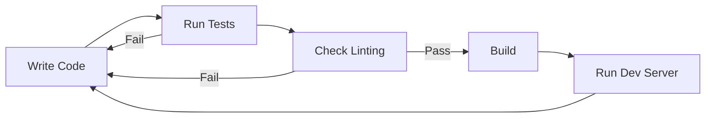
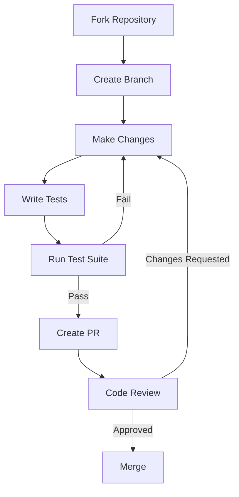

# Development Guide

Set up a local development environment for the Fairfield Nostr Relay.

## Prerequisites

- Node.js 18+ (use nvm for version management)
- npm 9+
- Git

## Setup

```bash
# Clone repository
git clone <repository-url>
cd nostr-relay

# Install dependencies
npm install

# Create development environment
cp .env.example .env
```

## Development Workflow



### Running Locally

```bash
# Development mode with hot reload
npm run dev

# Run tests
npm test

# Run tests in watch mode
npm run test:watch

# Build for production
npm run build

# Run production build
npm start
```

## Project Structure

```
nostr-relay/
├── src/
│   ├── server.ts       # Main server entry point
│   ├── handlers.ts     # WebSocket message handlers
│   ├── db.ts           # PostgreSQL database operations (pg driver)
│   ├── whitelist.ts    # Access control
│   ├── rateLimit.ts    # Rate limiting
│   ├── nip16.ts        # NIP-16 event treatment
│   ├── nip98.ts        # NIP-98 HTTP auth
│   └── did-nostr.ts    # DID resolution
├── tests/
│   └── unit/           # Unit tests
├── docs/               # Documentation
├── dist/               # Compiled output (gitignored)
├── package.json
├── tsconfig.json
└── jest.config.js
```

## Code Style

### TypeScript Guidelines

- Use strict mode
- Prefer explicit types over inference
- Use interfaces for object shapes
- Avoid `any` - use `unknown` when type is uncertain

### Naming Conventions

| Type | Convention | Example |
|------|------------|---------|
| Files | kebab-case | `rate-limit.ts` |
| Classes | PascalCase | `NostrDatabase` |
| Functions | camelCase | `saveEvent()` |
| Constants | UPPER_SNAKE | `MAX_CONNECTIONS` |
| Interfaces | PascalCase | `NostrEvent` |

### Example Code

```typescript
import { NostrEvent } from './db';

const MAX_EVENT_SIZE = 64 * 1024;

interface EventValidation {
  valid: boolean;
  error?: string;
}

export function validateEvent(event: NostrEvent): EventValidation {
  if (event.id.length !== 64) {
    return { valid: false, error: 'Invalid event ID length' };
  }

  return { valid: true };
}
```

## Testing

### Unit Tests

Located in `tests/unit/`. Uses Jest.

```typescript
import { describe, it, expect } from '@jest/globals';
import { isReplaceableKind } from '../../src/nip16';

describe('NIP-16 Event Treatment', () => {
  describe('isReplaceableKind', () => {
    it('should identify kind 0 as replaceable', () => {
      expect(isReplaceableKind(0)).toBe(true);
    });

    it('should identify kind 1 as not replaceable', () => {
      expect(isReplaceableKind(1)).toBe(false);
    });
  });
});
```

### Running Tests

```bash
# Run all tests
npm test

# Run with coverage
npm run test:coverage

# Run specific test file
npm test -- tests/unit/nip16.test.ts

# Run tests matching pattern
npm test -- --testNamePattern="replaceable"
```

### Test Coverage

Coverage reports are generated in `coverage/`. Aim for:
- 80%+ line coverage
- 100% coverage on critical paths (signature verification, whitelist)

## Adding Features

### Adding a New NIP

1. **Create module**: `src/nipXX.ts`
2. **Add tests**: `tests/unit/nipXX.test.ts`
3. **Integrate**: Update handlers or server as needed
4. **Update NIP-11**: Add to `supported_nips` array
5. **Document**: Update README and API docs

### Example: Adding NIP-50 Search

```typescript
// src/nip50.ts
export interface SearchFilter {
  search?: string;
}

export function parseSearchFilter(filter: any): SearchFilter | null {
  if (typeof filter.search !== 'string') {
    return null;
  }
  return { search: filter.search };
}

export function matchesSearch(event: NostrEvent, search: string): boolean {
  const terms = search.toLowerCase().split(/\s+/);
  const content = event.content.toLowerCase();
  return terms.every(term => content.includes(term));
}
```

## Debugging

### VS Code Launch Configuration

```json
{
  "version": "0.2.0",
  "configurations": [
    {
      "name": "Debug Server",
      "type": "node",
      "request": "launch",
      "runtimeExecutable": "npx",
      "runtimeArgs": ["ts-node", "src/server.ts"],
      "cwd": "${workspaceFolder}",
      "console": "integratedTerminal"
    },
    {
      "name": "Debug Tests",
      "type": "node",
      "request": "launch",
      "runtimeExecutable": "npx",
      "runtimeArgs": ["jest", "--runInBand"],
      "cwd": "${workspaceFolder}",
      "console": "integratedTerminal"
    }
  ]
}
```

### Logging

```typescript
// Add contextual logging
console.log(`[${new Date().toISOString()}] Event received: ${event.id.slice(0, 8)}...`);
console.error(`[${new Date().toISOString()}] Signature verification failed for ${event.pubkey.slice(0, 8)}...`);
```

### Database Inspection

```bash
# Connect to PostgreSQL database
psql $DATABASE_URL

# Or with explicit connection
psql -h localhost -U nostr -d nostr_relay

# Useful queries
\dt                                    -- List tables
\d events                              -- Describe events table
SELECT COUNT(*) FROM events;
SELECT kind, COUNT(*) FROM events GROUP BY kind;
SELECT * FROM whitelist;

# Check table sizes
SELECT pg_size_pretty(pg_total_relation_size('events'));
```

## Contributing

### Pull Request Process



### Commit Messages

Use conventional commits:

```
feat: add NIP-50 search support
fix: handle empty d-tag in parameterized events
docs: update API reference for NIP-98
test: add coverage for ephemeral events
refactor: extract signature verification
```

### Branch Naming

- `feat/nip-50-search` - New features
- `fix/empty-dtag` - Bug fixes
- `docs/api-update` - Documentation
- `refactor/handlers` - Code improvements

## Dependencies

### Production

| Package | Purpose |
|---------|---------|
| `pg` | PostgreSQL database driver |
| `ws` | WebSocket server |
| `@noble/curves` | Schnorr signatures |
| `@noble/hashes` | Cryptographic hashing |
| `nostr-tools` | Nostr utilities |
| `dotenv` | Environment configuration |

### Development

| Package | Purpose |
|---------|---------|
| `typescript` | Type checking |
| `jest` | Testing framework |
| `ts-jest` | TypeScript Jest integration |
| `ts-node` | TypeScript execution |
| `@types/*` | Type definitions |

## Performance Tips

### PostgreSQL Connection Pool

```typescript
// Already configured in db.ts
this.pool = new Pool({
  connectionString,
  max: 20,                    // Maximum connections
  idleTimeoutMillis: 30000,   // Close idle connections after 30s
  connectionTimeoutMillis: 10000,  // Connection timeout
});
```

### Efficient Queries

```typescript
// Use parameterized queries (prevents SQL injection)
const result = await this.pool.query(
  'SELECT * FROM events WHERE pubkey = $1',
  [pubkey]
);

// Use JSONB containment for tag queries (uses GIN index)
const result = await this.pool.query(
  `SELECT * FROM events WHERE tags @> $1::jsonb`,
  [JSON.stringify([['e', eventId]])]
);

// Batch inserts with transactions
const client = await this.pool.connect();
try {
  await client.query('BEGIN');
  for (const event of events) {
    await client.query(
      'INSERT INTO events (id, pubkey, ...) VALUES ($1, $2, ...)',
      [event.id, event.pubkey, ...]
    );
  }
  await client.query('COMMIT');
} catch (e) {
  await client.query('ROLLBACK');
  throw e;
} finally {
  client.release();
}
```

### Memory Management

- Limit subscription result sets
- Clean up closed connections promptly
- Monitor heap usage in production
